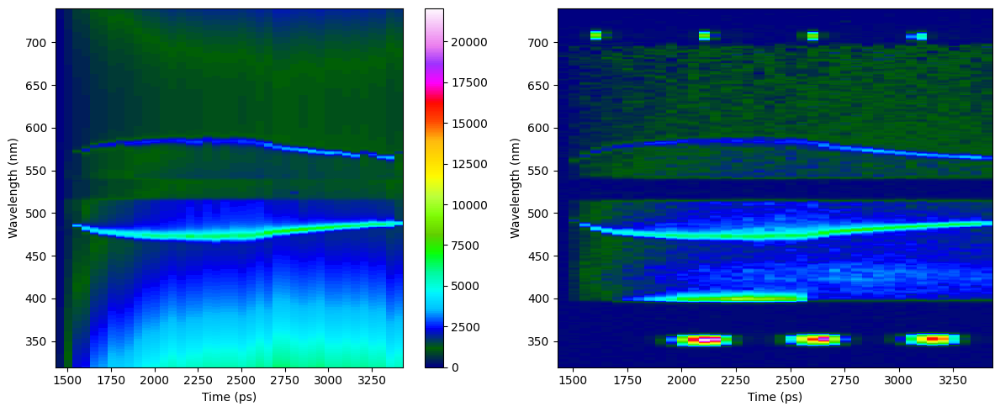
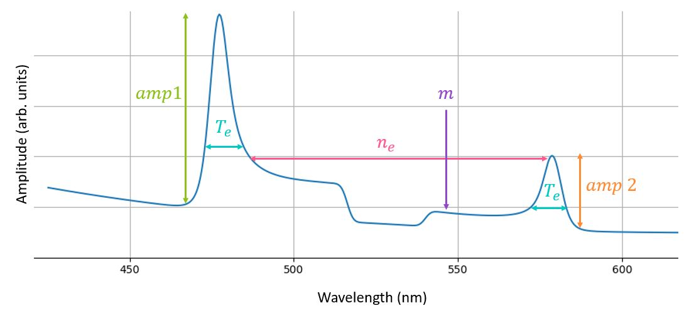
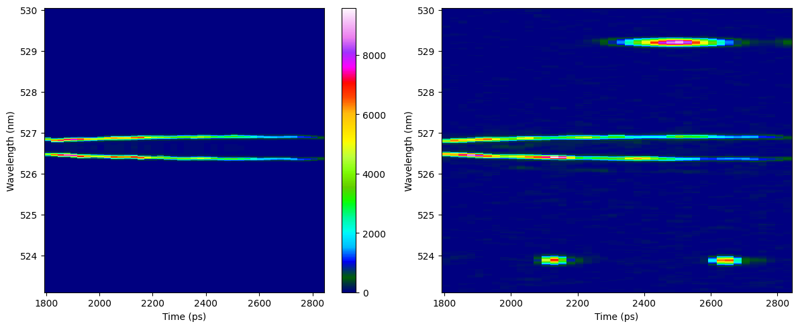
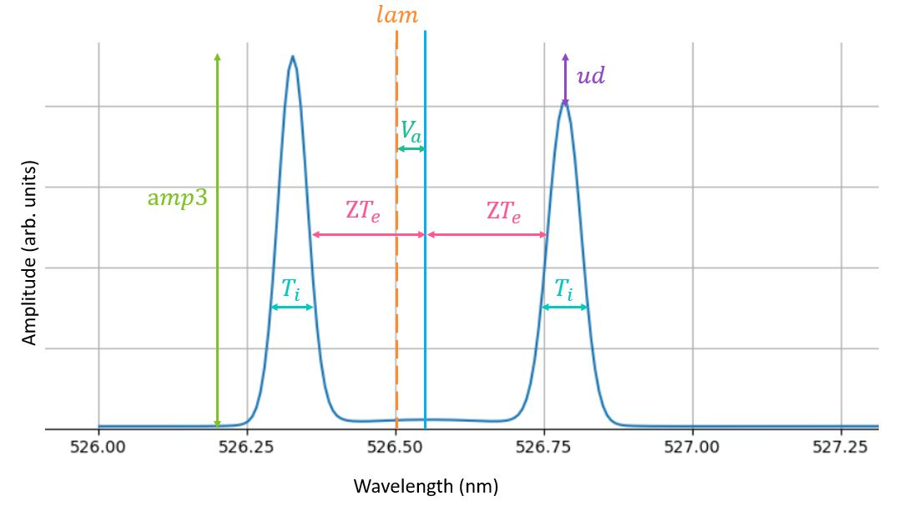

.. _ts_fundamentals:

Fundamentals of Thomson Scattering 
==========================================

This page provides some basics on Thomson scatering to help users figure out how to modify the input deck. 

**What is Thomson Scattering?** 
Thomson scattering is a diagnostic technique used to obtain information about the plasma conditions such as temperature and density.

**Lagmuir waves** are  high frequency electron plasma waves.

**Electron Plasma Waves (EPW)** also known as Langmuir waves, are high frequency electrostatic waves in a plasma with electrons as the oscillating species.

**Ion Acoustic Waves (IAW)** are low frequency electrostatic waves in a plasma, with ions as the primary oscillating species. 
In this case the electrons fight to sustain charge neutrality.

**Scattering angle** is the angle between the incident and scattered  electromagnetic wave.

Light scattered off of EPWs experience **Doppler shifts** due to the velocity of electrons relative to the incoming light. 
These shifts provide insights into the movemet of electrons and characteristics of the plasma waves. 

Fit and data plot for EPW
^^^^^^^^^^^^^^^^^^^^^^^^^^^

This plot gives an insight into the quality of the analysis, as it compares the fitted data (left) with the raw data (right).

Thomson Scattering Spectra for EPW 
^^^^^^^^^^^^^^^^^^^^^^^^^^^^^^^^^^^^^^^^^^^^^^^^^^^^^^^^^^^^^

The spectra provides a visual representation of the state of learned parameters for a given lineout. As each parament influeces an element in the wave. 

**Electron temperature (Te)**  as defined througth the averarge kinetic energy.

**Electron density (ne)** is the number of free electrons per unit volume,and it is used to characterize the plasma.

**m** is used to measure non-local heat flux

**amp1** is the blue-shifted EPW amplitude multiplier.

**amp2** is the red-shifted EPW amplitude multiplier. 

Electron Fit Ranges Plot 
^^^^^^^^^^^^^^^^^^^^^^^^^^^^^^^^^^^^^^

.. image:: _elfolder/electron_fit_annotated.png
    :scale: 75%

The **Electron Fit rRanges plots** uses lineouts to indicate the region where data is being analyzed.

**Lineouts** are used to specify the region of data to be analyzed. 

**Lineout : start** specifies the first location where a lineout will be take

**lineout : end** specifies the last location where a lineout will be taken

The scattered light is **red-shifted** if the electrons move away from the incoming light source. 
If the electrons move towards the light source, the scattered light is **blue-shifted**.  
**Min** and **max** values of these shifts indicate starting and ending waveleghts repectively to be analyzed.

Fit and data plot for IAW
^^^^^^^^^^^^^^^^^^^^^^^^^^^

    

Thomson Scattering Spectra for IAW
^^^^^^^^^^^^^^^^^^^^^^^^^^^^^^^^^^^^^^^^^^^^^^^^^^^^^^^^^^^^

**Ion tempreature (Ti)** the ion temperature as defined through the average kinetic energy.

**Ion density (ni)** is the number of free ions per unit volume.

**Z** is the average ionization state. 

**Va** is the plasma flow velocity.

**lam** is the probe wavelenght. 

**ud** is the electron drfit velocity. 

**amp3** is the IAW amplitude multiplier.

Ion Fit Ranges Plot
^^^^^^^^^^^^^^^^^^^^^^^^^^^^^^^^^

.. image:: _elfolder/ion_fit_annotated.png
    :scale: 75%

**IAW max & min** designate the starting and ending wavelenghts for the analysis of the IAW.

**IAW cf min & max** indicate the starting and ending wavelenghts for a central feature to be excluded from analysis.

