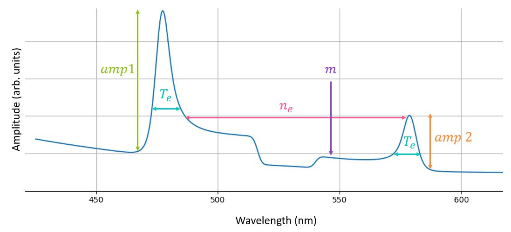
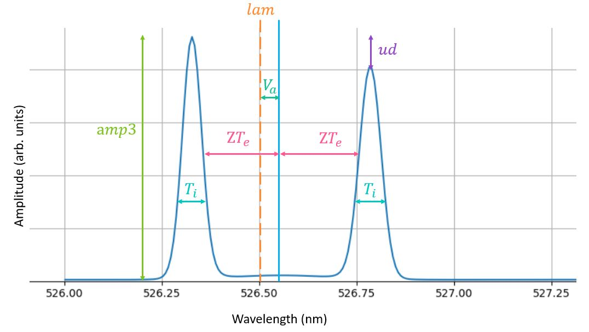

.. _ts_fundamentals:

Fundamentals of Thomson Scattering 
==========================================

This page just provides some high level basics on Thomson scatering to help users figure out how to modify the input deck. If you are interested in a more complete understanding we recommend the textbook `Plasma Scattering of Electromagnetic Radiation <https://www.sciencedirect.com/book/monograph/9780123748775/plasma-scattering-of-electromagnetic-radiation>`_  by Froula *et. al.*

.. toctree::
   :maxdepth: 4

Key Concepts
^^^^^^^^^^^^^

**Thomson scattering** is one of the classical light matter interactions describing the elastic scattering of an electromagnetic wave from a free electron. Thomson scattering is part of a continuum of interactions with Compton scattering, Rayleigh scattering, Mie scattering, and the photolectric effect. By measureing the scattered wave its possible to obtain infromation about the electron that wave scattered off. In a plasma the scattering from many electrons interfere to produce the Thomson-scattered spectrum. The spectrum is usually separated into a high frequency response and low frequency response.

There are two primary regiemes of Thomson scattering, **Colective Thomson scattering** and **Non-collective Thomson scattering**. In non-collective scattering the scattering from all the electrons interferes to give a spectrum reflective of the underlying electron distribtuion function. In collective Thomson scattering there is constructive interference from electrons oscilating as part of a natural mode of the plasma. This produces a spectrum with peaks that are representative of that natural mode.

**Electron Plasma Waves (EPW)**, also known as **Langmuir waves**, are high frequency longitudinal electrostatic waves in a plasma with electrons as the oscillating species.

**Ion Acoustic Waves (IAW)** are low frequency electrostatic waves in a plasma, with ions as the primary oscillating species and the electrons following the wave to maintain quasi-neutrality 

Since Thomson scattering occurs from individual electrons, their correlations are just due to the random particle noise or fluctuations in the plasma. The scattering is often refered to as scattering from plasma waves but this is just due to the correlations following the dispersion relations for the natural modes of a plasma. If any of these fluctuations is driven and becomes a true wave the Thomson scattering theory breaks down.

**Scattering angle** is the angle between the incident and scattered electromagnetic wave and has significant influence on the particular modes observbed as they follow the dispersion relations which require momentum matching.

Thomson scattering spectra for EPW 
^^^^^^^^^^^^^^^^^^^^^^^^^^^^^^^^^^^^^^^^^^^^^^^^^^^^^^^^^^^^^

The image provides a simplified visual representation of the effect of each parameter on the collective electron plasma wave spectrum. It is only meant to guide the user in how the input deck should be altered not to provide an comprehensive explaination of the features.

**Electron temperature (Te)** as defined via the second moment of the distribtuion function (i.e. averarge kinetic energy). Temperature alters the amount of Landau damping on the waves and therefore is related with the peak width with higher temperature giveing wider peaks.

**Electron density (ne)** is the number of free electrons per unit volume, for electron plasma waves it is also the leading term in the Bohm-Gross dispersion relation so the peak separation scales with electron density.

**m** is the super-Gaussian order of the electron velocity distribution function. This alters the damping like temperature but the easiest place to see its effect is in the plateau between the peaks. As m increases the plateaus will curve up more.

**amp1** is the blue-shifted EPW amplitude multiplier, this is a fudge factor that helps deal with Poisson noise.

**amp2** is the red-shifted EPW amplitude multiplier, this is a fudge factor that helps deal with Poisson noise.

Thomson scattering spectra for IAW
^^^^^^^^^^^^^^^^^^^^^^^^^^^^^^^^^^^^^^^^^^^^^^^^^^^^^^^^^^^^

This image provides a simplified visual representation of the effect of each parameter on the collective ion acoustic wave spectrum. It is only meant to guide the user in how the input deck should be altered not to provide an comprehensive explaination of the features.

**Ion tempreature (Ti)** is the ion temperature as defined through the average kinetic energy. Like the electron temperature this effects the landau damping so higher temperaturtes means a wider peak.

**Z** is the average ionization state. The separation between the 2 peaks is related to the sound speed in the plasma which scales with Z and Te, so increasing either of them will lead to more peak seperation.  

**lam** is the probe wavelength. The ion acoustic wave spectrum should be centered about the probe wavelength in the absence of flow.

**Va** is the plasma flow velocity. This provides a doppler shift to the entire spectrum resuling in the center of the 2 peaks shifting relative to the probe wavelength. 

**ud** is the electron drfit velocity or the velocity of the electrons relative to the fluid velocity of the ions. Shifting the electrons relative to the ions will increase damping on one wave while reducing it on the other leading to an asymmetry in the peak amplitudes. 

**amp3** is the IAW amplitude multiplier, this is a fudge factor that helps deal with Poisson noise.

