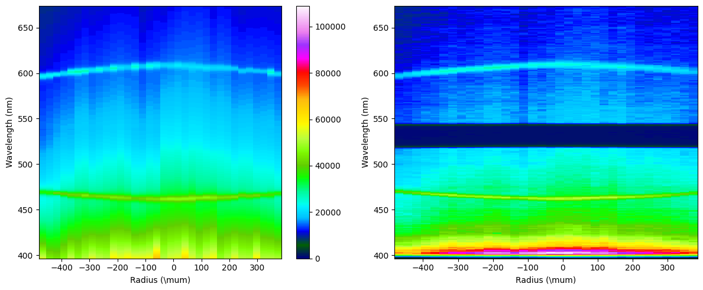
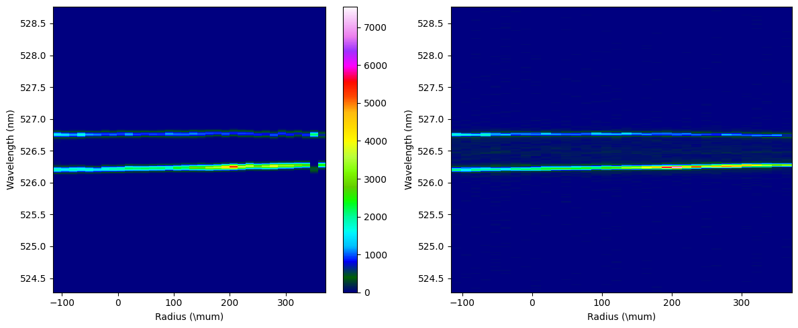

Combined Spatial Resolved (with some notes on centering TCC)
=====================================================================================

This example illustrates how to fit Spatially-resolved data for both EPW and IAW.

Load the provided data, update the input decks to mimc those used here, and use **fit** mode to run the code. 

::download:`data <examples/combined_s_data.zip>` 
::download:`input decks <examples/combined_s_inputs.zip>` 
::download:`output plots <examples/combined_s_outputs.zip>`
