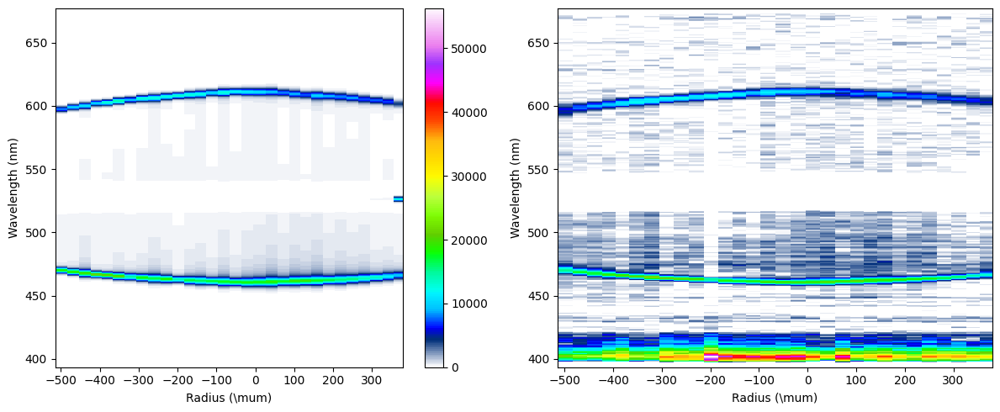

Combined Spatial Resolved 
================================

This example illustrates how to fit Spatially-resolved data for both EPW and IAW.

.. Tip:: To fix co-location issues, adjust the tcc locations which are defined in the ``calibration.py`` file.
   
    .. code-block:: python
        :caption: calibration.py
        :emphasize-lines: 3,4

        def get_calibrations(shotNum, tstype, CCDsize):
            ...
            EPWtcc = 1024 - 503 
            IAWtcc = 1024 - 578  

Load the provided data, update the input decks to mimc those used here, and use **fit** mode to run the code. 

.. image:: _elfolder/imaging_iaw.png
    :scale: 35%

::download:`EPW imaging data <examples/space_resolved/EPW_CCD-s97357.hdf>` 
::download:`IAW imaging data <examples/space_resolved/IAW_CCD-s97357.hdf>` 
::download:`input deck <examples/space_resolved/Combined_spatial_inputs.yaml>` 
::download:`default deck <examples/space_resolved/Combined_spatial_defaults.yaml>` 
::download:`output plots <examples/space_resolved/Spatial_combined.zip>`
