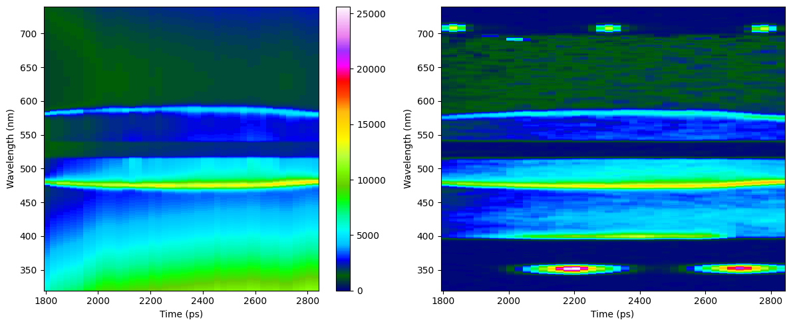
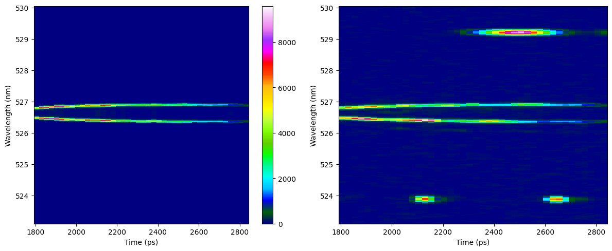

Combined Time Resolved 
=========================

This example illustrates how to fit time-resolved data for both EPW and IAW.

.. Tip:: To fix co-timing issues adjust the :bdg-success-line:`ion_t0_shift` and :bdg-success-line:`ele_t0`` variables, which are found in the default deck.

    .. code-block:: yaml
        :caption: Inputs.yaml
        :emphasize-lines: 3,5

        data:
            ...
            ele_t0: 
            ...
            ion_t0_shift: 

Load the provided data, update the input decks to mimc those used here, and use **fit** mode to run the code. 

::download:`data <examples/combined_t_data.zip>` 
::download:`input decks <examples/combined_t_inputs.zip>` 
::download:`output plots <examples/combined_t_outputs.zip>`
