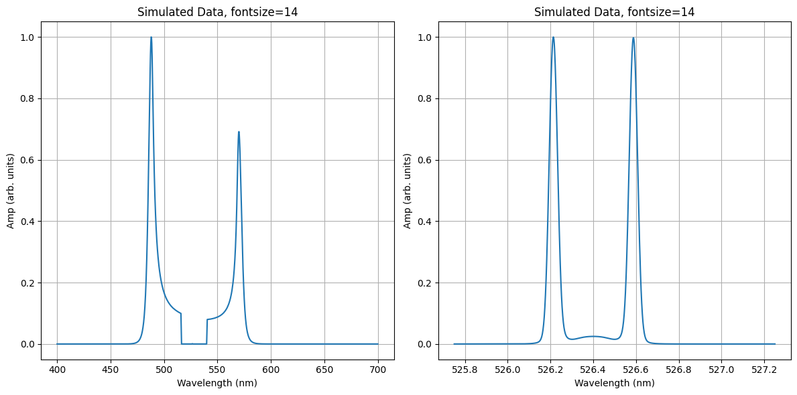

Forward Pass
=======================

This example demosntartes the application of a forward pass

Update the input decks to mimic those used here, and use **forward** mode to run the code. 

.. tip:: When computing a forward pass, check the input deck to indicate the spectype

    .. code-block:: yaml
        :caption: Inputs.yalm
        :emphasize-lines: 3

        other:
          extraoptions:
                 spectype: imaging  

Load the provided electron specta, update the input decks to mimc those used here, and use **fit** mode to run the code. 

::download:`input decks <examples/forward_pass_input_decks.zip>` 
::download:`output plot <examples/forward_pass_plot.png>`

