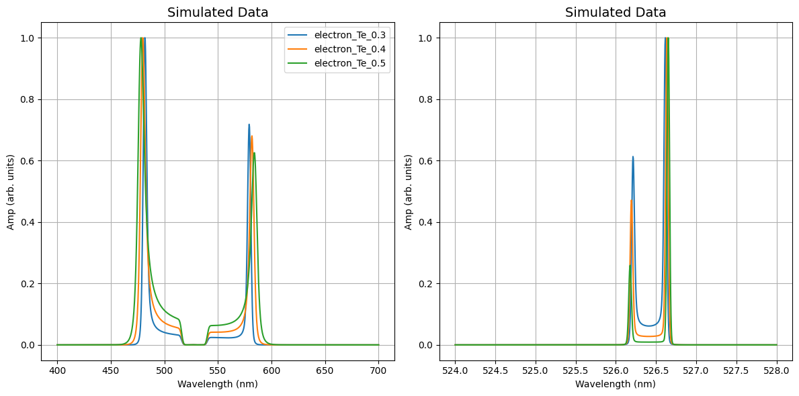

Forward Pass Series 
===============================

This example demonstrates the application of a forward pass with a series of parameters.

Update the input decks to mimic those used here, and use ``forward`` mode to run the code. 

::download:`input deck <examples/forward_mode/Series_inputs.yaml>`
::download:`default deck <examples/forward_mode/Series_defaults.yaml>` 
::download:`output plot <examples/Series.zip>`

