.. _getting started:

Getting Started Tutorial
----------------------------

This page provides instruction on installation and basic usage of the TSADAR code. More examples of input decks can be found on the :ref:`Examples <examples>` page. If you are looking for a more in depth explanation of the input deck fields please see the :ref:`input decks page <inputs_deck>`.

Installation 
^^^^^^^^^^^^^^^

1. Clone the github `repo <https://github.com/ergodicio/tsadar>`_ to the local or remote machine where you will be running analysis.
2. Install using the commands below, or following your preferred method.

TSADAR is configured through a single ``pyproject.toml`` and is installed with `uv <https://docs.astral.sh/uv/>`_ (or plain ``pip``). The available optional extras are:

- ``gpu`` — CUDA 12 JAX build plus ``pynvml`` for GPU runs
- ``hdf`` — ``pyhdf`` for loading legacy HDF4 streak-camera data (requires the HDF4 system library)
- ``docs`` — Sphinx and theme dependencies for building these docs
- ``test`` — ``pytest`` for running the test suite

.. tab-set::

    .. tab-item:: GPU (CUDA 12, recommended)

        .. code-block:: shell

            uv venv
            source .venv/bin/activate
            uv pip install -e ".[gpu]"

    .. tab-item:: CPU

        .. code-block:: shell

            uv venv
            source .venv/bin/activate
            uv pip install -e .

    .. tab-item:: Plain pip

        .. code-block:: shell

            python --version            # >= 3.10
            python -m venv venv
            source venv/bin/activate
            pip install -e .            # add [gpu] or [hdf] as needed

.. note::

   ``pyhdf`` is only needed to read legacy HDF4 streak data. It is not installed by default. To enable it, install the HDF4 system library first (``brew install hdf4`` on macOS, ``apt install libhdf4-dev`` on Debian/Ubuntu) and then run ``uv pip install -e ".[hdf]"``. If the extra is not installed, TSADAR still imports and runs — only the legacy loader will raise a clear error if called.

Importing raw data
^^^^^^^^^^^^^^^^^^^

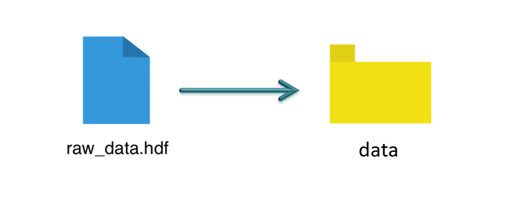

------------------

Once you have created a virtual environment, you should add your raw data, which should be an :bdg-primary-line:`.hdf` file 
into the provided data folder located at `tsadar/external/data`. For best results data should be downloaded from the official OMEGA data repository and uploaded without changes to the name or content. TSADAR is built to run on raw OMEGA data as all calibrations are 
handled internally and the specific naming conventions used on OMEGA are used to determine the type of data.

Input decks
^^^^^^^^^^^^

The code uses two input decks, which  are located in **configs/1d**. The primary input deck `inputs.yaml` 
contains the commonly altered parameters. The secondary input deck `defaults.yaml` contains additional options that tend to remain static. 

.. note::
   Any parameters in `inputs.yaml` will override the parameters supplied by `defaults.yaml`
More information on the specifics of each deck can be found by clicking the cards bellow. 

.. note::
   The input deck names are fixed and the code will always execute the decks named `inputs.yaml` and `defaults.yaml` in the specified directory. So creating additional decks with differnet names will not work, these named decks must be altered.

.. grid:: 2

    .. grid-item-card::  Inputs.yaml
        :link: inputs_deck
        :link-type: ref

        Primary input deck 

    .. grid-item-card::  Defaults.yaml
        :link: configuring-the-default
        :link-type: ref

        Secondary input deck 

Experiment information
^^^^^^^^^^^^^^^^^^^^^^^

The first step in setting up the input deck is to indicate the shotnumber of the data in the :ref:`inputs.yaml <inputs_deck>` deck. This is used by the code to both identify which data file should be analyzed and to determine the type of Thomson performed (temporal or spatial) for OMEGA experiments. For fitting data files from other sources, please contact the authors to discuss how to best format the data and input deck for analysis.

.. code-block:: yaml
    :caption: Inputs.yaml
    :emphasize-lines: 2

    data:
        shotnum: 101675
        lineouts:
            type: pixel

Selecting Fitting Regions
^^^^^^^^^^^^^^^^^^^^^^^^^^^

TSADAR allows for flexible selection of features to include in the analysis. This means that electron and ion data can be fit independently or simultaneously, and the blue-shifted and red-shifted EPWs can be fit independently. This allows for data to be analyzed even if the full dataset is not available due to experimental limitations. TSADAR also allows for selection of the lineouts to be fit, and the spectral range to be fit.

Selecting Spectra
~~~~~~~~~~~~~~~~~

There are 2 sets of flags, the first set is used to determine which spectra to load, and the second set is used to determine which spectra to fit. 
The boolean ``load_ion_spec`` controls whether to load ion spectra, and the boolean ``load_ele_spec`` controls whether to load electron spectra. 
Then the boolean ``fit_IAW`` controls whether to fit the IAWs, ``fit_EPWb`` controls whether to fit the blue-shifted EPW, and ``fit_EPWr`` controls whether to fit the red-shifted EPW.

For example in the case below, ion spectrum will loaded but not fit and the electron spectrum will be loaded and both of the features will be fit. Since the ion spectrum is loaded but not fit, the code will produce a fit and data plot for the ion spectrum but it will still compute an ion spectrum and plot it with the data, but no informaion from the ion spectrum will be used to constrain the fit.

.. code-block:: yaml
    :caption: Inputs.yaml

    data:
        load_ion_spec: False
        load_ele_spec: True
        fit_IAW: False
        fit_EPWb: True
        fit_EPWr: True

If data is loaded but not found in the data folder, the code will give a warning and continue without loading that spectrum and will also turn off the fits associated with it. So if the ``fit_IAW`` flag is set to ``True`` but the ion spectra are not found, the code will turn off the IAW fit and continue with the EPW fit if the electron spectrum is found.

.. warning::
   Simultaneous fitting of the IAW and EPW can be finicky, it is recommended to fit them separately first and then together once the quality of the individual fits are acceptable and any mismatch in the parameters can be understood.

Spectral Ranges
~~~~~~~~~~~~~~~~~

Further control over the portions spectra to be fit can be achieved by specifying the spectral range for each feature. The spectral range to be fit can be controlled in the ``defaults.yaml`` input deck. The fields ``blue_min`` and ``blue_max`` control the spectral range for the blue-shifted EPW, while the fields ``red_min`` and ``red_max`` control the spectral range for the red-shifted EPW. The field ``iaw_max`` controls the maximum wavelength to be fit for the IAW, and the field ``iaw_min`` controls the minimum wavelength to be fit for the IAW. Data outside of these ranges will not be used in the fit. 
The fields ``iaw_cf_min`` and ``iaw_cf_max`` control a region of the IAW spectrum that will be omitted from the fit. This can be used to eliminate hot-spots or scattered light features from the fit.

The values entered for these fields should be in nanometers and must have logical ordering, for example the value of ``blue_min`` must be less than the value of ``blue_max``. The values for these fields should be determined empirically by looking at the spectra and determining where the features of interest are located. 

.. code-block:: yaml
    :caption: Defaults.yaml

    data:
        fit_rng:
            blue_min: 460
            blue_max: 510
            red_min: 545
            red_max: 600
            iaw_min: 350.5
            iaw_cf_min: 351.01
            iaw_cf_max: 351.02
            iaw_max: 351.75
            

Lineout and background selection
~~~~~~~~~~~~~~~~~~~~~~~~~~~~~~~~

When fitting a new data set, we recommend starting by fitting a small region of the data using a small number of lineouts. This allows you to quickly evaluate if the region and initial parameters are reasonable before committing to a full fit which can take significantly more time. 
The fit will start at ``lineout:start`` and will end at ``lineout:end``. Lineouts will be fit every ``lineout:skip`` within that window.
The units for these lineouts are specified with the ``lineout:type`` field, and can be specified in pixel, ps, or um. 

.. code-block:: yaml
    :caption: Inputs.yaml
    :emphasize-lines: 3,6,7,8

    data:
        shotnum: 1234567
        lineouts:
            type: pixel
            start: 100
            end: 900
            skip: 10
        background:
            type: pixel
            slice: 900

There are multiple options for background algorithms selected with the ``background:type`` field. The current options are ``pixel``, ``fit``, and ``shot``. The tabs below show the recommended options for various data types. All of these
options are specified within the ``background`` field of the input deck. The ``slice`` field is used to select the location of the background lineout or to specify the background shot number (interpretation of this field is algorithm dependent). If the ``slice`` specifies a location, the units are interpreted as pixels.
The ``pixel`` option takes a lineout of the data at the location specified by the ``slice`` field and uses a smoothed version as the background. This requires there is no data feature at the specified location. The ``fit`` option fits a model to that background lineout for additional smoothing. Finally, the ``shot`` option uses a separate background shot specified by the ``slice`` field. 

.. tab-set::

    .. tab-item:: Time-resolved Data

        .. code-block:: yaml

            background:
                type: pixel
                slice: 900

    .. tab-item:: Spatially-resolved Data

        .. code-block:: yaml

            background:
                type: fit
                slice: 900

    .. tab-item:: Lineouts of Angular

        .. code-block:: yaml

            background:
                type: fit
                slice: <background shot number>

    .. tab-item:: Full Angular

        .. code-block:: yaml

            lineouts:
                type: range
                start: 90
                end: 900
                skip: #
            background:
                type:
                    fit
             slice: <background shot number>

Background can be highly variable based off the physics being studied, the experimental setup, and the type of Thomson being performed. Accurate background modeling is crucial for reliable fitting results. Much finer control over the background algorithms is available, for more information on the available algorithms and their control parameters please see 
the :ref:`background algorithms page <bg_algs>`

Plasma Parameters
^^^^^^^^^^^^^^^^^^^^^

The physical parameters to be fit are specified in the ``parameters`` section of the input deck. The parameters are organized by species, and then by parameter name. 
There are 3 species signifiers that the code recognizes, ``electron``, ``ion``, and ``general``. The ``electron`` and ``ion`` species are used to specify parameters that are specific to the electrons and ions respectively, while the ``general`` species is used to specify parameters that are common to both species.
There can only be a single ``general`` and ``electron`` species, but there can be multiple ``ion`` species. Each ``ion`` species must have a unique sequential number at the end of the species name, for example ``ion-1``, ``ion-2``, etc. This is used to differentiate between the different ion species and to determine which parameters are associated with which species. To add a new ion species, simply copy and paste the existing ion species and change the name and parameters as needed.

.. note::
   The code is currently only set up to fit a single electron species but will accept an input deck with multiple as this is a feature that will be added in the future.

Each physical parameter has 4 associated fields, ``val``, ``active``, ``lb``, and ``ub``. The ``val`` field is used to specify the initial value for the parameter, which is used as the starting point for the fitting algorithm. The ``active`` field is a boolean that indicates whether the parameter should be fit or held constant. If ``active`` is set to ``False``, the parameter will be held constant at the value specified in the ``val`` field. The ``lb`` and ``ub`` fields are used to specify the lower and upper bounds for the parameter, which are used to constrain the fitting algorithm and prevent it from exploring unphysical parameter space.
Fairly common abbreviations are used for the parameter names, for example ``Te`` is used for electron temperature, but a complete list of the currently implemented parameters and their names can be found on the :ref:`input decks page <inputs_deck>` as well as their units. An example of the ``Te`` parameter for the electron species is shown below. This example will fit the electron temperature starting from an initial value of 0.6 keV, with a lower bound of 0.01 keV and an upper bound of 1.25 keV.

.. code-block:: yaml
    :caption: Inputs.yaml

    parameters:
        electron:
            Te:
                val: .6
                active: True
                lb: 0.01
                ub: 1.25

Running your fit
^^^^^^^^^^^^^^^

Once you have set your fitting regions and your inital guesses for the plasma parameters, the last thing to set is the name of the run and the experiment name, which are used to organize the output data. 
Since the code outputs are packaged with MLFlow, these are found in the ``mlflow`` section of the input deck. The ``experiment`` field is used to group related runs together, while the ``run`` field is used to give a unique name to each run. It is recommended to use a consistent naming scheme for your runs and experiments to make it easier to navigate the output data. Especially since MLFlow gives each run a unique identifier, so the names of the runs and experiments need not be unique.

.. code-block:: yaml
    :caption: Inputs.yaml 
    :emphasize-lines: 3

    mlflow:
        experiment: folder1
        run: name of the run

Once you have adjusted the parameters and saved the changes made, you will want to implement the run command. If you have updated to the new version of the code using the new UV enviornments you can preface the following comands with ``uv run`` or you can run ``source .venv/bin/activate`` to activate the UV enviornment locally.

There are three run "modes".

**Fit mode** runs the fitting algorithm producing plasma conditions from the data.

.. code-block:: bash

   python run_tsadar.py --cfg <path>/<to>/<inputs>/<folder> --mode fit

**Forward mode** performs a forward pass and gives you the spectra given some input parameters. Additionally, it can produce spectra for a series of plasma conditions. 
 
.. code-block:: bash

   python run_tsadar.py --cfg <path>/<to>/<inputs>/<folder> --mode forward

**Interactive mode** performs a forward pass and plots it over the data. This mode will only work localy and not on remote clusters. In this mode the code will plot the data and the forward pass spectra (based off your current input deck) on top of each other on a html page. Then the code will halt and ask if you would like to continue, here the user can modify the input deck and then continue to see how the changes affect the fit. This mode is useful for getting a quick sense of how the parameters affect the fit and can be used to quickly iterate on the input deck before running a full fit.
 
.. code-block:: bash

   python run_tsadar.py --cfg <path>/<to>/<inputs>/<folder> --mode interactive

Re-running postprocessing
^^^^^^^^^^^^^^^^^^^^^^^^^^^

If you only want to redo the plots and saved parameter values from a fit that already completed -- for example after changing a plotting option, or if postprocessing was skipped or interrupted -- you don't need to re-run the fit. ``run_postprocessor.py`` replays :func:`postprocess() <tsadar.inverse.postprocess.postprocess>` against the saved config and fitted weights from a previous run, without re-optimizing. It logs its output to a new MLFlow run (tagged with the source run's id for traceability) rather than modifying the original run.

A ``fitted_weights.eqx`` artifact is saved automatically for every fit run, so this works for any fit made with a reasonably current version of the code; only fits that predate this feature lack it and cannot be replayed this way.

Point it at either a local copy of a run's artifact folder (containing ``defaults.yaml``, ``inputs.yaml``, and ``fitted_weights.eqx``):

.. code-block:: bash

   python run_postprocessor.py --dir <path>/<to>/<run>/<artifacts>

or directly at an MLFlow run, by its run id or a run URL:

.. code-block:: bash

   python run_postprocessor.py --run <run_id_or_url>

Running on a cluster
^^^^^^^^^^^^^^^^^^^^^^

``queue_tsadar.py`` submits a fit or forward pass as a batch job to a Slurm cluster (e.g. NERSC), rather than running it in your current shell. It creates the MLFlow run and uploads the input deck up front, then queues a job that resumes that same run via ``run_tsadar.py --run_id``, so the run is visible in MLFlow as soon as it's queued rather than only once the job starts.

.. code-block:: bash

   python queue_tsadar.py --cfg <path>/<to>/<inputs>/<folder> --mode <fit|forward>

This expects a Slurm job template to be filled in and submitted with ``sbatch``, selected by the top-level ``machine`` field of ``inputs.yaml`` (``cpu`` or ``gpu``):

.. code-block:: yaml
    :caption: Inputs.yaml

    machine: gpu

Before running, the environment variables ``CPU_BASE_JOB_FILE`` and/or ``GPU_BASE_JOB_FILE`` must point at a Slurm job script template for the corresponding machine type (``nersc-cpu.sh`` and ``nersc-gpu.sh`` at the repository root are examples of such templates), and ``BASE_TEMPDIR`` should be set to a scratch directory the compute nodes can write to. The run command is appended to the end of the template before it is submitted.

Output visualization
^^^^^^^^^^^^^^^^^^^^^^

Outputs of TSADAR are automatically saved to an **mlruns** folder in the same directory as TSADAR. Each experiment and run are given unique identifiers.
The outputs can be examined in this folder or with the mlflow gui. If inspecting the folders, they are named with the unique identifiers generated by mlflow. To launch the gui and visualize the outputs run the following command, and follow the resultant link. 

.. code-block:: bash

   mlflow ui 

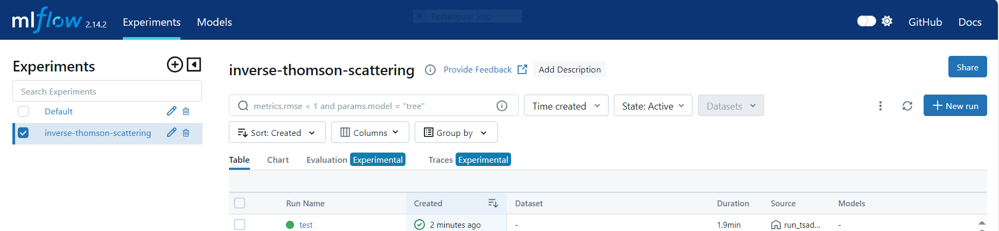

.. warning::
   Changing the names of files or folders within the mlruns directory may break the gui

.. note::
    In addition to the automatically generated plots a binary folder is created that stores the processed data and the final fits. These files called fit_and_data.nc can be downloaded and opened using the `Xarray open_dataset <https://docs.xarray.dev/en/stable/generated/xarray.open_dataset.html>`_ command. This allows any lineouts or group of lineouts to be replotted by the user.

Plots can be found in the **Artifacts** under the folder **plots**. Examples of the plots produced are shown below.

Data handling plots
~~~~~~~~~~~~~~~~~~~~

Three plots are produced to evaluate the data handling, they show the background detected, the selection of the lineouts and fitting regions, and the temporal overlap of the ion and electron spectra for time resolved data. The timing plot will only be produced if both the ion and electron spectra are loaded and the data is time resolved.

Fit ranges plots will show the entire loaded dataset with the region excluded from the fit greyed out. It will also plot a black line indicating the location where the background is analyzed. These plots can be used to evaluate if the fit regions are appropriately selected. This plot is generated before the fit is run so it can be be checked while the code is running. 

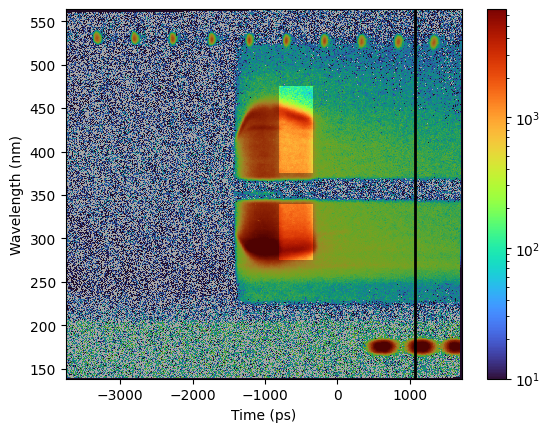

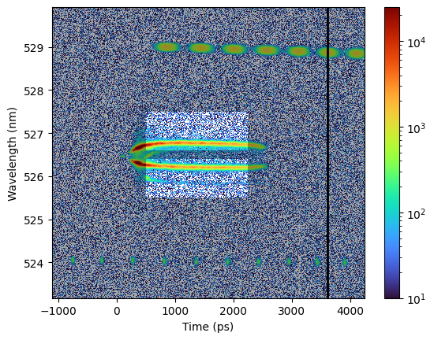

The lineouts with background plot shows the first last and middle lineout with the background plotted on top. This plot can be used to evaluate if the background is being appropriately modeled. The example below is from the **fit** background algorithm, so the background has beed fit to the edges of the current lineout. A yellow shaded region is also plotted showing the range used by the background algorithm. The spectral range of this plot also reflects the range used in the background algorithm, so these plots can be quickly used to evaluate if there are non-background features visible to the algorithm such as fiducial which will throw off the background model.

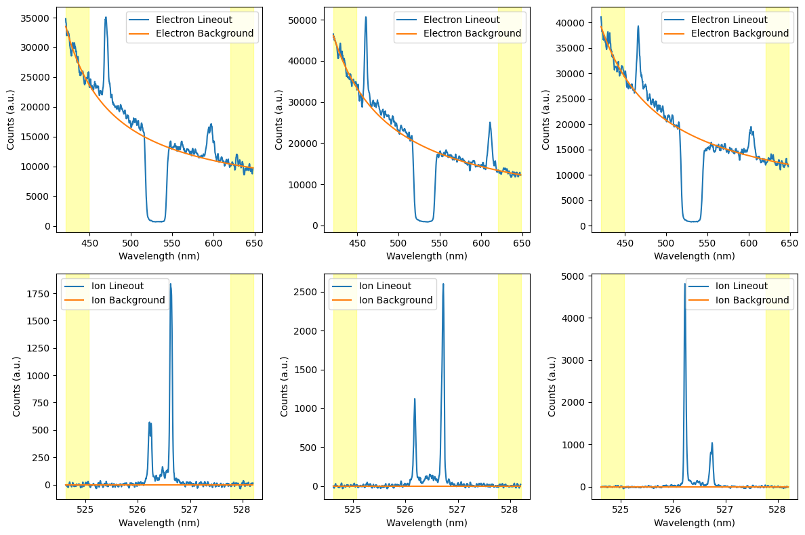

The timing plot shows the spectrally integrated ion and electron signal as a function of time for time resolved data. This plot can be used to evaluate if the ion and electron spectra are appropriately temporally overlapped, which is crucial for accurate fitting results. If the spectra are not appropriately overlapped, the relative timing can be adjusted with the ``data:ion_t0_shift`` field in the default deck. This field shifts the ion spectra in time relative to the electron spectra. The example below shows a case where the ion spectrum is shifted slightly relative to the electron spectrum.

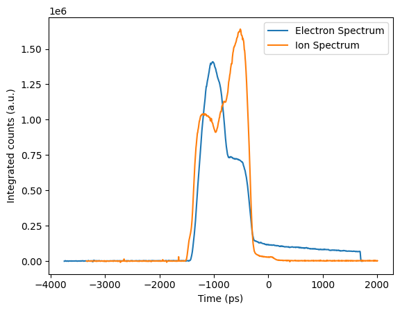

Fit and data plots
~~~~~~~~~~~~~~~~~~

Fit and data plots show a side by side of the fit and data, which can be used to evaluate the quality of the fit. These plots assemble the actively fit lineouts into 2D images so they only show the regions where the fit is being applied and will have a temporal resolution equal to the lineout spacing. Looking at the fit and data in 2D allows the user to get an idea of the fit quality for all linouts as it may not be practical to inspect every lineout when there are 100s of lineouts.

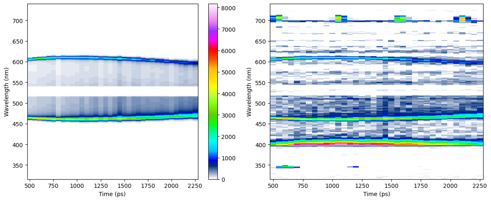

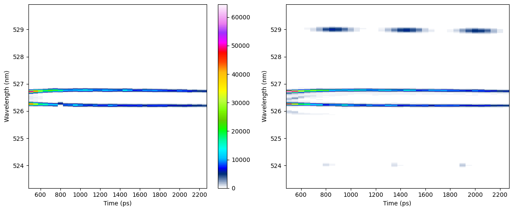

Best and worst plots
~~~~~~~~~~~~~~~~~~~~~

The 8 best and 8 worst lineouts are plotted in 1D to allow for a more detailed inspection of the fit quality. These lineouts are selected based on their individual loss values, so the best lineouts have the lowest loss and the worst lineouts have the highest loss. These plots also show the residuals for each lineout, which can be useful in determineing why fits are not performing well.
In the residual plots, locations outside of the fit range have zero residuals since they are not included in the loss calculation, looking for where the loss drops to zero relative to where that data is can be useful in determining if the fit ranges are appropriately selected.
**Best plots**

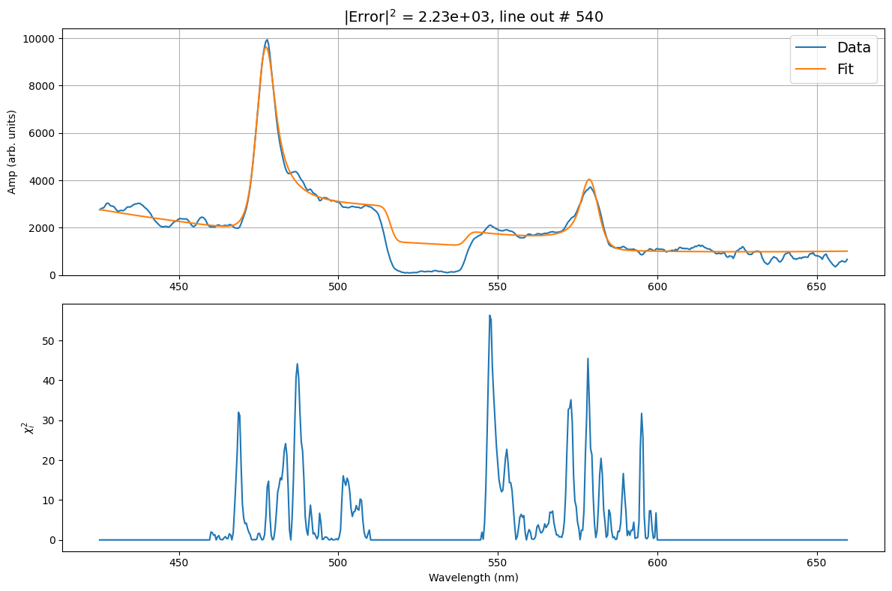

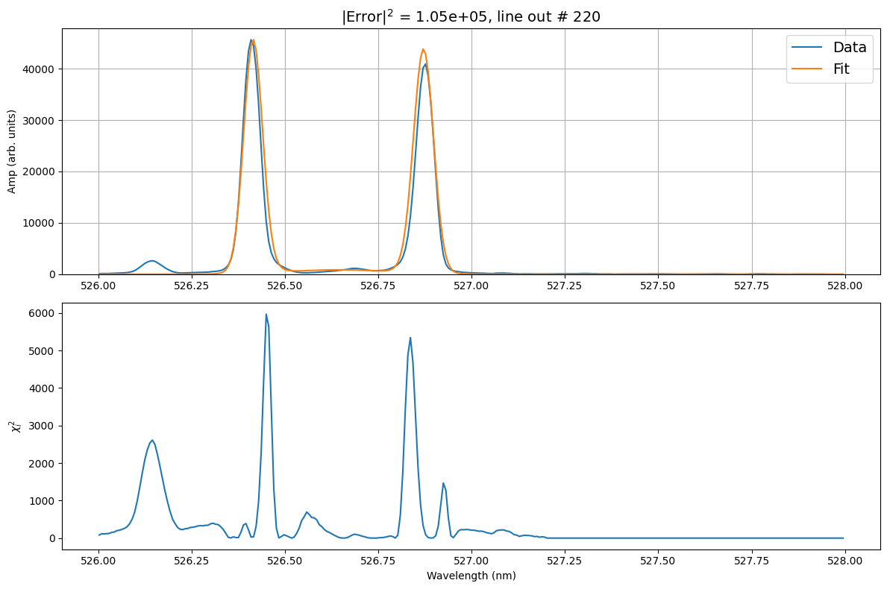

**Worst plots**

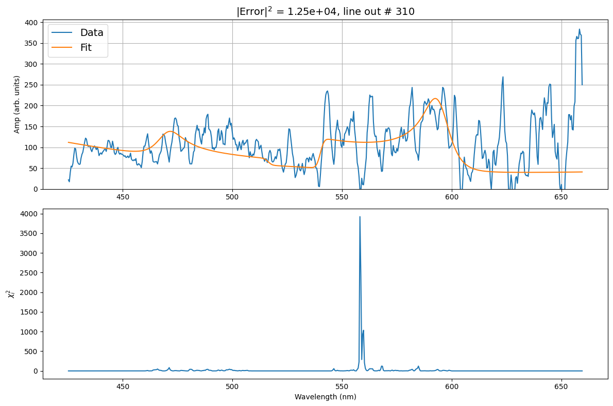

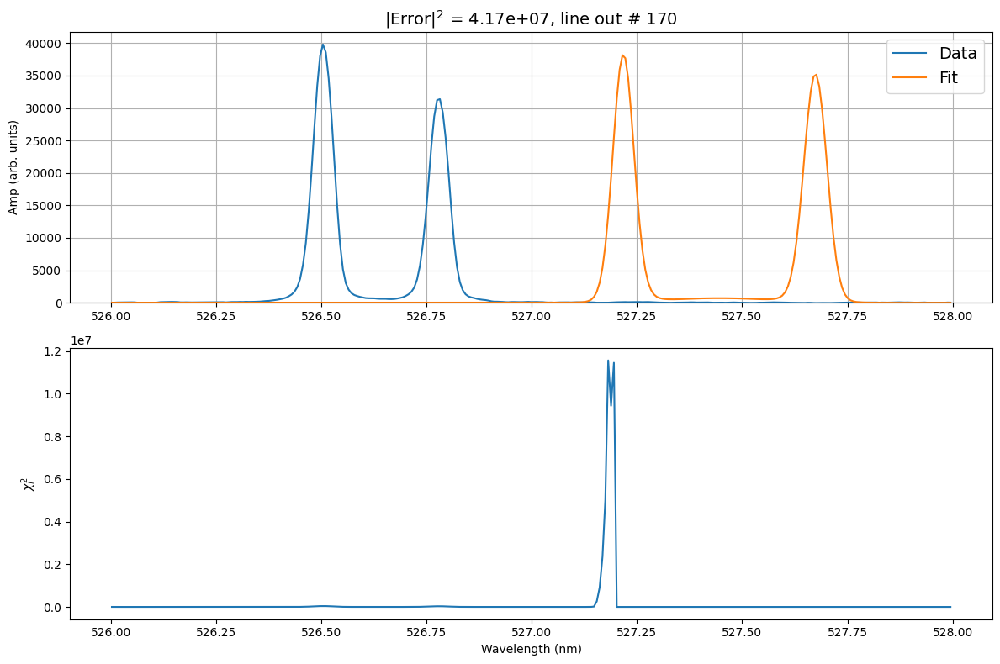

This worst plot shows a case where 2 common failure modes are occurring, the EPW fit is being performed in a region without data and the IAW fit has moved the flow to a high velocity in order to move the features outside the fit range. It is generally advised to only fit where you are confident there is data as the code will attempt to fit the noise if there is no data. If the peaks are being pushed outside the fit range, it is recommended to try different initial conditions since this often occurs if the initial conditions are far enough from the true conditions that the gradients point to the edge of fit space where there is a local minimum.

Learned parameters
^^^^^^^^^^^^^^^^^^^

Like the data and fits, the learned parameters are also provided in numerical form via a csv file and in visual form via the learned parameters plots. The csv file contains the fitted parameters for every lineout.

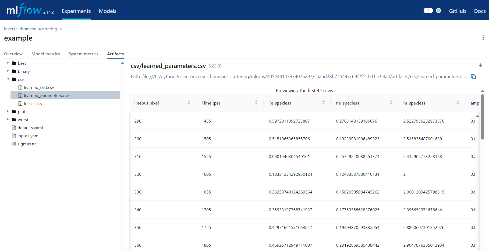

Each parameter is plotted as a function of the lineout, so the x-axis would represent time for time resolved data and space for spatially resolved data. By default, the fitted parameters are plotted with a 3:math:`\sigma` confidence interval which is calculated using a 5 lineout rolling standard deviation of the parameter. If the fit is performed at every pixel (i.e. ``lineout:skip`` is set to 1 and the ``lineout:type`` is set to pixel, or the equivalent for ps and um), this rolling standard deviation converges to the true uncertainty in the fit, but for larger lineout spacing this is not the case and the confidence interval should be used as a measure of the variability of the fit parameters rather than the true uncertainty. This calculation of confidence interval can be modified in the default deck.

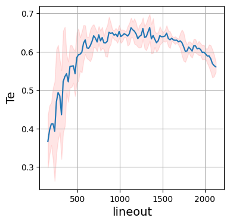

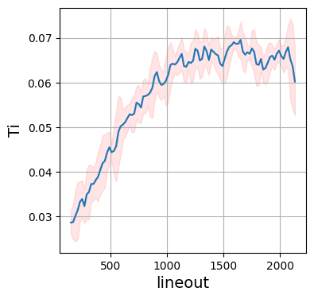