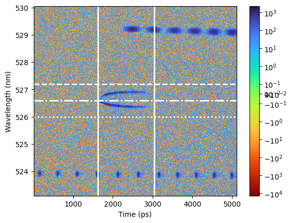
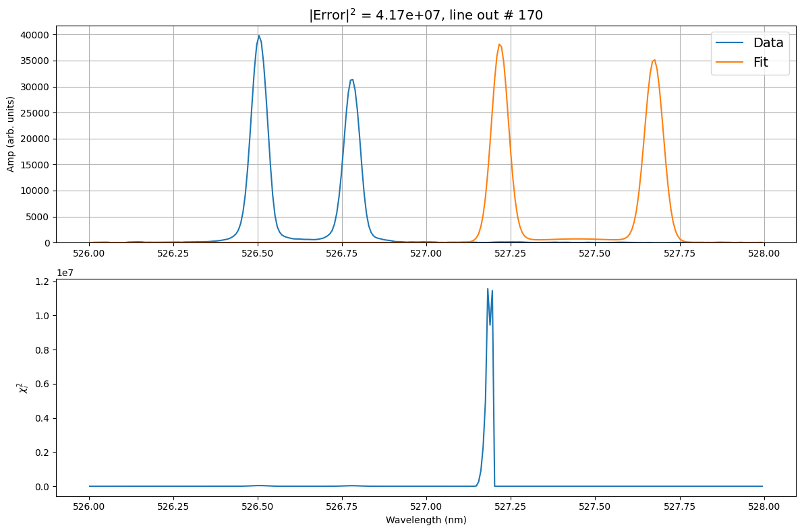
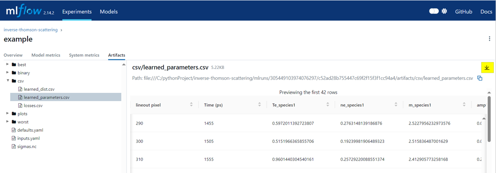

.. _getting started:

Getting Started Tutorial
----------------------------

This page should provides detailed instruction on instalation and basic usage of the TSADAR code.

Installation 
^^^^^^^^^^^^^^^
1. Clone the github `repo <https://github.com/ergodicio/tsadar>`_ to the local or remote machine where you will be running analysis.
2. Install using the commands bellow, or following your prefered method.

.. tab-set::

    .. tab-item:: Conda GPU (recomended)

        .. code-block:: shell

            conda env create -f env_gpu.yml
            conda activate tsadar-gpu
    
    .. tab-item:: Conda CPU

        .. code-block:: shell

            conda env create -f env.yml
            conda activate tsadar-cpu

    .. tab-item:: Python

        .. code-block:: shell
            
            python --version                # hopefully this says >= 3.9
            python -m venv venv             # make an environment in this folder here
            source venv/bin/activate        # activate the new environment
            pip install -r requirements.txt # install dependencies

Importing raw data
^^^^^^^^^^^^^^^^^^^

------------------

Once you have created a virtual environment, you should add your raw data, which should be a :bdg-primary-line:`.hdf` file 
into the provided data folder located at `tsadar/external/data`. TSADAR is built to run on raw OMEGA data as all calibrations are 
handled internally.

Input decks
^^^^^^^^^^^^

The code uses two input decks, which  are located in **configs/1d**. The primary input deck `inputs.yaml` 
contains the commonly altered parameters. The secondary input deck `defaults.yaml` contains additional options that tend to remain static. 
Please note, any parameters in `inputs.yaml` will override the secondary input deck when values conflict. More information on the specifics 
of each deck can be found by clicking the cards bellow. 

.. grid:: 2

    .. grid-item-card::  Inputs.yaml
        :link: inputs_deck
        :link-type: ref

        Primary input deck 

    .. grid-item-card::  Defaults.yaml
        :link: configuring-the-default
        :link-type: ref

        Secondary input deck 

Experiment information
^^^^^^^^^^^^^^^^^^^^^^^
Indicate the shotnumber of the experiment in the :ref:`inputs.yaml <inputs_deck>` deck.
The code will identify the type of Thomson data (temporal or spatial) for OMEGA experiments, based off the data file. 
For fitting data files from other sources, please contact the authors.

.. code-block:: yaml
    :caption: Inputs.yaml
    :emphasize-lines: 2

    data:
        shotnum: 101675
        lineouts:
            type:
                pixel

Fitting EPWs
^^^^^^^^^^^^^^^^^^^^^^^^^^^

Load the electron spectra, and activate the EPW fit by setting the corresponding booleans to :bdg-success-line:`True`.
Fits to the blue-shifted and red-shifted EPWs can be toggled independently.

.. code-block:: yaml
    :caption: Inputs.yaml
    :emphasize-lines: 5,7,8

    other:
        extraoptions:
            spectype: true
            load_ion_spec: False
            load_ele_spec: True
            fit_IAW: False
            fit_EPWb: True
            fit_EPWr: True

Fitting IAW
^^^^^^^^^^^^^^^^^^^^^^^^^^^

Load the ion spectra, and activate the IAW fit by setting the corresponding booleans to :bdg-success-line:`True`.
IAW and EPW fits can be mixed and matched to fit different aspects of the data.

.. code-block:: yaml
    :caption: Inputs.yalm
    :emphasize-lines: 4,6

    other:
        extraoptions:
            spectype: true
            load_ion_spec: True
            load_ele_spec: False
            fit_IAW: True
            fit_EPWb: False
            fit_EPWr: False

Background and lineout selection
^^^^^^^^^^^^^^^^^^^^^^^^^^^^^^^^^

There are multiple options for background algorithms and types of fitting. The following tend to be the best options for various data types. All of these options are specified using the input deck.
Additional information on the background algorithm is *coming soon*. 

.. tab-set::

    .. tab-item:: Time-resolved Data

        .. code-block:: yaml

            background:
                type: 
                    pixel
                slice: 900

    .. tab-item:: Spatially-resolved Data

        .. code-block:: yaml

            background:
                type: 
                    fit
                slice: 900 <or backrgound slice for IAW>

    .. tab-item:: Lineouts of Angular

        .. code-block:: yaml

            background:
                type: 
                    fit
                slice: <background shot number>

    .. tab-item:: Full Angular

        .. code-block:: yaml

            lienouts:
                type:
                    range
                start: 90
                end: 900
                skip: #
            background:
                type:
                    fit
             slice: <background shot number>

Fitting a new data set
^^^^^^^^^^^^^^^^^^^^^^^^
For fitting a new data set, it is recomended to start by fitting a small region of the data using a small number of lineouts. 
The fit will start at **lineout:start** and will end at **lineout:end**. Lineouts will be fit every **lineout:skip** of the unit type defined. 

.. code-block:: yaml
    :caption: Inputs.yaml
    :emphasize-lines: 3,6,7,8

    data:
        shotnum: 1234567
        lineouts:
            type:
                pixel
            start: 100
            end: 900
            skip: 10
        background:
            type:
                pixel
            slice: 900

Adjusting parameters
^^^^^^^^^^^^^^^^^^^^^

Set up the input decks to best fit your data. **val** sets the initial value for the first iteration, or the static value of unfit parameters.
These values are bounded by **lb** and **ub** indicating the lower and upper bound respectively.

.. code-block:: yaml
    :caption: Inputs.yaml
    :emphasize-lines: 7,9,10

    parameters:
        electron:
            Te:
                val: .6
                active: True
                lb: 0.01
                ub: 1.25

The secondary input deck, contains many additional parameters such as, the minimum and maximum values the fitting regions associated with the blue-shifted and red-shifted EPWs.

.. code-block:: yaml
    :caption: Defaults.yaml
    :emphasize-lines: 6,7,8,9

    data:
        shotnum: 1234567
        shotDay: False
        launch_data_visualizer: True
        fit_rng:
            blue_min: 460
            blue_max: 510
            red_min: 545
            red_max: 600

Run modes
^^^^^^^^^^^^^^^

Code outputs are packaged using MLFlow, each run should be individualy named in the input deck. The experiment field is a folder and can be used to group runs.

.. code-block:: yaml
    :caption: Inputs.yaml 
    :emphasize-lines: 3

    mlflow:
        experiment: folder1
        run: name of the run

Once you have adjusted the parameters and saved the changes made, you will want to implement the run command.
There are two run "modes".

**Fit mode** perfoms the fitting procedure producing plasma conditions from the data.

.. code-block:: bash

   python run_tsadar.py --cfg <path>/<to>/<inputs>/<folder> --mode fit

**Forward mode** performs a forward pass and gives you the spectra given some input parameters. Additionally, it can produce spectra for a series of plasma conditions. 
 
.. code-block:: bash

   python run_tsadar.py --cfg <path>/<to>/<inputs>/<folder> --mode forward

Output visualization
^^^^^^^^^^^^^^^^^^^^^^
To visualize the outputs run the following commnand, and follow the resultant link. 
The resulting plots can be found in the **Artifacts** unedr the folder **plots**. Examples of the plots produced are shown below.

.. code-block:: bash

   mlflow ui 

Fit and data plots
^^^^^^^^^^^^^^^^^^^^

Fit and data plots show a side by side of the fit and data, which can be used to evaluate the quality of the fit. These plots only consist of actively fit lineouts.

.. image:: _elfolder/fit_and_data_ele.png
    :scale: 35%
    :alt: Fit and data EPW

.. image:: _elfolder/fit_and_data_iaw.png
    :scale: 35%
    :alt: Fit and data IAW

Fit ranges plots 
^^^^^^^^^^^^^^^^^^
Fit and ranges plots use lines to indicate the region where data is being analyzed. Solid white lines indicate the beginning and end of the lineouts used for analysis.
On the EPW the dashed while lines indicate the spectral region used to analyze the blue-shifted EPW, while the dotted lines indicate the re-shifted EPW. On the IAW the dashed line is the maximum wavlength used for analysis and the dotted line is the minimmum wavelength.
Data within the dot-dashed lines on the IAW is not used in analysis and this can be used to eliminate hot-spots or zero-frequency features.

.. image:: _elfolder/electron_fit_ranges.png
    :width: 45%
    :alt: Electron Fit Ranges

Best and worst plots
^^^^^^^^^^^^^^^^^^^^^^^

Best and wost plots display the lineouts where the free parameters for the analysis best and worst match those of the data.
These plots can be used to determine how to alter input conditions. The lower images are residual plots showing the chi-squared metric per point helping to identify where the fit is behaving poorly.

**Best plots**

.. image:: _elfolder/epw_best.png
    :width: 45%
    :alt: EPW Best

.. image:: _elfolder/iaw_best.png
    :width: 45%
    :alt: IAW Best

**Worst plots**

.. image:: _elfolder/epw_worst.png
    :width: 45%
    :alt: EPW Worst

Learned parameters
^^^^^^^^^^^^^^^^^^^

Learned parameters is a csv file containing the fitted parameters for every lineout. These can be downloaded to further analyse individual lineouts.

Learned parameters plots
^^^^^^^^^^^^^^^^^^^^^^^^^

The variation of individual parameters throughout the linouts is shown in their respective learned plots.

