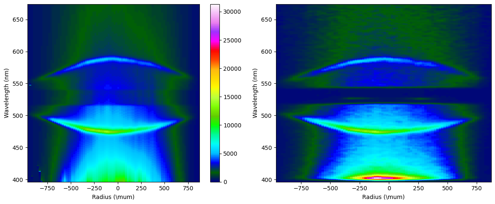

.. _imaging EPW:

Imaging data EPW
====================================

This example demonstrates fitting imaging data for EPW. 

Load the provided electron specta, update the input decks to mimc those used here, and use **fit** mode to run the code. 

::download:`EPW imaging data <examples/imaging_epw_data.hdf>` 
::download:`input decks <examples/imaging_epw_inputs.zip>` 
::download:`output plots <examples/imaging_epw_outputs.zip>`
