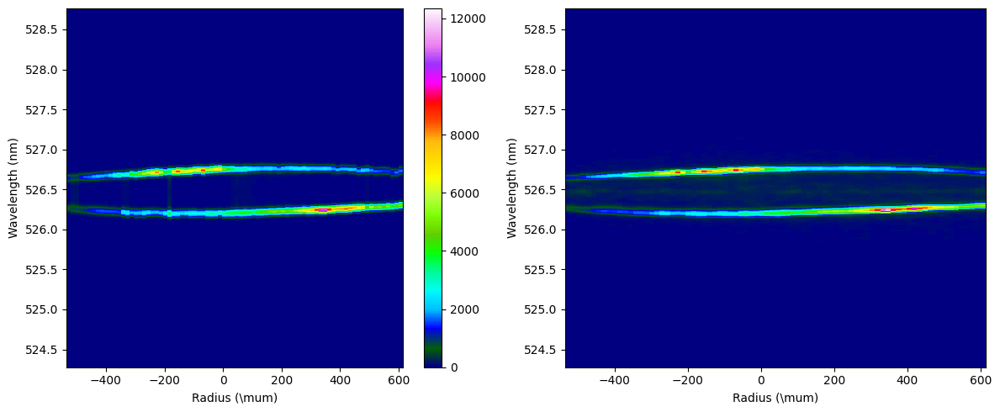

.. _imaging IAW:

Spatialy resolved IAW
====================================

This example demonstrates fitting imaging data for IAW. 

Load the provided electron specta, update the input decks to mimc those used here, and use **fit** mode to run the code. 

::download:`IAW imaging data <examples/iaw_imaging_data.hdf>` 
::download:`input decks <examples/imaging_iaw_inputs.zip>` 
::download:`output plots <examples/imaging_iaw_outputs.zip>`
