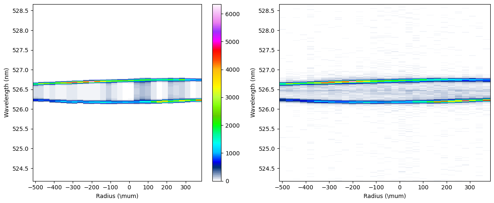

.. _imaging IAW:

Spatialy resolved IAW
====================================

This example demonstrates fitting imaging data for IAW. 

Load the provided electron specta, update the input decks to mimc those used here, and use **fit** mode to run the code. 

::download:`IAW imaging data <examples/space_resolved/IAW_CCD-s97357.hdf>` 
::download:`input deck <examples/space_resolved/IAW_spatial_inputs.yaml>` 
::download:`default deck <examples/space_resolved/IAW_spatial_defaults.yaml>` 
::download:`output plots <examples/space_resolved/Spatial_IAW.zip>`
