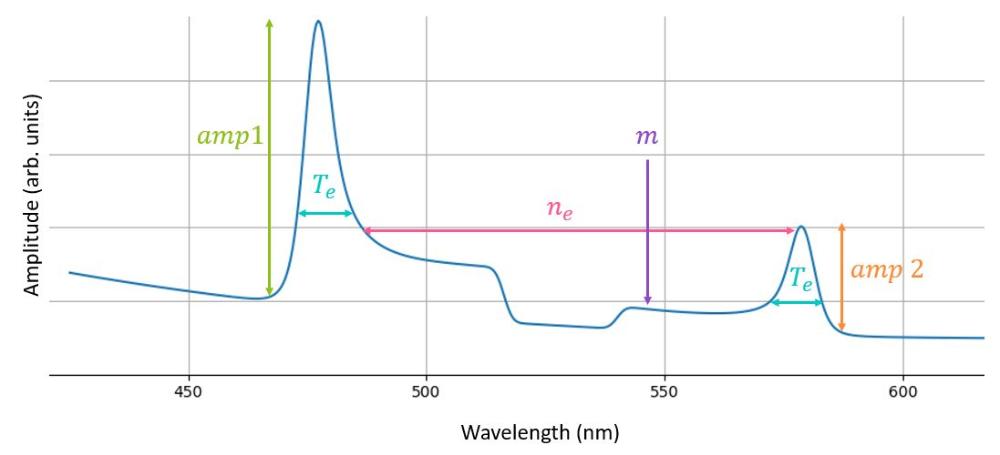
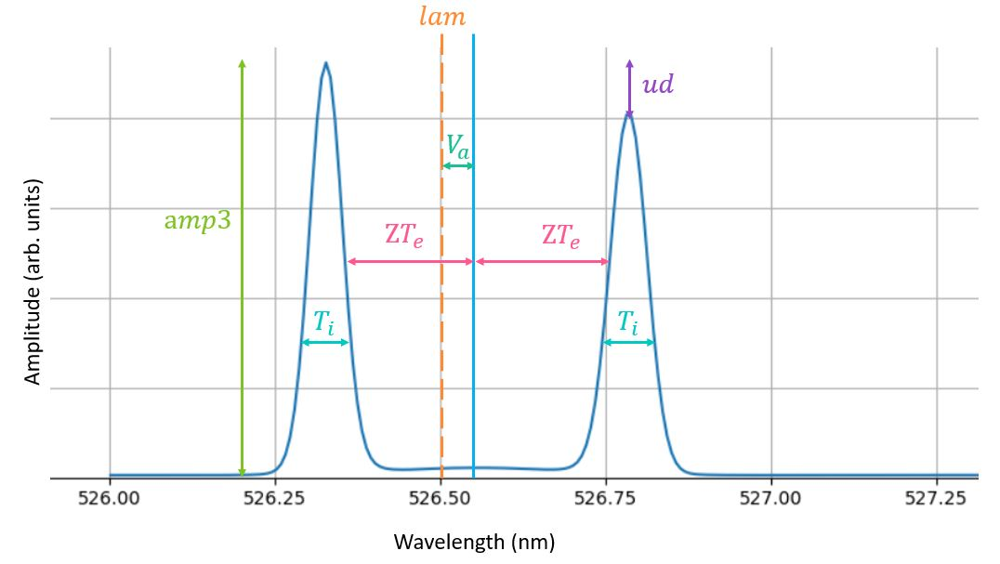
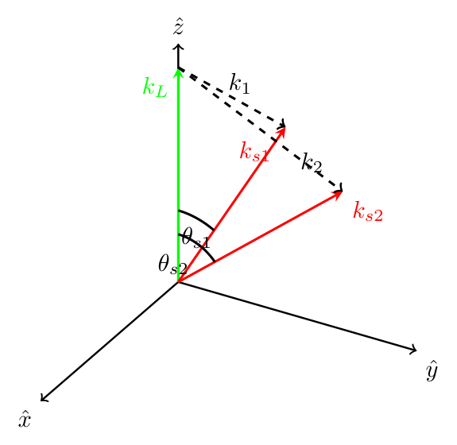
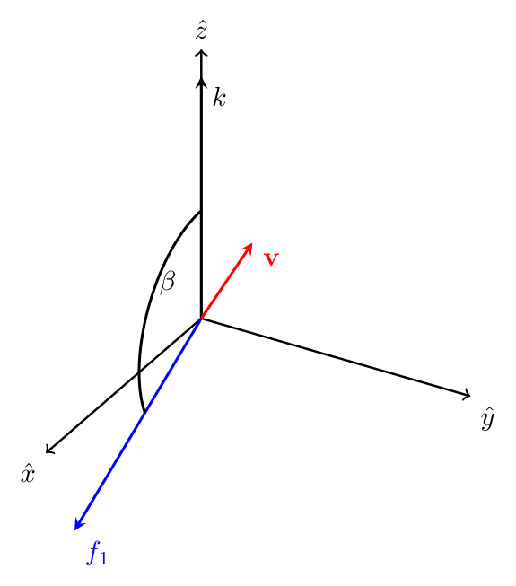
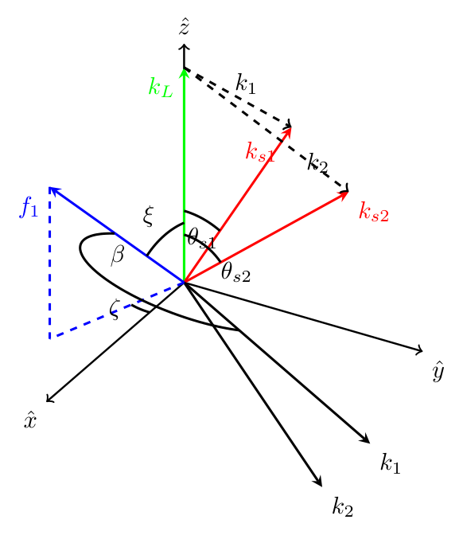
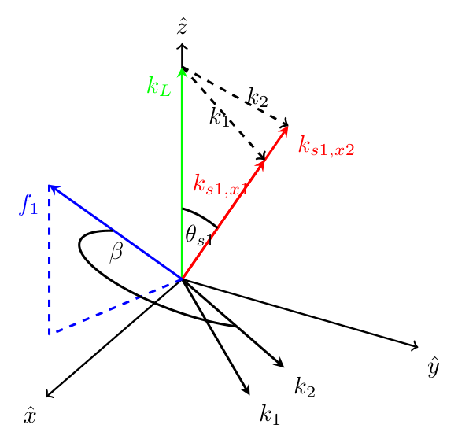

.. Generated from docs/tsadar_math.tex by docs/make_math_page.py. Do not edit this file directly.

Thomson-Scattering Theory and the TSADAR Forward Model
######################################################

.. note::

   **Work in progress.** This document is under active development. Sections may be incomplete or
   lag behind the code, and it has not yet been fully reviewed; where the two disagree, the code is
   authoritative. This page is generated from the `LaTeX source <https://github.com/ergodicio/tsadar/blob/main/docs/tsadar_math.tex>`_.

Collective Thomson scattering measures the spectrum of light scattered by electron-density fluctuations in a plasma, and that spectrum is set almost entirely by the electron and ion distribution functions. TSADAR fits measured spectra to infer the plasma parameters (:math:`n_e`, :math:`T_e`, :math:`T_i`, :math:`Z`, flow velocity, and, when the data support it, the electron distribution function :math:`f_e` itself) that produced them. This document works through that physics from the kinetic description of a plasma down to the numerical choices TSADAR actually makes: how a trial set of plasma parameters becomes a synthetic detector spectrum, and how that synthetic spectrum is compared back against data to produce the scalar loss the optimizer descends. The first few sections derive the collisionless spectral density from the Vlasov equation, largely following Froula, Glenzer, Luhmann, and Sheffield’s *Plasma Scattering of Electromagnetic Radiation* [sheffield2011]_; the remaining sections follow the code’s own computational path – parameters :math:`\to` distribution functions :math:`\to` susceptibilities :math:`\to` dynamic form factor :math:`\to` instrument-convolved spectrum :math:`\to` loss – pointing out along the way where a numerical choice in ``tsadar/`` is standing in for an idealization in the theory.

.. _`sec:physics`:

1 The physics of collective Thomson scattering
==============================================

1.1 Why the spectrum carries plasma information
-----------------------------------------------

Thomson scattering is the elastic scattering of a photon off a free electron, the low-energy limit of Compton scattering, valid whenever the photon energy is far below the electron rest mass (:math:`2\hbar\omega_0 \ll m_ec^2`, always true for optical probes). A single electron scatters as a dipole; what makes the technique a plasma diagnostic is that a probe beam illuminates not one electron but an ensemble of them, and the *ensemble* scatters collectively. The scattered field is the sum of the fields radiated by every electron along the line of sight, each with its own Doppler shift set by its velocity along the probed direction. The power collected at an observation point is therefore proportional to the electron density fluctuation spectrum, not to any single particle’s motion:

.. math::
   :label: eq-Ps

     P_s(\mathbf R,\omega_s)\,d\Omega\,d\omega_s =
     P_i\,r_e^2\,L \left\vert \hat s\times(\hat s\times\hat E_{i0})\right\vert^2
     \left(1+\frac{2\omega}{\omega_i}\right) n_e\, S(\mathbf k,\omega)\; d\Omega\, d\omega_s,

where :math:`P_i` is the probe power, :math:`r_e` the classical electron radius (the coupling constant of Thomson scattering), :math:`L` the length of plasma viewed along the probe, and :math:`\hat s\times (\hat s\times\hat E_{i0})` the usual dipole-radiation projection between the probe polarization and the observation direction :math:`\hat s`. The factor :math:`(1+2\omega/\omega_i)` is a first-order relativistic (“head-light”) correction relating the frequency of the emitting electron’s rest frame to the lab frame; this relativistic correction can be important even if the plasma is not relativistic because electrons at many times the thermal velocity are probed. All of the physics specific to the plasma sits in :math:`S(\mathbf k,\omega)`, the **dynamic structure factor** (equivalently, the spectral density function): the power spectrum of electron-density fluctuations at wavevector :math:`\mathbf k` and frequency :math:`\omega`, normalized so that :math:`\int S\,d\omega = 1` for an uncorrelated (shot-noise-only) plasma.

:math:`P_i`, :math:`L`, and :math:`\Omega`, the solid angle subtended by the collection optics, are geometric and radiometric factors that only ever act as overall scale parameters. TSADAR never tries to compute them from first principles. Instead it absorbs them into a handful of fitted nuisance amplitudes (§\ :ref:`9.3 <sec:irf>`), so everything from here on is concerned with getting the *shape* of :math:`S(\mathbf k,\omega)` right – that is what actually constrains :math:`n_e,T_e,T_i,Z,\ldots`.

.. _`sec:vlasov`:

1.2 The dynamic structure factor from the Vlasov equation
---------------------------------------------------------

A plasma is a collection of electrons and ions, and its exact microscopic state is given by the Klimontovich distribution – a sum of delta functions at each particle’s phase-space location. Averaging over an ensemble of such microscopic realizations gives a smooth, differentiable **distribution function** :math:`f_q(\mathbf r,\mathbf v,t)` for each species :math:`q`, interpretable as the probability of finding a particle of that species at :math:`(\mathbf r,\mathbf v)` at time :math:`t`. Its evolution is governed by the Boltzmann equation; dropping collisions leaves the collisionless Vlasov equation,

.. math::

     \frac{\partial f_q}{\partial t} + \mathbf v\cdot\nabla_{\mathbf r} f_q
     + \frac{q}{m_q}\left(\mathbf E + \frac{\mathbf v}{c}\times\mathbf B\right)\cdot\nabla_{\mathbf v} f_q = 0.

Linearizing about a uniform background :math:`f_q = f_{q0}(\mathbf v) + f_{q1}(\mathbf r,\mathbf v,t)`, keeping only the self-consistent electrostatic field (no ambient magnetic field, no externally driven fields – the “collisionless” assumption behind Eq. :eq:`eq-S-general` below), and Fourier transforming in space and time (:math:`f_{q1}\propto e^{i(\mathbf k\cdot\mathbf r-\omega t)}`) gives a linear response of the form :math:`\tilde f_{q1} \propto \mathbf k\cdot\partial f_{q0}/\partial\mathbf v \,/\,(\omega - \mathbf k\cdot\mathbf v)`. Substituting into Poisson’s equation and solving self-consistently for the induced potential defines the longitudinal **susceptibility** of species :math:`q`,

.. math::
   :label: eq-chi-def

     \chi_q(\mathbf k,\omega) = -\frac{4\pi q^2}{m_q k^2}\int d^3v\,
     \frac{\mathbf k\cdot\partial f_{q0}/\partial \mathbf v}{\omega - \mathbf k\cdot\mathbf v - i\gamma},
     \qquad \gamma\to0^+,

and the total dielectric function :math:`\varepsilon(\mathbf k,\omega) = 1+\chi_e+\chi_i` (summing :math:`\chi_i` over ion species if there is more than one). The location of the resonances, their widths, and how a non-Maxwellian :math:`f_e` distorts the spectrum all trace back to this integral.

Fluctuation-dissipation theory (the derivation is standard and is not repeated here; see Froula *et al.* [sheffield2011]_ or Salpeter [salpeter1960]_) relates the thermally excited density-fluctuation spectrum to these susceptibilities and to the *one-dimensional*, :math:`\mathbf k`-projected distribution functions :math:`f_{e,i}^{(1D)}(\omega/k) \equiv \int d^3v\, f_{e,i}(\mathbf v)\,\delta(\omega/k - \hat k\cdot\mathbf v)`:

.. math::
   :label: eq-S-general

     S(\mathbf k,\omega) = \frac{2\pi}{k}\left\vert 1-\frac{\chi_e}{\varepsilon}\right\vert^2
     f_e^{(1D)}\!\left(\frac{\omega}{k}\right)
     + \frac{2\pi Z}{k}\left\vert \frac{\chi_e}{\varepsilon}\right\vert^2
     f_i^{(1D)}\!\left(\frac{\omega}{k}\right).

Physically, the first term is fluctuations in the electron density that are only partially screened by the plasma’s dielectric response: :math:`1-\chi_e/\varepsilon` is the electron density response left over once the plasma has done its best to Debye-screen a test electron. The second term is ion-density fluctuations picked up through the electron susceptibility :math:`\chi_e/\varepsilon`.

This is the **dressed-test-particle** picture of collective scattering. Since the Thomson cross section scales as :math:`(e/m)^2`, a bare ion scatters negligibly compared to an electron. But a moving ion is always accompanied by a co-moving cloud of shielding electrons, and it is that electron cloud, oscillating in phase with the ion-acoustic wave, that actually does the scattering. This picture traces to Rostoker [rostoker1964]_, including the underlying result that a plasma’s fluctuation spectrum can be built up from a superposition of independent dressed particles; it is worked through in detail – including this same :math:`\chi_e`-in-the-ion-feature result – in Evans & Katzenstein’s review [evans1969]_ and in Froula *et al.* [sheffield2011]_.

Using :math:`\varepsilon-\chi_e = 1+\chi_i`, the electron term can equivalently be written :math:`\vert 1+\chi_i\vert^2/\vert\varepsilon\vert^2`, the form used directly by the code (§\ :ref:`7 <sec:formfactor>`). Both forms are the same physics; one just makes the screening of the *electron* feature by the *ions* explicit rather than folding it into :math:`\varepsilon`.

1.3 Collective vs. non-collective scattering
--------------------------------------------

Whether Eq. :eq:`eq-S-general` looks like a smooth bump or a pair of sharp resonances is characterized by a single dimensionless number, the **Salpeter parameter** (also called the **scattering parameter**) [salpeter1960]_,

.. math::
   :label: eq-salpeter

     \alpha \equiv \frac{1}{k\lambda_{De}},

comparing the electron Debye length :math:`\lambda_{De}` – the scale over which the plasma can screen a charge – against :math:`1/k`, the scale length actually being probed. For :math:`\alpha\ll1` the probed scale is much shorter than a Debye length: fluctuations are heavily screened and :math:`\varepsilon\to1`. Eq. :eq:`eq-S-general` then collapses to :math:`S(k,\omega) = (2\pi/k)f_e^{(1D)}(\omega/k)`, so the spectrum *is* a Doppler-broadened image of the electron velocity distribution. This is **non-collective** scattering.

For :math:`\alpha\gtrsim1`, the probed scale exceeds a Debye length and the plasma supports collective oscillations, so the poles of :math:`1/\varepsilon` produce two families of resonances. At high frequency is the electron-plasma wave (EPW, or Langmuir wave) feature, with dispersion relation :math:`\omega^2\approx\omega_{pe}^2+3k^2v_{Te}^2` (Bohm–Gross). At low frequency is the ion-acoustic wave (IAW) feature, with :math:`\omega/k\approx\sqrt{ZT_e/m_i}`.

.. _fig-annotated-spectrum:

.. _fig-img1:

.. _fig-img2:

   **Figure 1.** Schematic breakdown of parameters impact on a Thomson-scattering spectrum, (a) electron plasma wave, (b) ion-acoustic wave.

These dispersion relations give the classic interpretation of a Thomson scattering spectrum as demonstrated in Fig. :ref:`1 <fig-annotated-spectrum>` where the separation of the EPW is given by density and its width is set by Landau damping, the imaginary part of :math:`\chi_e`, while the separation in the IAW gives :math:`ZT_e` and its width gives :math:`ZT_e/T_i`. These scalings are good for understanding general trends but are insufficient for any kind of analysis.

One example of the limit of the scaling relations can be seen in the impact of temperature on the EPW peak location. The Bohm–Gross dispersion relation seems to indicate that :math:`\omega^2\approx\omega_{pe}^2` with :math:`3k^2v_{Te}^2` as a *correction*. The true relative importance of these terms can be seen by taking their ratio,

.. math::
   :label: eq-bg-ratio

     \frac{3k^2v_{Te}^2}{\omega_{pe}^2} = 3(k\lambda_{De})^2 = \frac{3}{\alpha^2}.

Using :math:`v_{Te}=\lambda_{De}\omega_{pe}`, the relative importance of the terms can be described by :math:`\alpha` alone. For :math:`T_e=1\,\mathrm{keV}`, :math:`n_e=10^{20}\,\mathrm{cm^{-3}}` (typical of a laser-produced coronal plasma), :math:`\omega_{pe}=5.64\times10^{14}\,\mathrm{rad/s}`, :math:`v_{Te}=1.33\times10^9\,\mathrm{cm/s}`, and :math:`\lambda_{De}=v_{Te}/\omega_{pe}\approx23.5\, \mathrm{nm}`; Eq. :eq:`eq-bg-ratio` then gives

.. container:: center

   +----------------+-----------------------+--------------------------------------------+
   | :math:`\alpha` | :math:`k\lambda_{De}` | :math:`3k^2v_{Te}^2/\omega_{pe}^2`         |
   +================+=======================+============================================+
   | 1              | 1.0                   | 3.0  (thermal term *dominates*)            |
   +----------------+-----------------------+--------------------------------------------+
   | 2              | 0.5                   | 0.75                                       |
   +----------------+-----------------------+--------------------------------------------+
   | 3              | 0.33                  | 0.33                                       |
   +----------------+-----------------------+--------------------------------------------+
   | 5              | 0.2                   | 0.12                                       |
   +----------------+-----------------------+--------------------------------------------+
   | 10             | 0.1                   | 0.03  (:math:`\omega_{pe}` term dominates) |
   +----------------+-----------------------+--------------------------------------------+

EPW Thomson-scattering measurements are typically taken with :math:`\alpha\sim1`–:math:`3`: collective enough to get a resonance, but not pushed to the deep-collective limit, where the peak width becomes instrument-limited and no longer gives a measure of the temperature. Over that whole practical range, the thermal term is a :math:`10`–:math:`100\%` correction to :math:`\omega_{pe}^2`, not a small one.

Reliance on the dispersion relations also masks the impact of the distribution function. The dispersion relations are derived kinetically using a Maxwellian distribution function or within the fluid limit where the distribution function is again inherently Maxwellian. This can lead to a misinterpretation of EPW peak width when the distribution function is super-Gaussian (flattened, depleted-tail). The Bohm-Gross dispersion relation only involves the distribution’s second moment, so a non-Maxwellian :math:`f_e` with the same :math:`T_e` leaves the *resonance* unchanged. But a super-Gaussian has a shallower slope past a few thermal velocities, so it Landau-damps the wave less, producing narrower peaks and a steeper fall-off outside them than a Maxwellian plasma at the same bulk temperature would give. Fitting such data with a Maxwellian-only model systematically misattributes that narrowing to a lower temperature, plus a compensating change in density to keep the resonance in place. Milder, Ivancic, Palastro, & Froula [milder2019]_ give a statistically-based quantification of exactly this effect: fitting synthetic super-Gaussian EPW spectra with a Maxwellian model can misinfer :math:`T_e` by up to :math:`50\%` and :math:`n_e` by up to :math:`30\%`. Being able to let :math:`f_e` depart from a Maxwellian in the fit, rather than assuming one, is the entire reason TSADAR carries a general electron-distribution-function machinery (§\ :ref:`5 <sec:edf>`) allowing the entire spectral shape to be used instead of reduced quantities such as peak position and width.

.. _`sec:freqk`:

2 From :math:`(\mathbf k,\omega)` to the laboratory coordinates
===============================================================

``tsadar/core/physics/form_factor.py``

Equation :eq:`eq-S-general` is most naturally written in :math:`(\mathbf k,\omega)`, but a detector measures wavelength and another free dimension (often space or time but potentialy angle) at a specified location. Converting requires nothing more than photon kinematics. The probe and scattered-light angular frequencies follow directly from their vacuum wavelengths,

.. math::

     \omega_L = \frac{2\pi c}{\lambda_L}, \qquad
     \omega_s(\lambda) = \frac{2\pi c}{\lambda}, \qquad
     \omega \equiv \omega_s-\omega_L,

and the corresponding wavenumbers follow the electromagnetic dispersion relation of an EM-wave propagating through a plasma of density :math:`n_e` (index of refraction :math:`<1`),

.. math::

     \omega^2 = \omega_{pe}^2+k^2c^2 \quad\Longrightarrow\quad
     k_s = \frac{\sqrt{\omega_s^2-\omega_{pe}^2}}{c}, \qquad
     k_L = \frac{\sqrt{\omega_L^2-\omega_{pe}^2}}{c}, \qquad
     \omega_{pe} = \sqrt{\frac{4\pi e^2n_e}{m_e}}.

The probed plasma fluctuation wavevector is the vector difference of the scattered and probe wavevectors (Fig. :ref:`2 <fig-vectors1>`), :math:`\mathbf k = \mathbf k_s-\mathbf k_L`; its magnitude follows the law of cosines with scattering angle :math:`\theta` (the angle between :math:`\mathbf k_L` and :math:`\mathbf k_s`),

.. math::
   :label: eq-law-of-cosines

     k = \sqrt{k_s^2+k_L^2-2k_sk_L\cos\theta}.

.. _fig-vectors1:

   **Figure 2.** Thomson probe vector is shown in green, scattering vectors are shown in red, and k-vectors corresponding to the blueshifted EPW scattering are shown with black-dashed lines. The two scattering vectors represent scattering measured at different scattering angle :math:`\theta_{s1}` and :math:`\theta_{s2}`.

Using these equations, Eq. :eq:`eq-Ps` and Eq. :eq:`eq-S-general` can be rewritten in the measurement coordinates namely :math:`\lambda_s` and :math:`\theta`

.. math::
   :label: Pslambda

       P_s(\lambda_s,\theta)=P_s(\textbf{R},\omega_s)\frac{\omega_s^2}{2\pi c}=\frac{P_i r_0^2 L}{4 \pi^2 c}\omega^2_s \left(1+\frac{2\omega}{\omega_i}\right) \left\vert \hat{s} \times \left(\hat{s} \times \hat{E}_{i0}\right)\right\vert^2 n_e S(x,\theta)

Here we have left the :math:`\mathbf{R}` dependence unaltered. We have also introduced the new normalized velocity, :math:`x\equiv \frac{v}{v_{th}}=\frac{\omega}{kv_{th}}`.

The structure factor can be written in terms of :math:`x`,

.. math::
   :label: Sx

       S(x,\theta)=\frac{2\pi}{k v_{th}} \left\vert 1-\frac{\chi_e (x)}{\epsilon(x)}\right\vert^2 f_{e,1D}(x) +\frac{2\pi Z}{k v_{th}} \left\vert \frac{\chi_e(x)}{\epsilon(x)}\right\vert^2 f_{i,1D}(x).

These equations are what TSADAR computes and compares to data.

.. _`sec:overview`:

3 Overview of the TSADAR computation
====================================

The calculation of a synthetic spectrum from a set of plasma conditions that can be compared against data is called the forward model. The forward model lives in ``tsadar/core/thomson_diagnostic.py`` (``ThomsonScatteringDiagnostic.__call__``) and proceeds in six stages, each taken up in its own section below:

#. **Parameter denormalization** (§\ :ref:`4 <sec:paramnorm>`): the optimizer works in an unconstrained normalized space; a sigmoid/logit reparameterization maps its raw parameters onto bounded physical quantities :math:`n_e,T_e,T_i,Z,\ldots` and assembles the electron distribution function object.

#. **Dynamic form factor** (§\ :ref:`5 <sec:edf>`–:ref:`8 <sec:assemble>`): given the denormalized plasma parameters and :math:`f_e`, this evaluates :math:`\chi_e`, :math:`\chi_i`, :math:`\varepsilon`, and :math:`S(k,\omega)` for the EPW and IAW features (Eq. :eq:`eq-S-general`), optionally layering on top of it a parametric-instability (SRS/SBS) gain calculation that reuses the same susceptibilities.

#. **Gradient and angle averaging** (§\ :ref:`9 <sec:downstream>`): the raw :math:`S(k,\omega)` is averaged over a small set of plasma conditions sampling a density/temperature gradient across the probed volume, and over the finite collection aperture.

#. **Instrument response** (§\ :ref:`9.3 <sec:irf>`): the theoretical spectrum is convolved with the spectrometer’s (and, for imaging data, the collection optics’) finite resolution and binned onto actual detector pixels.

#. **Calibration** (§\ :ref:`11 <sec:calibration>`): not strictly part of the forward model that produces the theory curve, but the affine pixel-to-physical-unit maps documented there are what put the *data* being fit onto the same wavelength/angle axes the previous stages compute.

#. **Loss** (§\ :ref:`12 <sec:loss>`): the instrument-convolved theory is compared to the measured data through a configurable per-pixel loss functional, optionally with a full noise-covariance matrix, and reduced to the scalar the optimizer descends.

.. _`sec:paramnorm`:

4 Parameter normalization
=========================

``tsadar/core/modules/ts_params.py``

Every scalar fit parameter (:math:`T_e`, :math:`n_e`, :math:`T_i`, :math:`Z`, :math:`V_a`, species fraction, probe wavelength :math:`\lambda`, amplitude nuisance parameters :math:`\mathrm{amp}_{1,2,3}`, gradient percentages, drift velocity :math:`u_d`) is carried by the optimizer not as its physical value but as an unconstrained real number, for two reasons. First, gradient-based minimizers work best when all parameters are of comparable magnitude, and :math:`n_e\sim10^{19}`, :math:`T_e\sim1`, and a species fraction :math:`\sim0.1` do not naturally share a scale. Second, most minimizers have no notion of a hard bound: constraints imposed by clamping can produce undefined or discontinuous gradients right at the boundary, exactly where the algorithm is most likely to want to go. Both problems are solved by fitting in a transformed space that approaches its bounds asymptotically and can never reach them.

Let :math:`p` be the physical value and :math:`[\ell,u]` its configured bounds, read from the input deck’s ``lb``/``ub`` by each owning parameter class (e.g. ``ElectronParams.__init__``); the sigmoid/logit pair itself is supplied separately by ``get_act_and_inv_act``. Define

.. math::

     \text{scale} = u-\ell,\qquad \text{shift}=\ell,\qquad x=\frac{p-\text{shift}}{\text{scale}}\in[0,1].

If the parameter is being actively fit, the optimizer sees a *stabilized logit* of :math:`x` rather than :math:`p` itself,

.. math::

     x_n = \ln\!\left(0.01+\frac{x}{1.01-x}\right),

(the :math:`0.01/1.01` offsets keep :math:`x_n` finite as :math:`x\to0,1`, rather than diverging exactly at the boundary), and the inverse map recovers the physical value from the optimizer’s raw parameter :math:`x_n` via a sigmoid,

.. math::

     p = \sigma(x_n)\cdot\text{scale}+\text{shift}, \qquad \sigma(x_n)=\frac{1}{1+e^{-x_n}}.

For inactive parameters, or when normalization is turned off, this transform is replaced with the identity map.

The parameters as well as their fit state and normalization/unnormalization function are carried by an instance of the ``ThomsonParams`` class. Within the class each parameter is contained within a class representing its physical association. ``ElectronParams`` normalizes :math:`T_e,n_e` this way and also owns the electron distribution function object (§\ :ref:`5 <sec:edf>`); ``IonParams`` normalizes :math:`T_i,Z,V_a`, and species fraction; ``GeneralParams`` normalizes :math:`\lambda`, :math:`\mathrm{amp}_{1,2,3}`, the gradient percentages, :math:`u_d`, and the two bremsstrahlung-background nuisance parameters :math:`\mathrm{brem\_amp}`, :math:`\mathrm{brem\_c}` (§\ :ref:`9.4 <sec:brem>`). ``ThomsonParams.renormalize_ions`` additionally enforces :math:`\sum_s\mathrm{fract}_s=1` by dividing every species fraction by their sum, since fractional ion populations are only physically meaningful relative to each other.

.. _`sec:edf`:

5 Electron distribution functions
=================================

``tsadar/core/modules/distribution_functions/base.py``, ``spherical_harmonics.py``

.. _`sec:dlm-physics`:

5.1 Physical motivation: inverse-bremsstrahlung heating and the Langdon effect
------------------------------------------------------------------------------

As argued in §\ :ref:`1.2 <sec:vlasov>`, the Vlasov equation’s collisionless solution is a Maxwellian only when the plasma has had time to relax under binary electron-electron collisions and nothing continues to push it away from equilibrium. In laser-produced plasmas, something does: the dominant laser absorption mechanism in underdense plasma is **inverse bremsstrahlung**, in which an electron oscillating in the laser’s electric field collides with an ion and retains some of the momentum gained from the field, converting quiver energy into thermal energy. The rate at which an electron absorbs energy this way scales as :math:`v^{-3}` (the electron-ion collision rate), so slow electrons are heated preferentially while fast electrons are barely affected. Solving the Boltzmann equation with this competition between selective inverse-bremsstrahlung heating and electron-electron thermalization (Langdon 1980) gives a steady-state distribution of super-Gaussian form,

.. math::
   :label: eq-dlm-physics

     f_m(v) = C_m\exp\!\left[-\left(\frac{v}{a_mv_{th}}\right)^m\right], \qquad
     a_m = \sqrt{\frac{3\,\Gamma(3/m)}{\Gamma(5/m)}},

this is the Dum–Langdon–Matte (DLM) distribution named after the three papers that introduced the theory. An equation of this form reduces to the ordinary Maxwellian at :math:`m=2`: :math:`3\Gamma(3/2)/\Gamma(5/2)=2` exactly, so :math:`a_2=\sqrt2` and :math:`f_2(v)=\exp[-v^2/(2v_{th}^2)]`, the standard :math:`1`\ D Maxwellian written with :math:`v_{th}=\sqrt{T/m_e}`.

The order :math:`m` varies continuously between a Maxwellian (:math:`m=2`, when electron-electron collisions dominate) and a flattened, depleted-tail distribution (:math:`m=5`, the theoretical maximum, when inverse-bremsstrahlung heating completely dominates). Matte *et al.* used Fokker–Planck simulations to relate :math:`m` directly to the competition between the two processes through the single dimensionless **Langdon parameter** :math:`\alpha = Zv_{\rm osc}^2/v_{th}^2` (the ratio of the IB heating rate to the e-e thermalization rate), giving the empirical scaling

.. math::
   :label: eq-matte-physics

     m(\alpha) = 2+\frac{3}{1+1.66\,\alpha^{-0.724}}.

This is exactly the mechanism responsible for the spectral changes discussed in §\ :ref:`1.2 <sec:vlasov>`: because :math:`m>2` implies a shallower tail and hence less Landau damping, a laser-heated plasma’s EPW feature is systematically narrower than a Maxwellian plasma of the same bulk temperature would produce, and a fit that is not allowed to explore :math:`m\neq2` will misattribute that narrowing to the wrong :math:`n_e,T_e`.

TSADAR represents :math:`f_e(v)` (1D, isotropic-in-speed) or :math:`f_e(v_x,v_y)` (2D) on a uniform, cell-centered velocity grid :math:`v\in[-6,6]v_{Te}`, with the functional form selected by the input deck’s ``fe.dim``/``fe.type``. All distribution functions in TSADAR are normalized so their zeroth moment is :math:`1` and all the higher moments have their usual form divided by density. These normalizations effectively allow density and temperature to be factored out, so any Maxwellian can be represented by the same equation, just with independently tracked density and temperature.

.. _`sec:dlm`:

5.2 The DLM family in TSADAR
----------------------------

Following the normalization conventions, the isotropic super-Gaussian of Eq. :eq:`eq-dlm-physics`, is

.. math::

     x=v/v_{th}, \qquad x_0=\sqrt{\frac{3\,\Gamma(3/m)}{\Gamma(5/m)}}, \qquad
     f_{\rm DLM}(v) = \exp\!\left[-\vert x/x_0\vert^m\right],

renormalized so :math:`\sum_v f_{\rm DLM}(v)\,\Delta v=1` (``Arbitrary1V.init_dlm``). Two modes are available for how :math:`f_e` actually participates in the fit. In the ``"dlm"`` mode, only the shape parameter :math:`m` is fit: a precomputed table of :math:`f_{\rm DLM}(v;m)` is bilinearly interpolated onto the working grid at the current :math:`m` (``DLM1V``), which is far cheaper than regenerating the super-Gaussian on the fly and projecting it into 1D along :math:`k`.

In the freely-fit ``"arbitrary"`` mode, the distribution itself is a set of :math:`\sim\!100` free parameters – the numerical analogue of letting the fit discover whatever non-Maxwellian shape the data actually demand, rather than assuming a super-Gaussian a priori. In this mode, Eq. :eq:`eq-dlm-physics` is only used to initialize the distribution. Fitting :math:`f_e` directly in linear space is poorly conditioned (values of the distribution function at high velocity will likely be 10s or up to :math:`\sim100` orders of magnitude smaller than near zero velocity), so the array is stored in a transformed representation :math:`f_{\rm val}=\sqrt{-\log_{10}f_{\rm DLM}}` that stays smooth, strictly positive, and roughly :math:`O(1)` in magnitude under gradient-based optimization; the forward map back to a distribution is

.. math::

     f_e(v) = \frac{10^{-f_{\rm val}(v)^2}}{\sum_v 10^{-f_{\rm val}(v)^2}\,\Delta v}.

Before transforming to real values, :math:`f_{\rm val}` is passed through a smoothing filter (a Hanning-window convolution, or a forward–backward second-order digital Butterworth filter) to keep the optimizer from carving unphysical spikes or oscillations into the distribution.

5.2.1 The Langdon (“Matte”) closure
~~~~~~~~~~~~~~~~~~~~~~~~~~~~~~~~~~~

``set_fe_to_matte`` implements Eq. :eq:`eq-matte-physics` directly, so that :math:`m` need not be a free parameter at all but can instead be *derived* from the other fit parameters at every iteration. This can be useful when m is poorly constrained on its own or to reduce complexity when Matte is expected to hold. Given the ion charges and fractions,

.. math::

     \bar Z=\sum_s\mathrm{fract}_sZ_s, \qquad \overline{Z^2}=\sum_s\mathrm{fract}_sZ_s^2,
     \qquad Z_{\rm eff}=\overline{Z^2}/\bar Z,

the code’s practical form of the Langdon parameter (laser intensity :math:`I` in :math:`10^{14}` W/cm\ :math:`^2`, :math:`T_e` in keV) is

.. math::

     \alpha_L = \frac{0.042\,I\,Z_{\rm eff}}{9\,T_e}.

This is more transparent when written as the “engineering” formula it comes from. The Langdon parameter’s own definition, :math:`\alpha=Zv_{\rm osc}^2/v_{th}^2`, is awkward to compute directly, since :math:`v_{\rm osc}` (the quiver velocity of an electron in the laser field) is rarely what’s quoted for a shot. From Matte *et al.*,

.. math::
   :label: eq-langdon-engineering

     \alpha = Z\frac{v_{\rm osc}^2}{v_{th}^2} = 0.042\frac{I}{10^{14} \mathrm{W\,cm^{-2}}}\frac{\lambda_0^2}{(1.06 \mathrm{\mu m})^2}\frac{1}{k_B T_e (\mathrm{keV})}Z.

The original equation differs from this in two ways. :math:`Z` has been replaced by :math:`Z_{eff}` following the generalization of IB heating to plasmas with mixed ion species. And the wavelength dependence has been hardcoded to interpret the input intensity as :math:`3\omega` light. A laser of another color can be included by calculating its :math:`3\omega` equivalent intensity (:math:`I_{3\omega, equiv} = I \frac{\lambda^2}{(0.35\mathrm{\mu m})^2}`). :math:`\alpha_L` is then fed through Eq. :eq:`eq-matte-physics` to get :math:`m`, which is fed in turn into the tabulated super-Gaussian interpolant of §\ :ref:`5.2 <sec:dlm>` to regenerate :math:`f_e` at the current iteration’s parameter values.

5.2.2 2D and anisotropic (“bi-DLM”) distributions
~~~~~~~~~~~~~~~~~~~~~~~~~~~~~~~~~~~~~~~~~~~~~~~~~

The isotropic 2D case is the direct Cartesian analogue of Eq. :eq:`eq-dlm-physics`,

.. math::

     f(v_x,v_y) = \exp\!\left[-\left(\sqrt{x_x^2+x_y^2}/x_0\right)^m\right],

normalized by :math:`\sum f\,\Delta v^2` (``Arbitrary2V.init_dlm``). Because inverse bremsstrahlung heating is driven by a laser with a definite polarization, the heated electrons are not, in detail, perfectly isotropic – there is a preferred (heat-flux) direction, and the anisotropic “bi-DLM” variant (``init_bidlm``) models a distribution with an independent order/temperature along that axis. With :math:`n=m\,m_{\rm asym}`,

.. math::

     r_0 = \frac{2\sqrt{\Gamma\!\big(\tfrac{2+m}{m}\big)}}{\sqrt{\Gamma\!\big(\tfrac{4+m}{m}\big)}},
     \qquad z_0=\sqrt{\frac{3\Gamma(1+1/n)}{\Gamma\!\big(\tfrac{3+n}{n}\big)}},

.. math::

     f_{3D}(v_x,v_y,v_z) = \exp\!\left[-\left(\frac{\sqrt{v_x^2+v_y^2}}{r_0}\right)^m\right]
     \exp\!\left[-\left(\frac{\vert v_z\vert/\sqrt{t_{\rm asym}}}{z_0}\right)^n\right],

integrated (trapezoid rule) over :math:`v_y` to project down to a 2D array, rotated by a configured angle, then renormalized by rescaling the velocity axes by :math:`\sqrt{\langle v^2\rangle/(2\langle v^0\rangle)}`, the numerical (``calc_moment``) ratio of the second to zeroth moment, so the resulting distribution matches the target thermal speed. DLM theory itself is developed strictly in spherical symmetry, keeping only the isotropic component, so this ansatz agrees with the underlying theory only in the trivial case :math:`m_{\rm asym}=1`, :math:`t_{\rm asym}=1`.

.. _`sec:sph`:

5.3 Anisotropic distributions: the spherical-harmonic expansion
---------------------------------------------------------------

.. _fig-vectors2:

   **Figure 3.** The anisotropic component of the distribution function :math:`f_1` is shown in blue in the coordinate system where :math:`\hat{z}=\hat{k}`.

The bi-DLM shape is a convenient parametric guess at anisotropy. ``spherical_harmonics.py`` provides a more general treatment, reachable when ``fe.type`` contains ``"sph"``; it is worth deriving physically, since it is exactly the kind of closure classically used for the electron heat-flux problem in laser plasmas. Write the 3D distribution as an isotropic piece plus a small anisotropic perturbation, :math:`f_e = f_0(v) + \hat{\mathbf v}\cdot\mathbf f_1(v)` – a first-order Legendre expansion in the angle between :math:`\mathbf v` and whatever direction singles out the anisotropy (here, :math:`\mathbf k`, since that is the only preferred direction that matters for the susceptibility integral). Choosing coordinates with :math:`\hat z\parallel\hat k` oriented so :math:`\mathbf f_1` lies in the :math:`x-y` plane we can describe the direction of :math:`\mathbf f_1` with a single angle :math:`\beta` from the :math:`\hat z` to :math:`\mathbf f_1`. The 1D distribution needed by Eq. :eq:`eq-chi-of-x` is the projection of :math:`f_e` onto :math:`\hat k`:

.. math::

     f_e^{(1D)}(k,\omega) = \int d^3v\,\big[f_0+\hat{\mathbf v}\cdot\mathbf f_1\big]\,
     \delta\!\left(v_z-\frac{\omega}{k}\right)
     = 2\pi\int_0^\infty v_r\,dv_r\Big[f_0 + \cos\beta\,f_1\Big],

where the azimuthal integral has already been carried out; the isotropic term survives unchanged (it has no preferred direction to be projected against), while the anisotropic term survives only through its projection onto :math:`\hat k` – any component of :math:`\mathbf f_1` perpendicular to :math:`\hat k` integrates to zero by symmetry.

The spherical-harmonic representation itself carries this further and expands the full angular dependence rather than truncating at :math:`l=1`:

.. math::

     f(v_x,v_y) = f_{00}(v_r)+\sum_{l=1}^{N_l}\sum_{m=0}^{l}f_{l,m}(v_r)\,
     \operatorname{Re}\!\big[Y_l^m(\theta,\phi)\big], \qquad v_r=\sqrt{v_x^2+v_y^2},

evaluated via ``jax.scipy.special.sph_harm_y`` on a radial grid and interpolated onto the working Cartesian grid, floored at :math:`10^{-32}` and renormalized so :math:`\sum f\,\Delta v^2=1`. The isotropic term :math:`f_{00}` is again a radial super-Gaussian, this time normalized as a proper spherical-shell density (:math:`\int f_{00}\,4\pi v^2\,dv=1`, with :math:`v_e\equiv1`):

.. math::

     v_0=\frac{v_e}{\sqrt{\Gamma(5/m)/(3\Gamma(3/m))}}, \qquad c=\frac{m}{4\pi\Gamma(3/m)},
     \qquad f_{00}(v_r)=\frac{c}{v_0^3}\exp\!\left[-(v_r/v_0)^m\right].

The anisotropic :math:`f_{l,m}` coefficients (:math:`l=1,\ldots,N_l`, the :math:`l=1` term being exactly the :math:`\mathbf f_1` of the projection derivation above) are built by one of three interchangeable parameterizations:

- **Free-form neural network** (``FLM_NN``): two small MLPs map :math:`v_r\mapsto(\text{log-magnitude},\text{sign})`, combined as

.. math::

           f_{l,m}(v_r) = 10^{-\operatorname{relu}(\mathrm{MLP}_{\rm mag}(v_r))}\,f_{00}(v_r)\,
           \tanh\!\big(\mathrm{MLP}_{\rm sign}(v_r)\big),

  bounded in magnitude by :math:`f_{00}` so the anisotropic piece can never exceed the isotropic one it perturbs.

- **Mora & Yahi (1982) heat-flux closure** [mora1982]_ (``FLM_MY``): a physically motivated closed-form for the :math:`l=1` term, derived from the electron Fokker–Planck equation for the heat-flux-carrying anisotropy driven by a temperature gradient, as a function of the isotropic super-Gaussian order :math:`m` (their Eq. 3). With

.. math::

           u(v_r)=v_r\sqrt{\Gamma(5/m)/(3\Gamma(3/m))},

.. math::

           \mathrm{coeff}(v_r) = \left[\frac{m}{2}u^{m}
           -\frac{5m}{12}\frac{\Gamma(8/m)}{\Gamma(6/m)}u^{m-2}
           -\frac32\right]v_r^4, \qquad f_{1,m}(v_r)=\mathrm{coeff}(v_r)\cdot dt\cdot f_{00}(v_r),

  where :math:`dt` is a fitted scale parameter standing in for the gradient scale length that physically sets the heat-flux amplitude in the Mora–Yahi theory. Only :math:`l=1`, :math:`m=0,1` are implemented.

- **Free-form radial array** (``ArbitraryVr``): an unconstrained numerical anisotropy profile, :math:`f_{l,m}(v_r)=10^{-10\sigma(\mathrm{smooth}(f_{\rm mag}))} \tanh(\mathrm{smooth}(f_{\rm sign}))`, the anisotropic analogue of the freely-fit 1D case in §\ :ref:`5.2 <sec:dlm>`.

.. _`sec:projections`:

6 Distribution function projections
===================================

.. _fig-vectors3:

.. _fig-vectors34:

.. _fig-vectors4:

   **Figure 4.** (a) Thomson probe vector is shown in green, scattering vectors are shown in red, and k-vectors corresponding to the blueshifted EPW scattering are shown in black lines. :math:`f_1` is shown in blue with it’s polar angle :math:`\xi` and it’s azimuthal angle :math:`\zeta`. :math:`\beta` is defined to be the angle between :math:`f_1` and :math:`k`. (b) Thomson probe vector is shown in green, scattering vectors are shown in red, and k-vectors corresponding to the blueshifted EPW scattering are shown in black lines. :math:`\beta` is defined to be the angle between :math:`f_1` and :math:`k`. Examples of relationship between scattering vector and required projection.

The distribution function constructed in 1D, 2D, or 3D must be projected onto the wavevector of the probed fluctuation :math:`\textbf{k}`, as discussed in §\ :ref:`1.2 <sec:vlasov>` – the same projection integral introduced in §\ :ref:`5.3 <sec:sph>`, worked out here in full for both the 1D and 2D cases,

.. math::
   :label: fekw

       f_{e,1D}(k,\omega)=\int d\textbf{v} f_{e,3D} \delta(v-v_k) \\
       = \int d\textbf{v} [f_0 +\frac{\textbf{v}}{|v|}\cdot f_{1}] \delta(v-v_k)

Figure :ref:`4 <fig-vectors34>` shows how the projection depends on the scattering angle :math:`\theta_s` and the scattered wavelength through :math:`\textbf{k}_s`. Two distinct scattering angles (as shown in fig. :ref:`4 <fig-vectors34>` (a)) result in distinct k-vectors of probed fluctuations, both in the direction and magnitude of :math:`\textbf{k}`. Dependence on scattering angle means that unique projections are required for each scattering angle either for finite aperture effects or ARTS. What makes these projections significantly more difficult is the additional dependence on scattered wavelength. Figure :ref:`4 <fig-vectors34>` (b) demonstrates this wavelength dependence, each scattered wavelength measured as part of a spectrum corresponds to a different length :math:`\textbf{k}_s` pointed in the same direction. The direction is set by the location of the detector while the change in length is due to the change in wavelength. While the :math:`\textbf{k}_s`\ s are all parallel, the resulting :math:`\textbf{k}` are not parallel or the same length. So the projection changes with both scattering angle and wavelength meaning each combination of (:math:`\textbf{k}_s`,\ :math:`\theta_s`) requires a unique projection of the true 3D distribution function.

6.1 Projecting for 1D distribtuions
-----------------------------------

When the distribution function is a spherically symmetric 1D function (i.e. only dependent on the radial coordinate) we can exploit the symmetry to simplify the projections. A 1D spherical symmetric distribution has no dependence on the polar coordinates :math:`(\xi,\zeta)` and therefore the projection at any :math:`\theta_s` is the same, only the magnitude of :math:`k` changes with scattering angle or wavelength. Because of this simplification only a single 1D distribution function needs to be carried by the code as any 1d projection is the same as all the others. For cases where that distribution function is from the DLM family the 1D distribution function has been tabulated as a function of :math:`m` so the correct 1D distribution can be read from the table instead of generated at every iteration by projecting the distribution from 3D to 1D. When working with the 1D arbitrary distributions, it is the projected 1D distribution that is carried and modified.

6.2 The sinogram: projecting in 2D
----------------------------------

For the anisotropic 2D path (§\ :ref:`5.3 <sec:sph>`) each point of the normalized electron velocity grid :math:`x_{ie}` represents a unique projection that must be performed. As in §\ :ref:`5.3 <sec:sph>`, choosing coordinates with :math:`\hat{z}=\hat{k}` so that :math:`f_1` lies in the :math:`x`-:math:`z` plane at an angle :math:`\beta` to the :math:`z`-axis (Figure :ref:`3 <fig-vectors2>`) makes the integral in eq. :eq:`fekw` straightforward to perform in either cylindrical or cartesian coordinates – how TSADAR actually determines :math:`\beta` for a given :math:`\mathbf k` is described below. Rewriting this integral in cylindrical,

.. math::

       f_{e,1D}(k,\omega)=\int d\textbf{v} [f_0 +\frac{\textbf{v}}{|v|}\cdot f_{1}] \delta(v-v_k)=
       \int\limits_0^{2\pi}\int\limits_0^\infty [f_0 +\frac{\textbf{v}}{|v|}\cdot f_{1}] v_r dv_r dv_\theta,

and expanding the dot product,

.. math::

       f_{e,1D}(k,\omega)= \int\limits_0^{2\pi}\int\limits_0^\infty [f_0 +\frac{v_r}{|v|}\cos(v_{\phi}) \sin(\beta) f_{1} +\frac{v_z}{|v|} \cos(\beta) f_{1}] v_r dv_r dv_\theta.

The first term of this integral gives the isotropic contribution to the one dimensional distribution function. This term does not depend on the directions of :math:`f_1` or :math:`\textbf{k}`. The third term gives the anisotropic contribution and demonstrates why the dot product is often written as the cosine of the projection angle. The second term integrates to 0 because of the symmetry of the cosine.

Accounting for the change of variable from :math:`v=\omega/k` to :math:`x=v/v_{th}`, the one-dimensional distribution function is

.. math::
   :label: fex

       f_{e,1D}(x)=v_{th} f_{e,1D}(k,\omega)=2\pi v_{th} \int\limits_0^\infty [f_0 +\frac{v_z}{|v|} \cos(\beta) f_{1}] v_r dv_r.

Because :math:`f_e(v_x,v_y)` is stored on a fixed Cartesian velocity grid whose axes are arbitrary lab-frame directions, while :math:`\mathbf k` points in a different direction for essentially every (scattering-angle, wavelength) combination probed, the direction :math:`f_e` must be projected along changes from point to point. That direction is set purely by :math:`\mathbf k` itself,

.. math::
   :label: eq-beta-def

     \beta=\operatorname{atan2}(\hat k_y,\hat k_x), \qquad \hat k\equiv\mathbf k/|\mathbf k|,

the polar angle of :math:`\hat k` in the :math:`(v_x,v_y)` plane (``_electron_resonance`` in ``form_factor.py``). A bulk plasma flow does not rotate this direction: flow shifts the point along the projection that must be evaluated – through the resonance coordinate :math:`x_e`, Eq. :eq:`eq-chi-of-x` below – but a component of flow perpendicular to :math:`\mathbf k` cannot change which way :math:`\mathbf k` itself points, so :math:`\beta` depends only on the scattering geometry and wavelength (§\ :ref:`2 <sec:freqk>`), never on :math:`\mathbf V_a` or :math:`u_d`.

Numerically, projecting :math:`f_e` onto :math:`\hat k` means rotating the 2D array by :math:`-\beta` and summing over the axis perpendicular to :math:`\hat k` (``FormFactor.project``) – exactly the line integral a Radon transform takes at angle :math:`\beta`, and the operation the rest of this subsection tabulates in advance.

This :math:`\beta` is the same angle that appears in the projection integral of §\ :ref:`5.3 <sec:sph>` (Eq. :eq:`fex`, Figures :ref:`3 <fig-vectors2>`, :ref:`4 <fig-vectors34>`) – the angle between :math:`\mathbf f_1` and :math:`\mathbf k` – even though nothing here ever computes that angle from :math:`\mathbf f_1` directly. :math:`\mathbf f_1` is never carried as an independent vector: its direction is fixed by construction in the same :math:`(v_x,v_y)` grid frame :math:`f_e` itself lives on (``spherical_harmonics.py`` measures its polar angle from the :math:`v_x` axis of that grid, not from :math:`\mathbf k`). Rotating the whole array so :math:`\hat k` lines up with a fixed grid axis and then summing is exactly equivalent to taking the dot product of :math:`\mathbf f_1` with :math:`\hat k` at every point – it just gets there by moving :math:`\hat k` into :math:`f_1`\ ’s frame instead of the other way around, which is why :math:`\beta=\operatorname{atan2}(\hat k_y,\hat k_x)` alone, with no reference to :math:`\mathbf f_1`\ ’s own orientation, is enough to reproduce the :math:`\cos\beta` dependence of Eq. :eq:`fex`.

Eq. :eq:`eq-radon-projection` depends on nothing but the angle :math:`\beta` – not on :math:`T_e,n_e,\lambda`, or which of the :math:`\sim\!10^5` (gradient-point, wavelength, scattering-angle) combinations a given evaluation belongs to. Yet the same handful of distinct angles :math:`\beta` recur across all of them (only the scattering angle, and :math:`\lambda` through the wavelength-dependent direction of §\ :ref:`2 <sec:freqk>`, actually change :math:`\beta`), so recomputing a fresh rotation and interpolation at every evaluation point is almost entirely redundant work.

This is exactly the situation tomography starts from: a **sinogram** is the table produced by taking a 1D projection (line integral) of a 2D image at each of many angles and stacking the results as rows, so that later work with the projections doesn’t require the original image again; a **Radon transform** is the map from the image to that table. TSADAR builds the same kind of table for :math:`f_e` – not to reconstruct an image, as tomography does, but so that any later query at a given :math:`\beta` is a cheap row lookup rather than a fresh rotation. It tabulates the projection once, over a uniform grid of ``n_beta`` angles spanning a full period (``FormFactor._build_sinogram``, default ``n_beta``\ :math:`=1024`):

.. math::
   :label: eq-radon-projection

     \mathrm{proj}[j,\cdot] = f_{1D}(v_\parallel;\ \beta_j), \qquad
     \beta_j = \frac{2\pi j}{n_\beta}, \qquad j=0,\ldots,n_\beta-1,

together with its derivative :math:`\partial\,\mathrm{proj}/\partial v_\parallel` (taken once per tabulated angle rather than once per evaluation point). Evaluating :math:`\chi_e` at a specific (angle, gradient-point, wavelength) point then reduces to a periodic Catmull-Rom interpolation of this precomputed table at the required :math:`\beta` (and, for the resonant point itself, at the required :math:`v_\parallel=x_e`) rather than a fresh 2D rotation – a linear interpolant was tried first but its derivative is only piecewise-constant in :math:`\beta`, too coarse to fit against, hence the cubic (Catmull-Rom) stencil. Setting ``n_beta``\ :math:`=0` falls back to the exact per-point rotation of Eq. :eq:`eq-radon-projection` directly (no tabulation); this exact path is kept specifically as the reference the tabulated one is validated against, not as a normal runtime option.

.. _`sec:formfactor`:

7 Susceptibilities
==================

``tsadar/core/physics/form_factor.py``

The vector dependence of the general 3D electron susceptibility (Eq. :eq:`eq-chi-def`) reduces to the same 1D form used throughout this document by the same cylindrical-coordinate construction used above to project :math:`f_e` (§\ :ref:`6 <sec:projections>`): using coordinates with :math:`\hat{z}=\hat{k}`,

.. math::

       \chi_e(\textbf{k},\omega)=\int\limits_{-\infty}^{\infty}\int\limits_{0}^{2 \pi}\int\limits_{0}^{\infty} v_rdv_r dv_\theta dv_z \frac{4\pi e^2 n_e}{m_e k^2} \frac{\textbf{k} \cdot \frac{\partial f_e}{\partial\textbf{v}}}{\omega-\textbf{k}\cdot\textbf{v}-i\gamma}

evaluating the dot products

.. math::

       \chi_e(\textbf{k},\omega)=\int\limits_{-\infty}^{\infty}\int\limits_{0}^{2 \pi}\int\limits_{0}^{\infty} v_rdv_r dv_\theta dv_z \frac{4\pi e^2 n_e}{m_e k^2} \frac{k \frac{\partial f_e}{\partial v_z}}{\omega-kv_z-i\gamma}

pulling everything outside the integrals

.. math::

       \chi_e(\textbf{k},\omega)=\frac{4\pi e^2 n_e}{m_e k^2} \int\limits_{-\infty}^{\infty} dv_z \frac{k \frac{\partial}{\partial v_z}\int\limits_{0}^{2 \pi}\int\limits_{0}^{\infty} v_rdv_r dv_\theta f_e}{\omega-kv_z-i\gamma}

noting the definition of :math:`f_{e0}`

.. math::

       \chi_e(\textbf{k},\omega)=\frac{4\pi e^2 n_e}{m_e k^2} \int\limits_{-\infty}^{\infty} dv_z \frac{k \frac{\partial}{\partial v_z} f_{e0}(k,\omega)}{\omega-kv_z-i\gamma}

Now substituting :math:`v=xv_{th}` and omitting the directional notation since we are down to one dimension.

.. math::

       \chi_e(x)=\frac{4\pi e^2 n_e}{m_e k^2} \int\limits_{-\infty}^{\infty} v_{th}dx \frac{k/v_{th} \frac{\partial}{\partial x} f_{e0}(x)/v_{th}}{\omega-kxv_{th}-i\gamma}

canceling k in the integral gives

.. math::

       \chi_e(x)=\frac{4\pi e^2 n_e}{m_e k^2 v_{th}^2} \int\limits_{-\infty}^{\infty} dx \frac{\frac{\partial}{\partial x} f_{e0}(x)}{\frac{\omega}{kv_{th}}-x-i\gamma}

The factor of :math:`kv_{th}` which multiplies :math:`i\gamma` has be omitted since this integral is evaluated in the limit :math:`\gamma \rightarrow 0`. We can make one more simplification

.. math::
   :label: chix

       \chi_e(x)=\frac{1}{k^2 \lambda_{D}^2} \int\limits_{-\infty}^{\infty} dx \frac{\frac{\partial}{\partial x} f_{e0}(x)}{\frac{\omega}{kv_{th}}-x-i\gamma}

TSADAR forms :math:`\mathbf k=\mathbf k_s-\mathbf k_L` as an explicit *2D* (in-plane) vector subtraction throughout: ``vsub``/``vdot`` in ``tsadar/utils/vector_tools.py`` operate on :math:`(x,y)` pairs, not general 3-vectors, so even the angularly-resolved path stays within the scattering plane rather than doing genuine 3D vector geometry. If the plasma itself is flowing with velocity :math:`\mathbf V_a`, the resonance condition sees an additional bulk Doppler shift,

.. math::

     \omega_{\rm dop} = \omega-\mathbf k\cdot\mathbf V_a,

which is the frequency that actually appears in the susceptibility integrals below – :math:`\mathbf V_a` here is a stand-in for whichever species’ flow is relevant: each ion species’ own :math:`V_a` for its own term (§\ :ref:`7.1 <sec:ionchi>`), or the charge-weighted, order-independent combination of all species plus the electron drift for the electron term (§\ :ref:`7.2 <sec:echi>`).

The normalized phase velocity that the electron and ion susceptibilities depend on (Eq. :eq:`eq-chi-def`, one-dimensional along :math:`\hat k`) is :math:`\omega_{\rm dop}/kv_{th}` for a species of thermal velocity :math:`v_{th}\equiv\sqrt{T/m}` (the code’s convention throughout; note the absence of the factor of 2 sometimes used elsewhere, consistent with writing a Maxwellian as :math:`e^{-x^2/2}`). Write :math:`x_e\equiv\omega_{\rm dop}/(kv_{Te})` for the specific point :math:`\chi_e` must be evaluated at – distinct from :math:`x` itself, the general normalized-velocity variable :math:`f_{e0}` is defined over (§\ :ref:`5.2 <sec:dlm>`). Writing Eq. :eq:`eq-chi-def` in this normalized variable and pulling out the electron Debye length then gives

.. math::
   :label: eq-chi-of-x

     \chi_e(x_e) = \frac{1}{k^2\lambda_{De}^2}\int_{-\infty}^{\infty}
     \frac{\partial f_{e0}/\partial x}{x_e - x - i\gamma}\,dx, \qquad
     k\lambda_{De}\equiv \frac{v_{Te}}{\omega_{pe}}\,k,

where :math:`f_{e0}` is now the (normalized) 1D electron distribution as a function of :math:`x=v/v_{Te}` and the sign convention matches Eq. :eq:`eq-chi-def` once the :math:`i\gamma\to i\gamma\, kv_{th}` rescaling is absorbed (it drops out entirely in the :math:`\gamma\to0` limit that is actually evaluated). The ion susceptibilities take the same form with each species’ own :math:`v_{Ti,s}`, :math:`\lambda_{Di,s}`, and :math:`x_{i,s}=\omega_{\rm dop}/(\sqrt2\,v_{Ti,s}k)` (the extra :math:`\sqrt2` is purely a normalization convention carried over from the tabulated plasma-dispersion function, §\ :ref:`7.1 <sec:ionchi>`). This is the point where the physics derivation in §\ :ref:`1 <sec:physics>` hands off to the numerics: Eq. :eq:`eq-chi-of-x` is what ``form_factor.py`` actually evaluates, once for the ions (analytically, via a tabulated special function) and once for the electrons (numerically, because :math:`f_e` is allowed to be an arbitrary fitted function). The rest of this document works through that evaluation and everything downstream of it.

Eq. :eq:`eq-chi-of-x` is a principal-value integral over :math:`f_{e0}`\ ’s derivative, plus a resonant (residue) contribution exactly at the pole :math:`x=x_e`. Splitting it this way is the Sokhotsky–Plemelj theorem,

.. math::

     \lim_{\gamma\to0^+}\int_a^b\frac{f(x)}{x-x_e\mp i\gamma}\,dx
     = \pm i\pi f(x_e) + \mathcal P\!\int_a^b\frac{f(x)}{x-x_e}\,dx,

applied to Eq. :eq:`eq-chi-of-x` with :math:`f=\partial f_{e0}/\partial x`:

.. math::
   :label: eq-chi-im-re

     \operatorname{Im}\chi_e = -\frac{\pi}{k^2\lambda_{De}^2}\left.\frac{\partial f_{e0}}{\partial x}\right\vert_{x=x_e},
     \qquad
     \operatorname{Re}\chi_e = -\frac{1}{k^2\lambda_{De}^2}\,\mathcal P\!\int_{-\infty}^{\infty}
     \frac{\partial f_{e0}/\partial x}{x-x_e}\,dx.

The imaginary part – Landau damping – is just the distribution’s local slope, trivial to evaluate numerically; the real part is a genuine principal-value integral with an integrable singularity sitting exactly at the point being evaluated, and is the most numerically delicate piece of the whole forward model.

.. _`sec:ionchi`:

7.1 Ions: Maxwellian by default
-------------------------------

TSADAR generally treats the ions as Maxwellian, for simplicity and ease of computation. The implementation is, in principle, compatible with the more complete treatment used for the electrons (§\ :ref:`7.2 <sec:echi>`) if that generality is ever needed. Treating the ions as Maxwellian allows their susceptibility integral to be done once in closed form via the derivative of the plasma dispersion function, :math:`Z'(x)` (Fried & Conte [fried1961]_). Rather than evaluate :math:`Z'` live, the code precomputes it once on a fixed grid :math:`x_2\in[-8.2,8.2]` (step :math:`0.01`, ``self.xi2`` in ``zprimeMaxw``) and thereafter performs 1D linear interpolation – this same :math:`x_2` grid is reused in §\ :ref:`7.2.1 <sec:ratintn>` purely for computational convenience. Beyond the tabulated range, the standard large-argument asymptotic form is used instead,

.. math::

     \operatorname{Re}Z'(x)\approx\frac{1}{x^2}, \qquad \operatorname{Im}Z'(x)\to0
     \qquad(\vert x\vert\gg1),

which is simply the statement that far from resonance there are essentially no resonant particles left to damp the wave. Per species :math:`s`, with :math:`x_{i,s}=\omega_{\rm dop}/(\sqrt2\,v_{Ti,s}k)`,

.. math::

     \chi_{i,s} = -\frac{1}{2(k\lambda_{Di,s})^2}\Big[\operatorname{Re}Z'(x_{i,s})
     +i\operatorname{Im}Z'(x_{i,s})\Big], \qquad \chi_i=\sum_s\chi_{i,s}.

.. _`sec:echi`:

7.2 Electrons: Non-Maxwellian by default
----------------------------------------

The electron distribution is not restricted to a Maxwellian, so :math:`\operatorname{Re}\chi_e` must be evaluated as an actual numerical quadrature for whatever :math:`f_e` the current fit iteration has. :math:`f_e` itself is stored on a fixed velocity grid (§\ :ref:`5 <sec:edf>`), set once at initialization, but the resonant phase velocity it must be evaluated at, :math:`x_e=\omega_{\rm dop}/(kv_{Te})` with :math:`\omega_{\rm dop}=\omega-kV_e` (unlike the ion term below, using the absolute electron flow :math:`V_e` defined next rather than any single species’ :math:`V_a` directly), changes every iteration as :math:`k`, the plasma parameters, and the wavelength all shift. So :math:`f_e` has to be interpolated onto whatever :math:`x_e` the current iteration needs, rather than looked up directly: :math:`f_e(x_e)=\exp[\operatorname{interp}(\log f_e)]`. Log-space interpolation is what keeps the potentially tiny, always-positive tails smooth rather than piecewise-linear-and-kinked.

Here :math:`\bar V_a=\sum_sZ_s\mathrm{fract}_sV_{a,s}\big/\sum_sZ_s\mathrm{fract}_s` is the charge-weighted ion-fluid flow (``_charge_weighted_flow``), order-independent across species, and :math:`V_e=\bar V_a+u_d` is the absolute electron flow used to form :math:`x_e` (``_electron_resonance``). :math:`u_d` is a single electron-drift parameter shared by the whole plasma, defined relative to the (charge-weighted) ion fluid rather than the lab frame; :math:`V_a` is, in the code, stored *per ion species*, and the ion susceptibility :math:`\chi_{i,s}` below uses each species’ own :math:`V_a` directly, since each ion species resonates in its own frame – only the electron term needs a single, order-independent reference flow, which is why it goes through :math:`\bar V_a` rather than any one species’ :math:`V_a`. :math:`\operatorname{Im}\chi_e` then follows from a finite difference of :math:`f_e` on the :math:`x_e` grid, exactly as derived above.

TSADAR evaluates :math:`\operatorname{Re}\chi_e` with ``ratintn`` (based on code by Ed Williams, following Chapman & Williams). This is a quadrature built specifically for integrals of the form :math:`\int f(x)/g(x)\,dx` where :math:`f,g` are piecewise-linear on a discretized grid and :math:`g` passes through or near zero – precisely the situation here, where :math:`g=x-x_e` vanishes at the evaluation point.

.. _`sec:ratintn`:

7.2.1 The ``ratintn`` quadrature
~~~~~~~~~~~~~~~~~~~~~~~~~~~~~~~~

For the affine denominator that appears here, :math:`g(x)=x-x_e`, ``ratintn`` evaluates the principal-value integral by **singularity subtraction against a cubic spline** of :math:`f`. A C2 cubic-Hermite spline of :math:`f` is built on the fixed grid (``interpax.approx_df``), giving both :math:`f(x_e)` and its one-sided divided differences at the pole even when :math:`x_e` lands exactly on a grid node. Subtracting :math:`f(x_e)/(x-x_e)` turns the singular integral into an ordinary one plus an analytic logarithm from the piece just subtracted off,

.. math::

     \mathcal P\!\int \frac{f(x)}{x-x_e}\,dx = \int \frac{f(x)-f(x_e)}{x-x_e}\,dx
     + f(x_e)\ln\!\left\vert\frac{x_{\max}-x_e}{x_{\min}-x_e}\right\vert,

where the first term is a plain trapezoidal integral of the now-regular integrand – except on the two grid intervals bracketing :math:`x_e`, where that integrand is replaced by the removable divided difference read directly off the spline’s cubic coefficients there, rather than the :math:`0/0`-prone quotient a literal evaluation would hit. This is smooth and differentiable in :math:`x_e` everywhere, including exactly on a node, without ever displacing the pole by an artificial :math:`\epsilon`.

An older piecewise-linear rule is still present in the code (``ratcen``) but only as a fallback for denominators that are *not* affine in the integration variable or are complex – a case the electron and ion susceptibility integrals here never hit, since their denominator is always the affine, real :math:`x-x_e`. On a subinterval :math:`[x_0,x_1]` (:math:`u=(x-x_0)/(x_1-x_0)`, :math:`df=f_1-f_0`, :math:`dg=g_1-g_0`, :math:`\bar f=\tfrac12(f_1+f_0)`, :math:`\bar g=\tfrac12(g_1+g_0)`) it selects, per subinterval, between an exact closed form

.. math::

     r_{fn} = \frac{df}{dg}+\big[\bar f\,dg-\bar g\,df\big]\,
     \frac{\ln\!\left(\dfrac{\bar g+dg/2}{\bar g-dg/2}\right)}{dg^2}

and a Taylor expansion about :math:`dg=0` valid near a pole,

.. math::

     r_f = \frac{\bar f}{\bar g}+\big[\bar f\,dg-\bar g\,df\big]\frac{dg}{12\,\bar g^3},

choosing :math:`r_f` when :math:`\vert dg\vert<10^{-4}\vert\bar g\vert` and :math:`r_{fn}` otherwise. Either way, only the real part is returned – the residue at the pole is accounted for separately, as :math:`\operatorname{Im}\chi_e` above, exactly per the Sokhotsky–Plemelj split.

In practice this quadrature is applied to :math:`f_e` re-interpolated (log-space, cubic) onto a fine fixed grid of 1024 points spanning :math:`\pm8.2`, evaluated at every point of a second static grid :math:`x_2` – the same fixed grid used to tabulate the Maxwellian :math:`Z'` function in §\ :ref:`7.1 <sec:ionchi>` (reused here purely for convenience, not for any ion-physics reason), *not* the actual per-species, per-iteration ion resonance velocities :math:`x_{i,s}`, which only ever appear as interpolation query points into that table and never as a grid :math:`\operatorname{Re}\chi_e` is evaluated on. Only after this fixed-grid result is computed once is it interpolated onto the actual :math:`x_e` needed and scaled by :math:`-1/(k\lambda_{De})^2`: evaluating on a shared, precomputed grid rather than at each :math:`x_e` directly is what makes it practical to redo this calculation for every (angle, gradient-point, wavelength) combination, at every step of the fit.

The 2D susceptibility path (§\ :ref:`5.3 <sec:sph>`) calls the same ``ratintn`` quadrature directly (rather than through the precomputed-operator trick above), on the projected 1D distribution at that point’s own signed resonance coordinate. This per-(angle, gradient-point, wavelength) computation is batched/vmapped/sharded across devices for performance; only the ``"batch_vmap"`` code path is exercised at runtime.

.. _`sec:assemble`:

8 Assembling the dynamic form factor
====================================

With :math:`\chi_e`, :math:`\chi_i`, and :math:`\varepsilon=1+\chi_e+\chi_i` in hand, Eq. :eq:`eq-S-general` is assembled directly, generalized to a mixture of ion species (each contributing to the ion feature in proportion to its share :math:`\mathrm{fract}_sZ_s^2/\bar Z` of the total ion charge density, evaluated at its own Doppler-shifted resonance and thermal speed):

.. math::

   \begin{align}
     \mathrm{SKW}_{\rm ion}(\omega) &= \frac1k\sum_s\frac{\mathrm{fract}_sZ_s^2}{\bar Z\,v_{Ti,s}}\,
       \vert\chi_e\vert^2\,\frac{e^{-x_{i,s}^2}}{\sqrt{2\pi}}\Big/\vert\varepsilon\vert^2, \\
     \mathrm{SKW}_{\rm ele}(\omega) &= \frac1k\,\vert1+\chi_i\vert^2\,\frac{f_e(x_e)}{v_{Te}}
       \Big/\vert\varepsilon\vert^2,
   \end{align}

using the :math:`\vert1+\chi_i\vert^2` form of the electron term derived in §\ :ref:`1.2 <sec:vlasov>`. Recall from Eq. :eq:`eq-Ps` that the geometric prefactors :math:`P_i`, :math:`L`, and solid angle are not computed from first principles but absorbed into fitted amplitudes, so the physically fixed prefactors of Eq. :eq:`eq-Ps` that TSADAR does keep are just :math:`r_e^2` (confirmed directly in the code, where the classical electron radius is multiplied in explicitly), the relativistic correction, and :math:`n_e` itself, which is a fit parameter and must stay in the theory curve:

.. math::

     P(\omega) = \big[\mathrm{SKW}_{\rm ion}(\omega)+\mathrm{SKW}_{\rm ele}(\omega)\big]
     \left(1+\frac{2\omega_{\rm dop}}{\omega_L}\right) r_e^2\,n_e.

:math:`P(\omega)` is only an intermediate quantity, however; before returning, ``form_factor.py`` converts it to the wavelength axis the detector actually reads using the Jacobian :math:`d\omega/d\lambda=2\pi c/\lambda^2`,

.. math::

     P(\lambda) = P(\omega)\cdot\frac{2\pi c}{\lambda_s^2},

and it is :math:`P(\lambda)` – not :math:`P(\omega)` – that is the function’s actual return value. It is also returned with its gradient-point and scattering-angle axes still intact (shape :math:`[N_g,N_\lambda,N_\theta]`): ``form_factor.py`` computes the raw, per-condition, per-angle spectrum only, and does none of the averaging over those axes itself – that is the job of the next stage (§\ :ref:`9 <sec:downstream>`).

8.1 Optional: parametric-instability gain
-----------------------------------------

If enabled (``calc_gain``), a supplementary physics module calculates the local SBS and SRS gain on the Thomson-scattered light, evaluated kinetically at the current plasma conditions. It lives in ``form_factor.py`` because it reuses the same electron and ion susceptibilities already computed above, repurposed to describe the resonant energy exchange between the two light waves. With pump intensity :math:`I_{\rm pump}`, beam diameter :math:`d`, and scattering angle :math:`\theta`:

.. math::

     L_{\rm int}=\frac{d}{2\sin\theta}, \qquad n_c=\frac{1.115\times10^{21}}{\lambda[\mu\mathrm m]^2}\ \mathrm{cm^{-3}},

.. math::

     a_0 = 8.55\times10^{-4}\,\lambda[\mathrm m]\sqrt{I_{\rm pump}}, \qquad
     j_0=\frac{a_0^2}{\sqrt{1-n_e/n_c}},

.. math::

     F_\chi=\frac{\chi_e(1+\chi_i)}{1+\chi_e+\chi_i}, \qquad
     G_D=\frac{k^2}{4k_s}\,j_0\,(-\operatorname{Im}F_\chi), \qquad \bar G_D=\langle G_D\,L_{\rm int}\rangle,

and the spectrum is amplified by :math:`\exp[\min(\bar G_D,G_{\max})]`. The cap :math:`G_{\max}` (``config["other"]["gain_cap"]``, default :math:`100`) is needed for two reasons. The linear gain model is not valid for large gains in the first place, and where :math:`1+\chi_e+\chi_i\to0` at a single grid point :math:`\bar G_D` can become very large. This has been seen at the ion-acoustic resonance, which the EPW wavelength grid under-resolves and which lies outside the EPW fit range. Once :math:`\bar G_D\gtrsim709` the exponential overflows in double precision, and the instrument convolution that follows turns the whole lineout into NaN. This is a secondary, optional feature layered on top of the base :math:`S(k,\omega)`, not part of the core spectral-density calculation.

.. _`sec:downstream`:

9 From a theoretical spectrum to a simulated detector image
===========================================================

``tsadar/core/physics/generate_spectra.py``, ``tsadar/core/instrument/irf.py``

9.1 Gradient averaging
----------------------

Nothing about Eq. :eq:`eq-S-general` says :math:`n_e` and :math:`T_e` must be uniform in the volume being probed, and in a laser-produced plasma they generally are not: the detector’s integration time is typically :math:`50`–:math:`100\ \mathrm{ps}`, and the probed volume is :math:`50`–:math:`100\ \mathrm{\mu m}` across. A real measurement is therefore effectively a superposition of scattering over a range of plasma conditions, not a single :math:`(n_e,T_e)`. TSADAR mimics this by evaluating the raw spectrum at ``num_grad_points`` values of :math:`(n_e,T_e)` sampling a linear gradient across the probed volume and averaging,

.. math::

     \overline S(\lambda) = \frac1{N_g}\sum_{g=1}^{N_g}S_g(\lambda).

This is a real, if simplified, physical effect: a genuine 1D hydrodynamic profile has been replaced by a linear one. Only this simple linear profile is currently available, though alternative profiles could be added. Several experiments do show this kind of gradient broadening on the EPW and IAW features, and ignoring it can inflate the inferred temperature.

9.2 Angle averaging: the finite collection aperture
---------------------------------------------------

The same logic applies to angle: a real collection optic subtends a finite solid angle, not a single ray, and Eq. :eq:`eq-law-of-cosines` makes clear that different rays within that aperture probe slightly different :math:`k` – an effect sometimes called :math:`k`-smearing. TSADAR handles this as a weighted sum over a discrete set of scattering angles,

.. math::

     \overline S(\lambda) = \sum_\theta w(\theta)\,S(\lambda,\theta), \qquad \sum_\theta w(\theta)=1,

with the weights precomputed as a fixed lookup table (``tsadar/data/calibration.py``, ``get_scattering_angles``) rather than recomputed from ray optics at fit time, since the geometry itself never changes during a fit.

.. _`sec:irf`:

9.3 Instrument response
-----------------------

Before the theoretical spectrum reaches the detector, it also passes through a physical spectral filter placed ahead of the spectrometer, meant to block the much brighter elastically-scattered light and ion feature so the (far dimmer) EPW feature isn’t swamped by it. TSADAR models this notch by attenuating a configured band :math:`[\lambda_-,\lambda_+]` around the probe wavelength by :math:`10^{-w}` for the EPW feature (or, in ``iawoff`` mode, zeroing a fixed :math:`\pm3\,`\ nm band outright). This is a wavelength-domain transmission effect, not an angular one, but it belongs here with the rest of the instrument’s response rather than with the angle averaging above.

No real spectrometer or imaging system is perfect: diffraction, finite source size, and aberrations blur the true spectrum before it reaches the detector. TSADAR models this as a Gaussian instrument response in wavelength (and, for angularly-resolved data, a separable Gaussian in angle as well),

.. math::

     g_\sigma(\lambda) = \frac{1}{\sigma\sqrt{2\pi}}\exp\!\left[-\frac{(\lambda-\lambda_0)^2}{2\sigma^2}\right],

centered at the axis midpoint so the convolution does not shift the spectrum. The theoretical spectrum is convolved with :math:`g_\sigma` (peak-height renormalized after convolution), optionally split into blue/red-of-probe wings each independently normalized and scaled by the fitted nuisance amplitudes :math:`\mathrm{amp}_1` (blue EPW), :math:`\mathrm{amp}_2` (red EPW), :math:`\mathrm{amp}_3` (IAW). These are the geometric prefactors dropped from Eq. :eq:`eq-Ps` in §\ :ref:`8 <sec:assemble>`, recovered empirically rather than computed, because the diagnostic’s true transfer function drifts over time with debris, optics damage, and alignment in ways no fixed calculation would capture. The result is finally bin-averaged from the internal fine grid down onto the detector’s actual pixel count,

.. math::

     \mathrm{Thry}[p] = \frac{1}{n_{\rm bin}}\sum_{j\in\mathrm{bin}(p)}\big(g_\sigma*S\big)[j].

For angularly-resolved (“ATS”) data the same blur is applied separably along the angular axis first, with its own independent width, then the wavelength axis. Additive background terms from the background analysis are added after instrument convolution, :math:`\mathrm{Thry}\mathrel{+}=\mathrm{noise}`.

.. _`sec:brem`:

9.4 Optional: bremsstrahlung continuum background
-------------------------------------------------

``tsadar/core/physics/bremsstrahlung.py``

Free-free (bremsstrahlung) continuum emission is a real, physical contribution to the light collected by the diagnostic that is not part of Thomson scattering at all, and in some data can rival the (far weaker) EPW feature in brightness. Its spectral shape follows the standard non-relativistic emissivity, with the usual Boltzmann suppression once the photon energy exceeds the electron thermal energy,

.. math::
   :label: eq-brem

     P_{\rm brem}(\lambda) = A\cdot 10^{8}\,\frac{Z\,n_e^2}{\sqrt{T_e}\,\lambda^2}\,
     \exp\!\left(-\frac{1.24}{\lambda[\mathrm{nm}]\,T_e[\mathrm{keV}]}\right) + C,

where :math:`1.24\ \mathrm{keV\,nm}\approx hc` and :math:`A,C` are an overall scale and additive offset. When ``config["data"]["background"]["type"]="brem_model"``, Eq. :eq:`eq-brem` is evaluated at the *current fit iteration’s* :math:`Z,T_e,n_e` (not fixed values) and added directly to :math:`\mathrm{Thry}` after instrument convolution and binning, immediately before the additive noise term above – i.e. :math:`A,C` (the fitted :math:`\mathrm{brem\_amp},\mathrm{brem\_c}` of §\ :ref:`4 <sec:paramnorm>`) become two more nuisance parameters fit jointly with everything else, and the continuum is constrained by the entire spectral shape (not just the lineout’s edges) using the same :math:`Z,T_e,n_e` that set the scattering physics itself. This is a different mechanism from the alternative ``"brem"`` choice of ``config["data"]["background"]["bg_alg"]`` (``tsadar/data/evaluate_background.py``): that option pre-fits the same functional form via ``scipy.optimize.curve_fit`` against only the edges of the lineout, *before* the main fit, and holds :math:`Z,T_e,n_e` fixed at the input deck’s initial values throughout (only :math:`A,C` are fit there) because, in a standalone curve fit with no other constraint on the spectrum, :math:`Z`, :math:`n_e^2`, and :math:`A` only ever appear multiplied together and are not separable. Using both options together would double-count the continuum.

.. _`sec:data`:

10 Data handling
================

``tsadar/data/prepare.py``, ``tsadar/data/load_ts_data.py``, ``tsadar/data/warpcorr.py``, ``tsadar/data/correct_throughput.py``, ``tsadar/data/evaluate_background.py``, ``tsadar/data/lineouts.py``

Everything in §\ :ref:`1 <sec:physics>`–§\ :ref:`12 <sec:loss>` describes how a set of plasma parameters becomes a theoretical spectrum; getting the raw detector image into a form that theory can actually be compared against is its own pipeline, run once per shot by ``prepare_data`` before any fitting starts:

#. **Load** (``load_ts_data.loadData``): read the raw CCD/streak image and apply whatever geometric correction that instrument needs (§\ :ref:`10.1 <sec:warp>`).

#. **Calibrate** (§\ :ref:`11 <sec:calibration>`, §\ :ref:`9 <sec:downstream>`\ ’s angle weights): build the pixel-to-wavelength/space axes and the :math:`k`-smearing weight table.

#. **Correct throughput** (§\ :ref:`10.2 <sec:throughput>`): divide out the instrument’s wavelength-dependent sensitivity.

#. **Handle background** (§\ :ref:`10.3 <sec:background>`): estimate and subtract, or flag for the forward model to add back in, everything in the collected light that isn’t Thomson-scattered signal.

#. **Extract lineouts** (``lineouts.get_lineouts``): sum each fit location over a window of :math:`n=2\,\mathtt{dpixel}+1` detector rows centered on the lineout position :math:`a` (rows :math:`a-\mathtt{dpixel}` to :math:`a+\mathtt{dpixel}`), the same :math:`n` that multiplies the readout noise in §\ :ref:`12 <sec:loss>`\ ’s noise-covariance matrix, and divide by the camera gain :math:`G` (``config["other"]["gain"]``, CCD electrons per photoelectron) to convert the data to photoelectrons, the units the noise model of §\ :ref:`12.3 <sec:covar>` assumes. Each lineout is then smoothed along the wavelength axis with a boxcar of ``config["data"]["spectral_smoothing"]`` pixels. The default width is :math:`n`, which with the row sum makes a square :math:`n\times n` kernel; a width of :math:`1` leaves the data unsmoothed. Smoothing lowers the pixel noise and correlates neighboring pixels in a way no noise model here describes, so it is suitable for the pointwise fitting losses but not for a likelihood: ``loss_method="covar"`` and the MCMC postprocessor force the width to :math:`1`, and ``calc_sigmas`` warns when it is larger. Independently of this setting, an :math:`n`-pixel smoothed copy is used to estimate the background and to set each lineout’s amplitude normalization.

An optional feature-detection pass (``feature_detector.first_guess``) can run partway through step 4, after the shot-background estimate but before lineout extraction, to estimate reasonable lineout locations and fit-range bounds directly from the data, sparing the input deck from having to specify them by hand; the rest of this section covers steps 1, 3, and 4.

.. _`sec:warp`:

10.1 Warp correction
--------------------

Streak-camera (``"temporal"``) EPW data is swept across the detector by the camera’s own sweep optics, which are not perfectly linear: the image is geometrically distorted (warped) in a way that mixes the spectral and temporal axes near the edges of the frame. ``perform_warp_correction`` corrects this using a precomputed per-pixel displacement map :math:`(\Delta x(i,j),\Delta y(i,j))`, characterizing where each pixel of an undistorted test image would have to move to produce the warped one. Dewarping applies that map as a *forward* splat rather than the more common backward/gather resampling: for every source pixel :math:`(i,j)` of the warped image, the corrected location it belongs at,

.. math::

     (\tilde x,\tilde y) = (i,j) + \big(\Delta x(i,j),\Delta y(i,j)\big),

is computed, and the source pixel’s value is bilinearly splat (scatter-added, weighted by the fractional distance to each of the 4 neighboring integer pixel locations) onto the output image at :math:`(\tilde x,\tilde y)` – the inverse of the usual dewarping recipe, which would instead gather each *output* pixel’s value by interpolating the warped image at the corresponding *input* location, but equivalent here since a forward map (not its inverse) is what was actually characterized for the instrument. Currently only implemented for EPW data at a 5 ns sweep speed (other configured sweep speeds fall back to the 5 ns map with a warning rather than failing); angular data instead gets a simple horizontal flip and imaging data a fixed :math:`90°` rotation to fix orientation (:math:`90°\times3` for the EPW channel, a single :math:`90°` for the IAW channel), since neither of those exhibits the streak camera’s sweep-induced geometric distortion in the first place.

.. _`sec:throughput`:

10.2 Transmission (throughput) correction
-----------------------------------------

``tsadar/data/correct_throughput.py``

Every optical element in the collection path – lenses, gratings, filters, and the photocathode of an image-intensified detector – has its own wavelength-dependent efficiency, and their product is the diagnostic’s overall spectral transmission :math:`T(\lambda)` (measured, historically, by comparing the instrument’s response to a well-characterized calibration lamp against the lamp’s known spectrum, :math:`T(\lambda)=s_{\rm measured}(\lambda)/ s_{\rm known}(\lambda)`). Since the forward model of §\ :ref:`1 <sec:physics>`–:ref:`8 <sec:assemble>` computes the *true* scattered power with no wavelength-dependent sensitivity of its own, the data must have :math:`T(\lambda)` divided out before the two can be compared on equal footing. ``correctThroughput`` selects a tabulated sensitivity curve appropriate to the diagnostic type (angular, temporal, or imaging – each with its own measured calibration file) and shot-number range, interpolates it onto the data’s actual calibrated wavelength axis :math:`\lambda(\rm px)` (§\ :ref:`11 <sec:calibration>`), inverts it, and multiplies it elementwise into the raw data, :math:`d\mathrel{\times}=1/T(\lambda)`, row by row. Regions where the measured sensitivity is unreliable (interpolation out of range, or a near-zero calibration value that would blow up its own inverse) are floored to zero or backfilled from the nearest usable value rather than left to divide-by-near-zero.

.. _`sec:background`:

10.3 Background handling
------------------------

``tsadar/data/evaluate_background.py``, ``tsadar/data/lineouts.py``

Collected light that is not Thomson-scattered signal – bremsstrahlung continuum (§\ :ref:`9.4 <sec:brem>`), stray light, dark current, or Thomson scattering from other beams in a multi-beam experiment – must be accounted for, since the forward model otherwise only predicts the Thomson-scattering signal itself. ``config["data"]["background"]["type"]`` selects among several complementary strategies for estimating it:

- ``"Shot"``: loads a companion background-only shot (same conditions, no probe beam, or probe blocked), throughput-corrects it identically to the foreground (§\ :ref:`10.2 <sec:throughput>`), and smooths it with a small boxcar convolution to avoid amplifying its own statistical fluctuations into the subtraction – directly the background-subtraction picture of matching a background shot to the foreground data.

- ``"Fit"`` (``bg_alg``): fits one of several parametric functional forms – a sum of two exponentials, a power law, one of two low-order rational functions, or the bremsstrahlung shape of Eq. :eq:`eq-brem` with :math:`Z,T_e,n_e` held fixed at the input deck’s initial values (§\ :ref:`9.4 <sec:brem>`) – via ``scipy.optimize.curve_fit`` against only the edges of the same lineout being fit, outside the configured signal domain. For angular data specifically, this mode instead fits an additional quadratic-in-pixel amplitude/shape correction factor (least squares, against a reference row with no real Thomson signal) to compensate for shot-to-shot drift in the background shot’s own amplitude and shape.

- ``"pixel"``: averages a spatial/pixel window of the *same* image at a location assumed to carry no real signal, smooths it, and (for non-angular data) rescales it lineout-by-lineout to best match each lineout’s own edge region.

- ``"brem_model"``: computes nothing here at all – the bremsstrahlung background is instead added inside the forward model itself, using the current fit iteration’s own :math:`Z,T_e,n_e` (§\ :ref:`9.4 <sec:brem>`).

Whichever of the first three produces ``noiseE``/``noiseI``, a configured constant floor (``flatbg``) is added on top; the ion background is handled far more simply than the electron one throughout (a single scalar level, ``bgscaleI`` times a smoothed, masked mean of the lineout), reflecting how much smaller and less structured the IAW background typically is compared to the EPW background. The result becomes exactly the additive ``noise`` term already introduced in §\ :ref:`9.3 <sec:irf>` (:math:`\mathrm{Thry}\mathrel{+}=\mathrm{noise}`): background handling and the forward model meet at that single addition, whether ``noise`` came from an estimated/subtracted background here or – for ``brem_model`` – is identically zero because the forward model is adding its own bremsstrahlung term instead.

.. _`sec:calibration`:

11 Calibration
==============

``tsadar/data/lam_parse.py``, ``tsadar/data/calibration.py``

The standalone wavelength/frequency axis builder used elsewhere in the data-loading pipeline applies the same :math:`\omega\leftrightarrow\lambda` relation as §\ :ref:`2 <sec:freqk>`. Per-shot calibration constants (dispersion, offsets, IRF widths, magnification) are a hardcoded lookup table, not a formula – they come from independent optical characterization of each instrument, not from the physics model – but the pixel-to-physical-unit transforms applied with them are simple affine maps,

.. math::

   \begin{align}
     \lambda_E(\mathrm{px}) &= \mathrm{px}\cdot D_E+\lambda_{0,E}, &
     \lambda_I(\mathrm{px}) &= \mathrm{px}\cdot D_I+\lambda_{0,I} &&\text{(spectral dispersion)}, \\
     x_E(\mathrm{px}) &= (\mathrm{px}-t_{0,E})\,M_E, &
     x_I(\mathrm{px}) &= (\mathrm{px}-t_{0,I})\,M_I &&\text{(space/time axis)},
   \end{align}

with an additional target-chamber-center re-centering offset, :math:`x_E\mathrel{-}= \mathrm{tcc}_E\cdot M_E`, in imaging mode.

These calibration constants are treated as exactly known throughout everything above, but they are themselves measured quantities with their own uncertainty. The MCMC postprocessor (§\ :ref:`13 <sec:uq>`) can optionally account for this: rather than perturbing them at every MCMC step (which would mean re-running the data-loading pipeline, including the per-shot lookup table above, on every step), it pre-draws a small number :math:`K` of independent realizations of :math:`(D_E,D_I,\lambda_{0,E},\lambda_{0,I},\sigma_{{\rm IRF},E},\sigma_{{\rm IRF},I},G)` from independent Gaussians centered on the nominal calibration values (``calibration_uncertainty`` in the config, one :math:`\sigma` per quantity), rebuilds the corresponding wavelength axes and gain-rescaled data once per realization, and runs one full MCMC chain per realization (§\ :ref:`13 <sec:uq>`) – so calibration uncertainty is marginalized over at the granularity of :math:`K` independent data realizations rather than resampled continuously.

.. _`sec:loss`:

12 The fit objective
====================

``tsadar/inverse/loss_function.py``

With a fully assembled synthetic spectrum for a set of test conditions, the next step is to compare it against the data. That is the job of the objective function: quantify the goodness-of-fit as a single scalar value that can be minimized.

12.1 Per-pixel loss functionals
-------------------------------

Given data :math:`d`, theory :math:`t`, and per-pixel uncertainty :math:`\sigma` (``loss_functionals``), one of several elementwise residuals is selected by configuration:

.. math::

   \begin{align}
     \text{l1:}\quad & e=\vert d-t\vert/\sigma, \\
     \text{l2:}\quad & e=(d-t)^2/\sigma \qquad\text{(a weighted, $\chi^2$-style residual)}, \\
     \text{log-cosh:}\quad & e=\ln\cosh(d-t), \\
     \text{poisson:}\quad & e=t-d\ln t \qquad\text{(negative Poisson log-likelihood, up to a $d$-only constant --}\\
     &\qquad\text{appropriate since the underlying signal is photon-counting statistics)}, \\
     \text{covar:}\quad & e=d-t \qquad\text{(the quadratic form is applied downstream, below).}
   \end{align}

12.2 Masking and reduction
--------------------------

The elementwise loss is masked to the configured fit window(s) for the IAW feature and the EPW blue/red wings (``calc_ei_error``) – regions with no real signal, filter artifacts, or third-harmonic contamination are simply excluded rather than fit – then reduced to a scalar per feature, by default a masked mean. When ``loss_method="covar"``, a proper correlated-noise :math:`\chi^2` statistic is used instead,

.. math::

     \chi^2 = \frac{\mathbf e^{\!\top}K^{-1}\mathbf e}{N_{\rm pts}-N_{\rm free}},

with :math:`\mathbf e=d-t` (masked to the fit window), and :math:`K^{-1}\mathbf e` obtained from a Cholesky factorization of :math:`K` rather than an explicit matrix inverse. Both the numerator and :math:`N_{\rm free}` are pooled over the whole batch rather than computed per lineout: :math:`\mathbf e^{\!\top}K^{-1}\mathbf e` is summed over every lineout in the batch, and :math:`N_{\rm free}` is the number of actively fit parameters *times the batch size*, so :math:`\chi^2` is a single batch-wide statistic, not one value per lineout. This normalized form is what the point-estimate optimizer minimizes. The uncertainty routines of §\ :ref:`13 <sec:uq>` use the unnormalized quadratic form of each lineout instead (§\ :ref:`13.2 <sec:uq-likelihood>`).

.. _`sec:covar`:

12.3 Noise covariance matrix
----------------------------

Treating every pixel’s noise as independent (an implicit assumption of the l1/l2/poisson functionals above) is only correct if the detector’s point-spread function is a delta function, which it is not: real CCD counting statistics are correlated between neighboring pixels once convolved with the sensor’s own PSF. Following the method of Swadling *et al.* [swadling2022]_, ``calculate_covariance_matrix`` builds a detector noise-covariance matrix from a shot-noise term convolved with the CCD’s point-spread function, plus an uncorrelated readout-noise term.

.. rubric:: Shot noise from the model.

A signal of :math:`S_{\rm pe}` photoelectrons is recorded as :math:`S_{\rm ccd}=G\,S_{\rm pe}` CCD electrons with variance :math:`S_{\rm ccd}\,G\,F^2`, where :math:`G` is the camera gain and :math:`F` its noise factor [ghosh2004]_. TSADAR works with the data divided by :math:`G` (§\ :ref:`10 <sec:data>`), i.e. in photoelectrons, where the per-pixel shot-noise variance is

.. math::

     \sigma_s^2 = \max(t,\,10^{-10})\cdot F^2 \qquad(F^2=1.15\ \text{\cite{ghosh2004}}),

where :math:`t` is the forward model’s prediction for that pixel, not the measured count :math:`d`. Estimating the variance from the data biases a :math:`\chi^2` fit even at high counts [humphrey2009]_, and it fails outright wherever the (dark-frame- or background-subtracted) data happen to sit near zero: the variance collapses there and any ordinary model–data mismatch is weighted enormously. Because :math:`K` depends on :math:`t` it is rebuilt at every evaluation of the loss, as in Ref. [swadling2022]_. The floor is needed because a model prediction can still dip to tiny negative values, at the level of floating-point noise around a near-zero continuum, which would turn the square root into NaN. The floor is :math:`10^{-10}` rather than :math:`0` because the derivative of :math:`\sqrt{x}` diverges as :math:`x\to0^+`, so a pixel sitting at a floor of exactly zero would still give a NaN gradient.

.. rubric:: Covariance.

The diagonal matrix :math:`\operatorname{diag}(\sigma_s^2)` is 2D-convolved with a Gaussian CCD point-spread function and a readout-noise term is added on the diagonal,

.. math::

     K = \operatorname{conv2d}\!\big(\operatorname{diag}(\sigma_s^2),\,g\big)+n\,\Big(\frac{\sigma_{\rm rn}}{G}\Big)^{2} I,
     \qquad g(a,b)=\frac{1}{2\pi\sigma_{\rm px}^2}\exp\!\left[-\frac{a^2+b^2}{2\sigma_{\rm px}^2}\right],

with :math:`\sigma_{\rm px}=1.0`, :math:`n=2d_{\rm pixel}+1` the number of detector rows summed per lineout, :math:`\sigma_{\rm rn}=17.0` CCD electrons (preliminary, see below), and :math:`G` the same gain the data were divided by. There is a single gain in the code, the input deck’s ``other.gain``; its default is :math:`108`, and ``fitter._validate_inputs_`` warns when ``loss_method="covar"`` is used with any other value, because the noise model is only correct if the data really are in photoelectrons. The kernel :math:`g` is tabulated on :math:`[-5\sigma_{\rm px},5\sigma_{\rm px}]`.

.. rubric:: Throughput correction.

The EPW data are multiplied by the wavelength-dependent throughput correction :math:`C(\lambda)` of §\ :ref:`10.2 <sec:throughput>` when they are loaded, so the data and the model :math:`t` are in corrected units while the detector noise is not. The covariance above is therefore built from the uncorrected signal :math:`t/C` and transformed with the data,

.. math::

     K_{\rm corr}=\operatorname{diag}(C)\,K\big(t/C\big)\,\operatorname{diag}(C),

which scales the shot-noise variance of a pixel by :math:`C` and its readout variance by :math:`C^2`. This is the same likelihood as one evaluated on uncorrected data, up to a constant. :math:`C` is evaluated on the calibrated wavelength axis by the same routine that corrects the data; pixels where it is undefined are left uncorrected. The IAW data carry no throughput correction.

The data are corrected once, on the nominal wavelength axis. A calibration draw of §\ :ref:`13.5 <sec:uq-pooling>` that perturbs the EPW dispersion or offset moves the model’s wavelength axis but does not re-correct the data, so every draw’s covariance uses the nominal :math:`C`, the one actually present in the data. This keeps the data and their noise model consistent. It is an approximation in one respect: under a perturbed wavelength calibration the appropriate correction would itself differ slightly (by roughly a percent per nanometre of shift), and that change is not propagated into the data.

.. rubric:: Fitting statistic and likelihood.

Reference [swadling2022]_ is a least-squares method: it minimizes :math:`S=\mathbf e^{\!\top}K^{-1}\mathbf e` by Gauss–Newton iteration, with :math:`K` rebuilt from the current fit before each step and held fixed within it, and takes the parameter covariance as :math:`2H^{-1}` with :math:`H` the Hessian of :math:`S` at the best fit. The point-estimate loss of §\ :ref:`12 <sec:loss>` is that statistic, and it is differentiated the same way: the gradient is taken with :math:`K` held fixed at the current model (a stop-gradient on :math:`K`), giving :math:`-2\,\mathbf e^{\!\top}K^{-1}\partial t/\partial\beta`. Differentiating through :math:`K` as well would add a term that lowers :math:`S` by inflating the predicted variance, which nothing in :math:`S` penalizes. A probability density needs one more term. Because :math:`K` depends on the model, the Gaussian density of the data is :math:`\exp(-\tfrac12\mathbf e^{\!\top}K^{-1}\mathbf e)/\sqrt{\det K}` and the determinant is not a constant: it is what penalizes a model for inflating its own predicted variance. The likelihood used for uncertainty estimation (§\ :ref:`13.2 <sec:uq-likelihood>`) is therefore

.. math::
   :label: eq-covar-likelihood

     -2\log L=\mathbf e^{\!\top}K^{-1}\mathbf e+\ln\det K ,

with both terms taken from one Cholesky factorization of :math:`K`.

.. rubric:: Background must not be subtracted.

The shot noise is set by the *total* count on each pixel, signal plus background. The covar method therefore requires ``config["data"]["background"]["bg_subtract"]`` to be false, in which case the estimated background of §\ :ref:`10.3 <sec:background>` is added to the model (the additive ``noise`` term of §\ :ref:`9.3 <sec:irf>`) instead of being subtracted from the data. With subtraction enabled the model in signal-free wings falls to nearly zero, the variance there collapses to the readout floor, and the fit is rewarded for predicting spurious signal that inflates the local variance. In MCMC runs on one shot this showed up as chains trapped in different local optima; turning subtraction off reduced the spread between chains of one lineout’s flow-velocity parameter from about :math:`25` to about :math:`4` with every other setting unchanged. ``fitter._validate_inputs_`` sets ``bg_subtract`` to false, with a warning, whenever ``loss_method="covar"``.

.. rubric:: Pixel window.

:math:`K` only needs to be built where the residual is nonzero. For each feature (IAW, EPW blue, EPW red) the data, the model and the covariance source are gathered to a fixed window of pixels that spans the fit range padded on each side by the half-width of :math:`g` (for the IAW the window also covers the excluded central gap). The convolution is evaluated on that padded window, so every in-range pixel sees its true neighbors, and :math:`K` is then restricted to the rows and columns of the in-range pixels, which is their joint covariance. Because :math:`g` has no support beyond its half-width, the padding makes this restricted block identical to the one a full-detector calculation would give, while the factorized matrix shrinks from the full pixel count (e.g. :math:`1024`) to roughly :math:`150`–:math:`200` pixels. Factorizing the full matrix was the dominant cost of the method, about three times slower per evaluation than l2. The wavelength axes are fixed by the calibration and do not depend on the fitted parameters, so the windows are computed once per ``LossFunction`` (``_init_covar_pixel_indices``); each calibration draw of §\ :ref:`13 <sec:uq>` builds its own.

.. rubric:: Source of the constants.

The detector model and the instrument are those of Ref. [swadling2022]_: the OMEGA Thomson-scattering diagnostic and its ROSS optical streak cameras. The gain and noise factor, :math:`G=108` CCD electrons per photoelectron and :math:`F^2=1.15`, are the values measured by Ghosh, Boni and Jaanimagi [ghosh2004]_ from the single-photoelectron pulse-height distribution of the LLE optical streak camera (P510 tube, S-20 photocathode, fiber-coupled CCD). The pixel spread :math:`\sigma_{\rm px}=1.0` px is the value measured in Ref. [swadling2022]_, which for its own camera found :math:`G=135` and :math:`F^2=1.05`; Ref. [ghosh2004]_ reports :math:`70`, :math:`95` and :math:`100\%` of a single event’s signal inside :math:`3\times3`, :math:`5\times5` and :math:`7\times7` pixels, consistent with that spread. These are calibrations of the camera type made in 2004 and 2022. They have not been repeated for the individual cameras or shot days analyzed, and gain differences of this size between nominally similar cameras are reported in both references.

.. rubric:: Open items.

The readout noise is preliminary. The published version of Ref. [swadling2022]_ gives :math:`\sigma_{\rm rn}=11`, obtained from the standard deviation of the CCD overscan region, and Ref. [ghosh2004]_ measured a CCD noise of :math:`7` electrons on background-subtracted, unbinned images. TSADAR uses :math:`\sigma_{\rm rn}=17`, a value raised from the published one to better match the data, which has not yet been derived from a measurement. For comparison, the dark-frame standard deviation measured on one streaked shot was about :math:`65`–:math:`73` ADU (EPW) and :math:`64` ADU (IAW). How the unconditional dark-frame subtraction applied when the data are loaded maps onto :math:`\sigma_{\rm rn}` has not been settled.

12.4 Total loss
---------------

.. math::

     L = \alpha_{\rm ion}\,e_{\rm ion}+e_{\rm ele},

where :math:`e_{\rm ion}` is the (masked, reduced) IAW-feature error, :math:`e_{\rm ele}` is the EPW-feature error (averaged :math:`\tfrac12(e_{\rm blue}+e_{\rm red})` if both wings are fit and the per-feature reduction is a mean over pixels; wherever the reduction is a sum – the ``covar`` statistic and the :math:`-2\log L` of §\ :ref:`13.2 <sec:uq-likelihood>` – the two wings add), and :math:`\alpha_{\rm ion}` is a configured scale factor balancing the two features – needed because the IAW feature is typically orders of magnitude brighter than the EPW feature (§\ :ref:`1.2 <sec:vlasov>`), so an unweighted sum would let the fit ignore the electron feature almost entirely. In ``multiplex_ang`` mode the same loss is evaluated a second time with :math:`f_e` rotated by a configured angle, modeling a second, angularly offset line of sight that shares the same underlying plasma condition, and the two contributions are summed.

.. _`sec:optimizers`:

12.5 Optimizers
---------------

``tsadar/inverse/loops.py``

:math:`L` is a scalar, but nothing above says how it is minimized; ``config["optimizer"]["method"]`` selects among three genuinely different numerical strategies for the 1D (non-angular) case:

- ``"l-bfgs-b"``: ``scipy.optimize.minimize``, a quasi-Newton method that builds up an approximate inverse Hessian from successive gradient evaluations. The gradient itself comes from JAX autodiff (``grad_method="AD"``) or finite differences otherwise. Because the parameters are already unconstrained by the sigmoid reparameterization of §\ :ref:`4 <sec:paramnorm>`, ``bounds=None`` is passed in the normal (activated) case – the “-b” bound-constraint handling this method offers would only be exercised if normalization were turned off and the raw :math:`[0,1]`-bounded parameters optimized directly, but ``_1d_scipy_loop_`` currently hardcodes activation on, so that branch is presently dead code.

- ``"lsq"``/``"lm"``: Levenberg–Marquardt (``optimistix.LevenbergMarquardt``), which minimizes :math:`\sum_i r_i^2` directly from the residual vector :math:`\mathbf r` and its Jacobian rather than from the scalar loss and its gradient, exploiting curvature information L-BFGS has to approximate. ``LossFunction.residuals`` builds :math:`\mathbf r` to be exactly the signed, whitened per-pixel deviation whose sum of squares reproduces the l2 loss (each in-range point scaled by :math:`1/\sqrt{\sigma^2 N}`, :math:`N` = that feature’s number of in-range points, folding the mean reduction into a plain sum of squares; the IAW/EPW balance :math:`\alpha_{\rm ion}` and blue/red averaging are folded in the same way) – so this option requires ``loss_method="l2"`` and is unavailable for l1/log-cosh/ poisson/covar. Levenberg–Marquardt converges quadratically near the optimum and typically needs far fewer iterations than L-BFGS for the same fit, at the cost of a more expensive per-iteration Jacobian solve.

- Anything else is treated as the name of an Optax optimizer and dispatched dynamically via ``getattr(optax, method)`` (e.g. ``"adam"``, or Optax’s own ``"lbfgs"``) – a first-order stochastic-gradient step (Adam) or another quasi-Newton variant, taken at a configured learning rate for a fixed number of epochs.

For angularly-resolved (ATS) data, ``angular_multiple_optax`` uses a genuinely different strategy: rather than one optimizer for every parameter, ``optax.partition`` applies *two* independently-configured Optax optimizers to two disjoint groups of parameters simultaneously – every scalar plasma parameter (including the DLM shape order :math:`m`) at a fixed ``param_learning_rate``, and, when the electron distribution function is itself active, its free-form array parameters on their own cosine-decay learning-rate schedule (decaying from ``learning_rate_init`` to ``learning_rate_final`` over the first three-quarters of training, then held flat). This is a direct numerical answer to the scale mismatch already noted in §\ :ref:`12.6 <sec:regularization>`: a step in :math:`n_e` or :math:`T_e` and a step in a :math:`\sim\!100`-parameter :math:`f_e` live at completely different natural scales, and giving each its own optimizer state and schedule is how TSADAR avoids one dominating the other’s convergence.

.. _`sec:regularization`:

12.6 Regularization and the normalization problem
-------------------------------------------------

The forward model deliberately lets :math:`f_e`\ ’s shape and its normalization float somewhat independently during optimization: a small step in :math:`n_e` or :math:`T_e` corresponds to a large, high-dimensional step in a freely-fit :math:`f_e`, so decoupling them is what makes the optimization landscape tractable in the first place. The cost is that a raw, freely-fit :math:`f_e` has no guarantee of integrating to a physically sensible density, temperature, or zero mean drift at any given iteration. ``penalties`` computes a set of soft constraints meant to discourage this (the current ``calc_loss`` does not add the penalty term into the returned total – it is hardcoded to :math:`0` – but the machinery is real and documented here since it may be re-enabled):

- **Bound-violation penalty**, on parameters already normalized to :math:`[0,1]` (§\ :ref:`4 <sec:paramnorm>`): :math:`\sum_p\max\!\big(0,\ln(\vert p-0.5\vert+0.5)\big)`, a soft log-barrier that only grows once :math:`p` actually leaves :math:`[0,1]`.

- **Moment regularization** (``_moment_loss_``), enforcing that a freely-fit :math:`f_e` integrates to physically sensible moments – density, temperature, and zero mean drift, the same three moments used to identify the constants in the Maxwellian derivation of §\ :ref:`1.2 <sec:vlasov>`. For a symmetric 1D :math:`f_e` (only half the domain is stored, hence the factor of 2):

.. math::

           L_{\rm density} = \Big\langle\big(1-2\textstyle\sum_vf_e\,\Delta v\big)^2\Big\rangle,
           \qquad
           L_{\rm temp} = \Big\langle\big(1-2\textstyle\sum_vf_e\,v^2\,\Delta v\big)^2\Big\rangle,

  (dropping the factor of 2 in the non-symmetric case), plus a momentum penalty :math:`L_{\rm mom}=\langle(\sum_vf_e\,v\,\Delta v)^2\rangle` penalizing nonzero mean drift. The 2D analogues are :math:`L_{\rm density}=\langle(1-\sum f_e\Delta v^2)^2\rangle` and :math:`L_{\rm temp}=\langle(1-\tfrac12\sum f_e(v_x^2+v_y^2)\Delta v^2)^2\rangle`.

- **Monotonicity penalty**: penalizes any *increase* of :math:`f_e` with :math:`\vert v\vert` – a soft version of the physical expectation, from §\ :ref:`1.2 <sec:vlasov>`, that a stable distribution function should not be growing outward in its tail,

.. math::

           L_{\rm mono} = \tan\!\left[\min\!\left(\textstyle\sum_v\max\big(0,\operatorname{sign}(v)\,
           \Delta f_e\big),\ \tfrac\pi2\right)\right],

  which saturates (:math:`\tan\to\infty`) as its argument approaches :math:`\pi/2`.

.. _`sec:uq`:

13 Uncertainty quantification
=============================

``tsadar/inverse/postprocess/laplace.py``, ``tsadar/inverse/postprocess/mcmc.py``, ``tsadar/inverse/postprocess/mcmc_calibration.py``, ``tsadar/inverse/postprocess/mcmc_postprocess.py``

Minimizing the loss of §\ :ref:`12 <sec:loss>` produces a single best-fit point, not an estimate of how tightly that point is actually constrained by the data. TSADAR offers two postprocessing routes to that question, of increasing cost and generality, both built on the same statistical model.

.. _`sec:uq-model`:

13.1 The statistical model
--------------------------

Both routes are approximations to one Bayesian inference problem, posed independently for each lineout. With :math:`d` the measured spectrum of a lineout and :math:`p` its active plasma parameters, Bayes’ theorem gives the posterior

.. math::
   :label: eq-bayes

     \pi(p\mid d)\;\propto\;L(d\mid p)\,\pi_0(p),

and the three ingredients are specified as follows.

- **Likelihood** :math:`L(d\mid p)` (§\ :ref:`13.2 <sec:uq-likelihood>`): the probability of the measured counts given the forward model’s prediction :math:`t(p)` and a noise model. With ``loss_method="covar"`` it is the multivariate Gaussian of Eq. :eq:`eq-covar-likelihood`, whose covariance is the detector model of §\ :ref:`12.3 <sec:covar>` evaluated at :math:`t(p)`. Everything the forward model holds fixed (inactive parameters, the electron distribution function, the calibration) is conditioned on.

- **Prior** :math:`\pi_0(p)`: uniform on each parameter’s :math:`[\mathrm{lb},\mathrm{ub}]` from the input deck by default, independent across parameters. It is a named, replaceable component (§\ :ref:`13.4 <sec:uq-mcmc>`).

- **Posterior**: the Laplace route (§\ :ref:`13.3 <sec:laplace>`) approximates it by a Gaussian centered on the best fit, with covariance from the curvature of the likelihood there. The MCMC route (§\ :ref:`13.4 <sec:uq-mcmc>`) draws samples from Eq. :eq:`eq-bayes` itself, so the reported means, standard deviations and covariances are posterior moments, and the saved samples are posterior draws.

When calibration uncertainty is enabled, the calibration constants :math:`c` are given independent Gaussian priors and the reported posterior is the marginal :math:`\int\pi(p\mid d,c)\,\pi_0(c)\,dc`, estimated by pooling chains run at draws of :math:`c` with equal weight (§\ :ref:`13.5 <sec:uq-pooling>`).

Three qualifications apply to reading the result as a posterior. First, it is only as good as the noise model: the gain, noise factor and pixel spread of §\ :ref:`12.3 <sec:covar>` are published calibrations of this camera type rather than measurements of the individual cameras on the day, the readout noise is a preliminary value, and the Gaussian form replaces the true counting statistics. Second, with ``loss_method="l2"`` the per-pixel variance is taken from the data rather than the model, which is a convenient weighting, not a generative noise model; ``covar`` is the choice for which Eq. :eq:`eq-bayes` holds as written. Third, the chain selection of §\ :ref:`13.6 <sec:uq-mcmc-rhat>` is a convergence safeguard applied to the sampler’s output, not part of the model: it decides which chains are trusted to have reached the posterior.

.. _`sec:uq-likelihood`:

13.2 A shared likelihood
------------------------

``LossFunction.neg_log_likelihood`` defines the :math:`-2\log L` used by both routes. It reuses the masking and loss functional of §\ :ref:`12 <sec:loss>` for the configured ``loss_method``, but *sums* over the in-range pixels instead of averaging, and does not apply the IAW/EPW weighting of the total loss:

- **l2**: :math:`\sum(d-t)^2/\sigma^2` with :math:`\sigma^2=\vert d\vert+10^{-10}`, a Poisson-like variance taken from the data (the offset only guards against an exactly-zero-count pixel).

- **covar**: :math:`\mathbf e^{\!\top}K^{-1}\mathbf e+\ln\det K` for each feature (Eq. :eq:`eq-covar-likelihood`), with :math:`K` the model-based noise covariance of §\ :ref:`12.3 <sec:covar>` and no degrees-of-freedom normalization.

It can reduce either to a single scalar for a whole batch or, when ``per_lineout=True``, to one value per lineout. The per-lineout form is what the sampler and the Hessian use, because each lineout’s posterior is independent and should not be coupled through a shared reduction. For the covar method the batch scalar is the degrees-of-freedom-normalized :math:`\chi^2` of §\ :ref:`12 <sec:loss>`, which is the right scale for the optimizer but not a likelihood: differentiating it instead of the per-lineout sum divides the Hessian by :math:`N_{\rm pts}-N_{\rm free}` (a factor of several hundred to over a thousand on a real shot) and so inflates a Laplace-seeded proposal step by its square root. For angular data ``neg_log_likelihood`` delegates to the angular objective, which is not separable per lineout.

The covar form is the one intended for MCMC. With the data-based l2 variance, the likelihood is dominated by the few pixels where background-subtracted data are closest to zero: on one lineout the ten worst pixels of the EPW red feature carried :math:`49\%` of that feature’s total, and every lineout’s chains moved :math:`7{,}000`–:math:`34{,}000` log-posterior units away from the point estimate within the first few hundred burn-in steps. The postprocessor can sample the covar likelihood around a point estimate that was fit with l2 (the override deck sets ``optimizer.loss_method``); the point estimate is then close to, but not exactly, the mode of the sampled posterior.

.. _`sec:laplace`:

13.3 Laplace approximation: curvature at the best-fit point
-----------------------------------------------------------

The cheapest estimate of parameter uncertainty comes from the local curvature of the likelihood at its optimum. Approximating :math:`-2\log L` by its second-order Taylor expansion around the best fit turns the posterior into a Gaussian, the Laplace approximation, whose covariance is twice the inverse Hessian of :math:`-2\log L`. TSADAR takes the JAX-differentiated Hessian of ``neg_log_likelihood`` with respect to only the *active* leaves of the ``ThomsonParams`` pytree, ``diff_params`` (``LossFunction.h_loss_wrt_params``), obtained by partitioning the best-fit weights via ``eqx.partition(ts_params, get_filter_spec(…))`` and closing the loss over the complementary ``static_params`` with ``eqx.combine`` before differentiating – the same restriction §\ :ref:`13.4 <sec:uq-mcmc>`\ ’s step-scale seeding below also applies, and for the same reason: differentiating the *entire* pytree instead pulls in every fixed array the model carries, including large distribution-function lookup tables, and has been observed to attempt a multi-hundred-GB allocation on an ordinary fit. Then, per lineout, the :math:`d\times d` block of the Hessian spanning every active parameter is assembled from the diagonal (cross-lineout terms are structurally zero since lineouts in a batch don’t affect each other) and inverted jointly:

.. math::

     \Sigma_z \approx 2H^{-1}
     \qquad(\mathtt{postprocess.laplace.get\_sigmas}).

:math:`\Sigma_z` comes from the *full* :math:`d\times d` active-parameter block, so the uncertainties account for correlations between simultaneously-fit parameters. The same Hessian seeds the MCMC proposal of §\ :ref:`13.4 <sec:uq-mcmc>`. Because ``ThomsonParams.get_fitted_params`` (whose species order the returned columns must match) and ``diff_params``\ ’ own pytree flatten order enumerate species differently (electron/general/ion-:math:`n` vs. electron/ion-:math:`n`/general, respectively), the Hessian’s rows and columns are permuted by parameter name before this inversion.

.. rubric:: Units.

The Hessian is taken in the coordinates the optimizer works in, the logit variables :math:`z` of §\ :ref:`4 <sec:paramnorm>`, so :math:`\Sigma_z=2H^{-1}` is a covariance of those dimensionless variables. The reported uncertainties are in physical units: with :math:`J_{ab}=\partial p_a/\partial z_b` the Jacobian of the map from :math:`z` to the physical parameters :math:`p` (evaluated by automatic differentiation, so that couplings such as the ion fraction normalization are included),

.. math::

     \Sigma_p = J\,\Sigma_z\,J^{\!\top},\qquad
     \sigma_p = \operatorname{sign}\big((\Sigma_p)_{pp}\big)\sqrt{\vert(\Sigma_p)_{pp}\vert}.

For an uncoupled parameter :math:`p=\mathrm{lb}+(\mathrm{ub}-\mathrm{lb})\,\sigma(z)` this is :math:`\sigma_p=(\mathrm{ub}-\mathrm{lb})\,s(1-s)\,\sigma_z` with :math:`s=\sigma(z)`. The proposal seed of §\ :ref:`13.4 <sec:uq-mcmc>` needs no such conversion, because the sampler walks in :math:`z`.

.. rubric:: Computing the per-lineout Hessian.

A direct Hessian of the batch-summed likelihood with respect to the active leaves is dense in the batch axis: every pair of parameters :math:`(a,b)` yields a :math:`B\times B` block (:math:`B` the batch size), of which only the diagonal is nonzero because lineouts do not interact. Memory then scales as :math:`(N_{\rm active}B)^2` while only :math:`N_{\rm active}^2B` numbers are used, and forming it has been observed to request more than :math:`18` GiB on a production shot. ``h_loss_wrt_params_per_lineout`` avoids this. Stack the active leaves into an :math:`N_{\rm active}\times B` array :math:`\theta` and let :math:`L(\theta)` be :math:`-2\log L` summed over the batch, with gradient :math:`g=\nabla L` from one reverse-mode pass. For a fixed parameter :math:`b`, take the forward-mode directional derivative of :math:`g` along the tangent :math:`e_b` that is :math:`1` on row :math:`b` (in every lineout at once) and :math:`0` elsewhere:

.. math::

     \big[\partial_{e_b}g\big]_{a,i}
     = \sum_{j}\frac{\partial^2L}{\partial\theta_{a,i}\,\partial\theta_{b,j}}
     = \frac{\partial^2L}{\partial\theta_{a,i}\,\partial\theta_{b,i}} = H^{(i)}_{ab},

since only :math:`j=i` survives. One Jacobian–vector product per active parameter therefore gives a full column of every lineout’s Hessian, :math:`N_{\rm active}` products in total. The loop over :math:`b` uses ``jax.lax.map`` so that it is compiled once rather than unrolled.

A true local minimum has a positive-definite Hessian, and hence :math:`\Sigma_{pp}>0`. A negative :math:`\Sigma_{pp}` instead signals that the “best fit” isn’t actually a clean minimum in that parameter’s direction – a saddle, a boundary artifact, or an under-constrained parameter. Rather than silently clamping this to a positive number, TSADAR reports :math:`\sigma_p` itself as negative, so a downstream consumer can flag the fit as suspect instead of trusting an uncertainty that was never really a curvature in the first place. As with §\ :ref:`13.4 <sec:uq-mcmc>`, the electron distribution function cannot currently be an active fit parameter when ``calc_sigmas`` is requested: its per-lineout representation as a list of separate objects rather than one batched array is incompatible with this leaf-based approach, and ``get_sigmas`` raises rather than silently mis-computing.

.. _`sec:uq-mcmc`:

13.4 MCMC: sampling the full posterior
--------------------------------------

The Laplace approximation is local and Gaussian by construction; it says nothing about skewed or multimodal posteriors, or about parameters near a bound where the sigmoid reparameterization (§\ :ref:`4 <sec:paramnorm>`) makes the unconstrained space badly non-Gaussian even if the physical space were well-behaved. ``postprocess/mcmc.py`` instead samples the posterior directly with a random-walk Metropolis–Hastings chain, run in the same unconstrained/logit space the optimizer already works in (so bounds are enforced implicitly by the same sigmoid map, never by rejection), vectorized across every lineout in a batch simultaneously:

- **Target**: the posterior density written in the sampled coordinates :math:`z`, per lineout,

.. math::
   :label: eq-mcmc-target

           \log\pi(z)=-\tfrac12\cdot\mathtt{neg\_log\_likelihood}\big(p(z)\big)+\log\pi_0\big(p(z)\big)
           +\sum_k\big[\log s_k+\log(1-s_k)\big],\qquad s_k=\sigma(z_k),

  where :math:`\pi_0` is the prior over the physical parameters and the last term is the log-Jacobian :math:`\log\vert\partial p/\partial z\vert` of the sigmoid map, up to a constant. The Jacobian is required: the likelihood alone tends to a positive constant as a parameter approaches a bound (:math:`z\to\pm\infty`), so it does not integrate over :math:`z`, and sampling it would correspond to the improper prior :math:`1/[(p-\mathrm{lb})(\mathrm{ub}-p)]` that piles weight onto the bounds. The default :math:`\pi_0` is uniform on :math:`[\mathrm{lb},\mathrm{ub}]` for every parameter. The prior is selected by name (``other.mcmc.prior``) from a registry in ``mcmc.py``, so another prior can be added without touching the likelihood or the Jacobian. The sum runs over every active parameter, which are exactly the leaves the optimizer fits. An active ion fraction is one of them: it is fitted as the logit of a raw fraction in :math:`(0,1)`, and the raw fractions of all species are then divided by their sum. The uniform prior therefore applies to each raw fraction, not to the normalized composition.

- **Proposal**: a Gaussian random walk in the unconstrained space, jointly correlated across every active parameter of a lineout (``_propose``: proposal :math:`=` current :math:`+\,S\,z`, :math:`z\sim\mathcal N(0,I)`, :math:`S` the lineout’s own proposal Cholesky factor) rather than independent per-parameter steps – letting the walk move efficiently along a real correlated or degenerate ridge instead of proposing independent per-axis moves that almost always land off of it. Since the proposal is symmetric, the Metropolis acceptance ratio is just the posterior-density ratio (no Hastings correction term).

- **Step-scale seeding**: optionally seeded from the *full* local curvature (not just the diagonal) of ``neg_log_likelihood`` taken only with respect to the active parameters (``diff_params``) – the same diff_params-only restriction §\ :ref:`13.3 <sec:laplace>` uses and for the same reason (avoiding the memory blowup a full-pytree Hessian would risk). The resulting per-lineout Hessian block :math:`H` is turned into a proposal covariance the same way §\ :ref:`13.3 <sec:laplace>` inverts it for :math:`\Sigma\approx H^{-1}`, scaled by the Roberts–Rosenthal :math:`2.38/\sqrt d` asymptotically-optimal random-walk factor [roberts2001]_ (:math:`d` = the number of active scalar parameters) – but, unlike §\ :ref:`13.3 <sec:laplace>`, :math:`H` is not always positive-definite here: a weakly- or jointly-identified parameter (e.g. an ion temperature identifiable only in combination with another parameter) can have negative or near-zero curvature at the reported best fit, a saddle rather than a true local minimum in that direction. ``_regularized_proposal_cholesky`` handles this by eigenvalue-clipping :math:`H` in *normalized* (correlation-scaled) space – dividing by each parameter’s own :math:`\sqrt{\vert H_{ii}\vert}` before eigendecomposing, so that one small fixed floor is a meaningful "this direction needs regularizing" threshold regardless of how many orders of magnitude the raw diagonal entries span across parameters (a real fit showed roughly :math:`-700` for one parameter alongside :math:`6\times10^7` for another) – while preserving :math:`H`\ ’s eigenvectors, i.e. *which combinations* of parameters actually form each near-degenerate direction, rather than discarding that structure the way an independent per-parameter fallback would. Here :math:`H` denotes the Hessian of the negative log-target of Eq. :eq:`eq-mcmc-target`: half the Hessian of :math:`-2\log L` plus the Jacobian term :math:`\operatorname{diag}\big(2s_k(1-s_k)\big)` (the curvature of a non-uniform prior is not included). Explicitly, with :math:`D=\operatorname{diag}(1/\sqrt{\vert H_{ii}\vert})` and the eigendecomposition :math:`DHD=Q\Lambda Q^\top`,

.. math::

           \Sigma_0=\Big(\frac{2.38}{\sqrt d}\Big)^{2}\,D\,Q\,
           \operatorname{diag}\!\Big(\frac{1}{\max(\lambda_k,\lambda_{\rm floor})}\Big)\,Q^\top D,
           \qquad S_0=\operatorname{chol}(\Sigma_0),\qquad \lambda_{\rm floor}=10^{-3}.

  In normalized units a well-conditioned, uncorrelated direction has :math:`\lambda=1`, so a clipped direction is given a proposal about :math:`30` times wider (:math:`1/\sqrt{10^{-3}}`) than a typical one. This is deliberately generous: an unconstrained parameter should come out with a large uncertainty, and the sigmoid map bounds how far a logit-space step can move it in physical units. If ``use_laplace_seed`` is off, or the Hessian computation fails, the seed is instead the flat :math:`S_0=\mathtt{init\_step\_scale}\cdot I`. ``init_step_scale`` is a plain logit-space step shared by every parameter; it is not scaled by a parameter’s position or physical range.

  Even restricted to ``diff_params``, this per-lineout Hessian (``LossFunction.h_loss_wrt_params_per_lineout``) is assembled with the same low-memory, one-leaf-at-a-time ``jax.lax.map`` sweep §\ :ref:`13.3 <sec:laplace>` uses, for the same peak-memory and compile-time reasons documented there. A fit’s lineouts are also split across many fit-batches, and ``run_mcmc_for_fit_batches`` vmaps the rest of this sampler across all of them at once for one shared compile – but this step-scale seed (and, when applicable, the block-partition decision below) is computed sequentially, one fit-batch at a time (``_seed_step_scale``, itself jit-compiled so the loop still only compiles once), *before* that vmap: fusing it into the fit-batch vmap has been observed to multiply its memory cost by the fit-batch count.

- **Adaptation**: burn-in adapts the proposal covariance every single step (not once per window) via Vihola’s (2012) Robust Adaptive Metropolis (RAM) [vihola2012]_, which replaced an earlier two-part Robbins–Monro-magnitude\ :math:`+` empirical-shape-re-estimation scheme. Writing :math:`S_{i-1}` for the current Cholesky factor, :math:`z_i` for this step’s whitened proposal draw (so the proposal was current\ :math:`+S_{i-1}z_i`), and :math:`\alpha_i\in[0,1]` for this step’s *continuous* MH acceptance probability (not just the realized accept/reject event),

.. math::

           \Sigma_i = S_{i-1}\Big(I+\eta_i(\alpha_i-\text{target})\,
           \frac{z_iz_i^\top}{\lVert z_i\rVert^2}\Big)S_{i-1}^\top, \qquad
           S_i=\operatorname{chol}(\Sigma_i),

  with vanishing-gain schedule :math:`\eta_i=\min\!\big(1,\,d\cdot i^{-\gamma}\big)` (:math:`\gamma\in(0.5,1]`, ``adapt_gamma``, default :math:`0.6`). A direction that keeps getting accepted grows on its own; one that keeps getting rejected shrinks – every direction of the joint proposal adapts simultaneously and independently, with no separate "magnitude" vs. "shape" decomposition and no eigenvalue floor of its own: :math:`\alpha_i\in[0,1]` and :math:`\text{target}\in(0,1)` bound the inner matrix’s one nontrivial eigenvalue strictly above :math:`1-\text{target}>0`, so :math:`\Sigma_i` stays positive-definite by construction regardless of how poorly the Hessian-seeded :math:`S_0` was scaled to begin with. The earlier scheme normalized the shape estimate to unit determinant, which forced the regularization of one near-degenerate direction to inflate every well-constrained direction with it; RAM has no such coupling. The update uses the acceptance *probability* :math:`\alpha_i`, not the realized accept/reject outcome, and the step counter :math:`i` runs over the whole burn-in. The scale is frozen once burn-in ends, for the sampling phase proper.

- **Sampling**: the post-burn-in chain is run for the configured number of steps and thinned by a configured factor before being returned.

MCMC is not available when the electron distribution function itself is an active fit parameter (``check_fe_inactive``) – only the scalar plasma parameters are sampled; :math:`f_e` must be held fixed (e.g. at its point-estimate best fit, or via the Matte closure) for this postprocessing step.

.. _`sec:uq-mcmc-block`:

13.4.1 Block Metropolis-within-Gibbs
~~~~~~~~~~~~~~~~~~~~~~~~~~~~~~~~~~~~

A joint proposal (above) draws and accepts/rejects every active parameter of a lineout together, from one shared Metropolis decision. That works well when every parameter’s own local curvature is roughly comparable, but real fits showed a recurring failure mode when it isn’t: a parameter with substantially negative normalized-Hessian curvature (a genuine saddle – see the step-scale seeding bullet above) gets a hugely oversized regularized proposal in its own direction. Because the joint step’s accept/reject decision is a single coin flip shared by every parameter, that one oversized direction ends up dictating whether the whole step is accepted almost regardless of what every other, well-conditioned parameter proposed – starving those other parameters’ own RAM adaptation of a meaningful, direction-specific learning signal. This was confirmed directly on real fitted data: a controlled test that simply deactivated the offending parameter(s) (holding them fixed rather than sampling them) recovered clean, fast-mixing convergence in every *other* parameter, on multiple lineouts of the same shot.

``mcmc.py`` addresses this with block Metropolis-within-Gibbs, a standard technique in the adaptive-MCMC literature for exactly this kind of curvature heterogeneity (see e.g. Turek, de Valpine, Paciorek & Anderson-Bergman’s automated correlation-based parameter blocking [turek2015]_, though that work chooses blocks from online posterior-sample correlation rather than the Hessian-eigenvalue criterion below, which is this codebase’s own adaptation of the general technique rather than a method drawn directly from that paper). Once per run, every active parameter that participates (``block_gibbs_component_threshold``, an eigenvector-component-magnitude cutoff) in some lineout’s substantially negative normalized-Hessian eigendirection (:math:`\le` ``block_gibbs_eigval_threshold``, default :math:`-0.1`, deliberately a stricter, more negative threshold than the eigenvalue-*clipping* floor above) is unioned, across every lineout in every fit-batch of the shot, into one shot-wide "problem" block; every other active parameter forms the complementary "well-conditioned" block. Within one outer MCMC step, the two blocks are then proposed and accepted/rejected *separately* – the well-conditioned block first, then the problem block – each against its own Metropolis decision and its own independently RAM-adapted proposal covariance (own dimension, own Roberts–Rosenthal :math:`2.38/\sqrt{d_{\rm block}}` scaling), so a poorly-conditioned direction’s own adaptation can no longer dominate or starve the rest of the lineout’s parameters. A single, fixed partition is used for every fit-batch in a run (rather than one decided independently per fit-batch) because ``run_mcmc_for_fit_batches`` vmaps every fit-batch’s sampler into one compiled graph, which requires every fit-batch’s arrays to share one shape – a per-fit-batch block size that varied from one fit-batch to the next would break that vmap outright. ``block_gibbs`` (on by default) disables this entirely, restoring the single joint proposal described above, when set to ``false``.

The two thresholds were set from observed cases. Clipping has to catch every non-positive or merely small eigenvalue to keep the proposal covariance valid, but blocking should only trigger for a genuine saddle. The ion temperature whose isolation was confirmed to restore convergence had normalized eigenvalues of about :math:`-1.2` to :math:`-1.6`. A mildly negative eigenvalue of :math:`-0.02` to :math:`-0.05` on an under-converged test fit instead made block Gibbs converge *more* slowly, within a short burn-in, than the regularized joint proposal. The default of :math:`-0.1` sits between the two. The component cutoff ``block_gibbs_component_threshold`` (default :math:`0.3`) is applied to the entries of the unit-norm eigenvector, so a flagged parameter accounts for at least :math:`0.3^2=9\%` of that direction. It is deliberately permissive: leaving a real participant in the well-conditioned block lets it dominate that block’s acceptance in the same way, whereas blocking a parameter that is well-conditioned in some lineouts only costs a little efficiency. When nothing is flagged, or every parameter is, the single joint proposal is used.

.. rubric:: A future alternative: geodesic/Riemannian-manifold-aware sampling.

Block Gibbs isolates a near-degenerate direction rather than addressing *why* a naive Euclidean random-walk step struggles there in the first place: the Hessian (or Fisher information) defines a natural Riemannian metric on parameter space, and that metric’s eigenvalue spectrum for this kind of physics model is a known, named phenomenon in the physics/systems-biology literature – "sloppy models," an eigenvalue spread of many orders of magnitude with roughly log-linear decay [transtrum2011]_ [sethna2015]_ – matching this codebase’s own observed spread directly (roughly seven orders of magnitude across active parameters on a real fit). The principled fix in that framework is to move along *geodesics* of the Riemannian metric rather than straight Euclidean lines, e.g. Geodesic Monte Carlo [byrne2013]_ or Riemannian-manifold HMC with the SoftAbs metric [betancourt2013]_, which *symmetrically* regularizes indefinite curvature rather than the one-sided eigenvalue floor ``_regularized_proposal_cholesky`` uses above. This is a substantially heavier architectural change than block Gibbs – gradient-based (HMC-style) proposals, and for SoftAbs specifically, third derivatives of the loss – and was set aside in favor of block Gibbs given the latter’s direct experimental validation already in hand on this codebase’s own production data. Recorded here as a documented future direction should block Gibbs prove insufficient on some shot – e.g. a lineout whose problem block itself remains poorly-mixing even once isolated.

.. _`sec:uq-pooling`:

13.5 Pooling over calibration uncertainty
-----------------------------------------

Section :ref:`11 <sec:calibration>` already describes how, when configured, :math:`K` independent realizations of the instrument’s calibration constants are pre-drawn and used to rebuild :math:`K` corresponding ``(config, data)`` pairs. ``mcmc_postprocess.py`` builds those :math:`K` pairs and hands them to ``mcmc.run_mcmc_pooled``, which runs the full MCMC procedure above once per realization (dispatched across a thread pool, one chain per realization) and pools the :math:`K` resulting sets of posterior samples into one combined ensemble, so that the reported uncertainty on each plasma parameter reflects both the statistical (shot-noise) uncertainty the likelihood already captures *and* the systematic uncertainty in the instrument calibration those :math:`K` realizations sample from – two genuinely different sources of uncertainty that a single MCMC chain against fixed calibration constants could not distinguish.

:math:`K` (``calibration_uncertainty.num_draws``) is the number of chains whether or not any calibration :math:`\sigma` is nonzero. With every :math:`\sigma` at zero the chains share the nominal calibration and differ only in their random numbers and, if ``init_dispersion_factor`` :math:`=c>0`, in their starting point: each chain starts from the best fit displaced by one draw :math:`c\,S_0z`, :math:`z\sim\mathcal N(0,I)`, of its own seeded proposal. Dispersed starts are what make the diagnostics below meaningful.

.. _`sec:uq-mcmc-rhat`:

13.6 Convergence diagnostics: rank-normalized R-hat and per-parameter reliability
---------------------------------------------------------------------------------

Pooling :math:`K\ge2` independent chains (whether from calibration draws, dispersed starting points, or both) makes the classic Gelman–Rubin diagnostic available: the potential scale reduction factor :math:`\hat R`, the ratio of a pooled (between-plus-within-chain) variance estimate to the within-chain variance, close to :math:`1` once every chain has mixed to the same distribution [gelmanrubin1992]_. ``mcmc_postprocess.py`` uses two variants of it – a cross-chain :math:`\hat R` across all :math:`K` chains (``mcmc._max_r_hat_across_chains``) and a per-chain *split* :math:`\hat R` that treats one chain’s own first and second half as two chains, catching a chain that never reached a stationary distribution within its own budget even when it coincidentally agrees with the others on average (``mcmc._within_chain_r_hat``) – to decide, per lineout, which posterior-sampling chains to trust. A chain is flagged for a parameter when its split :math:`\hat R` exceeds ``within_chain_r_hat_threshold`` (default :math:`1.1`, more lenient than the :math:`1.01` usually quoted for many chains because only two half-chains are compared).

13.6.1 Rank-normalized, folded, split R-hat
~~~~~~~~~~~~~~~~~~~~~~~~~~~~~~~~~~~~~~~~~~~

The classic :math:`\hat R` formula is known to fail once a chain’s variance is very large or effectively infinite [vehtari2021]_. That is exactly what a genuinely weakly-identified parameter looks like in this sampler’s own unconstrained/logit space (§\ :ref:`13.4 <sec:uq-mcmc>`): its RAM-adapted proposal step can keep growing throughout burn-in with no sign of plateauing, since nothing in the likelihood pulls it back. On a real production shot this alone was measured to drive classic cross-chain :math:`\hat R` above :math:`1000` for such a parameter – not because the chains disagreed about where the *bulk* of the distribution sits, but because a handful of extreme per-chain excursions dominate the naive variance ratio.

``mcmc._rank_normalized_r_hat`` replaces the classic formula everywhere in this module with the rank-normalized, folded, split :math:`\hat R` of Vehtari, Gelman, Simpson, Carpenter & Bürkner [vehtari2021]_, the modern default in Stan/ArviZ. Every chain is first split into two halves (catching within-chain non-stationarity the same way the existing split-:math:`\hat R` already did); the pooled values across every resulting half-chain are then replaced by their rank (ties broken by averaging – material here, since a *rejected* Metropolis–Hastings step repeats the previous sample’s exact float value, a common source of ties in real MCMC output) and mapped through the inverse-normal (“Blom”) transform onto approximately standard-normal scores before the classic formula is applied. Two such statistics are computed and the worse one kept: a *bulk* :math:`\hat R` (rank-normalizing the raw split chains, sensitive to disagreement in location) and a *tail* :math:`\hat R` (rank-normalizing the *folded* chains, :math:`\vert x-\mathrm{median}(x)\vert`, sensitive to disagreement in spread even when the centers agree). Rank-normalizing makes the statistic depend only on each chain’s relative *ordering*, which stays well-defined and comparably scaled regardless of how extreme the raw values get – on the same production shot, this alone brought the worst cross-chain :math:`\hat R` down from the hundreds/thousands to order :math:`10`.

.. _`sec:uq-mcmc-mad`:

13.6.2 Cross-chain outlier detection
~~~~~~~~~~~~~~~~~~~~~~~~~~~~~~~~~~~~

A chain can be stationary and still have settled in a different region from the others, for example at another point along a degenerate ridge; a random-walk sampler does not cross between well-separated modes. ``mcmc_postprocess._mad_flagged_chains`` tests for this per lineout and per parameter. With :math:`\mu_c` the posterior mean of chain :math:`c`,

.. math::

     m=\operatorname{median}_c\,\mu_c,\qquad
     \mathrm{MAD}=\operatorname{median}_c\,\vert\mu_c-m\vert,\qquad
     \text{chain $c$ is flagged if}\quad \frac{\vert\mu_c-m\vert}{1.4826\,\mathrm{MAD}}>s ,

where :math:`1.4826\,\mathrm{MAD}` is the usual normal-consistent robust standard deviation and :math:`s` is ``chain_outlier_mad_scale``. The default :math:`s=3.5` is the modified :math:`z`-score cutoff of Iglewicz and Hoaglin [iglewicz1993]_. The MAD is exactly zero whenever more than half the chains agree exactly, so it is floored at a tiny positive number; an agreeing chain then still has zero deviation and a divergent one is still flagged. A posterior with several well-populated modes inflates its own MAD and is rarely flagged, which is intended: the test targets one or two stray chains. Flagged chains are never deleted from the saved samples, only excluded from the summary statistics as described next.

13.6.3 One weakly-identified parameter must not veto every other parameter
~~~~~~~~~~~~~~~~~~~~~~~~~~~~~~~~~~~~~~~~~~~~~~~~~~~~~~~~~~~~~~~~~~~~~~~~~~

A well-scaled :math:`\hat R` formula alone does not fix the deeper issue: :math:`\hat R` cannot tell “this parameter’s posterior is genuinely flat, so chains landing at different values within it is correct” apart from “these chains have not yet converged.” Both of the :math:`\hat R` variants above, and the outlier check of §\ :ref:`13.6.2 <sec:uq-mcmc-mad>`, were therefore changed to report their result *per active parameter* rather than reduced, as they previously were, to a single worst-case-across-parameters number per lineout – under that reduction, one honestly weakly-identified parameter (e.g. an ion temperature the data barely constrain – exactly the parameter §\ :ref:`13.4.1 <sec:uq-mcmc-block>`\ ’s block Metropolis-within-Gibbs isolates) made an entire lineout’s summary statistics look unreliable even when every *other* parameter converged cleanly: on one real production shot this reduction alone flagged 83 of 84 lineouts as unreliable although mean sampling acceptance across chains was within a percent of the target rate for every one of them.

``mcmc_postprocess._finalize_chain_selection`` accordingly decides, independently per lineout and per active parameter, whether that parameter’s own bad-chain count (chains failing the split-:math:`\hat R` check, the cross-chain outlier check, or both) exceeds ``max_dropped_chain_fraction`` (default :math:`0.2`) *on its own*. A parameter that does is *structurally unreliable* for that lineout – no subset of chains would satisfy the budget using that parameter alone – and is excluded from voting on which chains to keep, rather than being allowed to write off (nearly) every chain and, with it, every other parameter’s perfectly good summary statistics. Only the remaining, *voting* parameters’ bad-chain flags are combined (by union) to select which chains feed the lineout’s mean/standard-deviation/covariance; if even that restricted union still exceeds the budget, the lineout is marked unreliable outright (NaN’d) as before, since that signals genuine, non-parameter-specific disagreement rather than one flat direction. Keeping the least-bad subset of chains in that case was tried and rejected, because it hides exactly the lineouts where most chains failed together. When *no* parameter can vote, every chain is kept and every parameter’s own (necessarily wide) statistics are reported from the full, unfiltered pool, rather than discarding a lineout that has no informative subset to select by in the first place.

Critically, a structurally-unreliable parameter is not hidden: its mean and standard deviation are still computed and reported (from whichever chains the voting parameters selected, or the full pool), simply without being allowed to influence that selection. ``mcmc_postprocess`` additionally returns which (lineout, parameter) pairs were excluded from voting (``mcmc_diagnostics["param_unreliable"]``) and logs, per active parameter, how many lineouts across the shot were affected – so a wide reported uncertainty on a specific parameter can be told apart from a genuinely tight one, and a parameter that is weakly identified *everywhere* in a shot (as opposed to one lineout) is visible at a glance, rather than left implicit in a single aggregate “lineouts unreliable” count.

.. _`sec:uq-impl`:

13.7 Implementation notes
-------------------------

These points do not change the algorithm but explain how ``mcmc.py`` and ``mcmc_postprocess.py`` are organized.

- **Thinning inside the scan.** Collecting every step and slicing afterwards would hold the whole unthinned chain in memory, which for long chains is the largest allocation of the run. The sampling scan instead nests an uncollected inner scan of ``thin`` steps inside an outer scan that stores only the last state of each group, so the stored output is already thinned. The number of sampling steps is rounded up to a multiple of ``thin``.

- **Compiled windows.** Burn-in and sampling are run in chunks of ``adapt_every`` steps, purely for progress reporting; RAM adapts on every step and its step counter is passed into each chunk as an array so the gain schedule continues across chunks without retriggering compilation. The chunk functions are wrapped in ``eqx.filter_jit``. Without it each call retraces the forward model in Python even though the compiled kernel is reused, which was measured at roughly :math:`0.8`–:math:`0.9` s per call and most of the wall time on a small fit (about :math:`15` times slower overall).

- **Chains in parallel.** Each chain has its own ``LossFunction``, since a calibration draw changes the wavelength axes and instrument response, so chains cannot be vmapped together. They are dispatched to a thread pool, one chain per worker, assigned round-robin to the available devices, which is what keeps more than one GPU busy.

- **Checkpoints.** Each chain’s samples and diagnostics are uploaded to the mlflow run under ``draw_checkpoints/`` as soon as that chain finishes, so a run that is killed partway keeps its completed chains.

- **Parameter order.** The sampler orders parameters by pytree traversal (electron, ions, general) while the reported tables follow the configuration’s order (electron, general, ions). The :math:`\hat R` arrays are permuted into the latter before they are combined with the outlier flags; ``laplace.get_sigmas`` applies the same permutation to the Hessian.

- **Defaulted options.** A warning lists every ``other.mcmc`` field that was left at its built-in default, because a misspelled or renamed key is otherwise ignored silently.

References
==========

.. [salpeter1960] E. E. Salpeter, *Electron density fluctuations in a plasma*, Physical Review **120**, 1528 (1960).

.. [rostoker1964] N. Rostoker, *Superposition of dressed test particles*, Physics of Fluids **7**, 479 (1964).

.. [evans1969] D. E. Evans and J. Katzenstein, *Laser light scattering in laboratory plasmas*, Reports on Progress in Physics **32**, 207 (1969).

.. [sheffield2011] D. H. Froula, S. H. Glenzer, N. C. Luhmann Jr., and J. Sheffield, *Plasma Scattering of Electromagnetic Radiation: Theory and Measurement Techniques*, 2nd ed. (Academic Press, 2011).

.. [fried1961] B. D. Fried and S. D. Conte, *The Plasma Dispersion Function: The Hilbert Transform of the Gaussian*, (Academic Press, New York, 1961).

.. [mora1982] P. Mora and H. Yahi, *Thermal heat-flux reduction in laser-produced plasmas*, Physical Review A **26**, 2259 (1982).

.. [milder2019] A. L. Milder, S. T. Ivancic, J. P. Palastro, and D. H. Froula, *Impact of non-Maxwellian electron velocity distribution functions on inferred plasma parameters in collective Thomson scattering*, Physics of Plasmas **26**, 022711 (2019).

.. [swadling2022] G. F. Swadling, C. Bruulsema, W. Rozmus, and J. Katz, *Quantitative assessment of fitting errors associated with streak camera noise in Thomson scattering data analysis*, Review of Scientific Instruments **93**, 043503 (2022).

.. [ghosh2004] S. Ghosh, R. Boni, and P. A. Jaanimagi, *Optical and x-ray streak camera gain measurements*, Review of Scientific Instruments **75**, 3956 (2004).

.. [humphrey2009] P. J. Humphrey, W. Liu, and D. A. Buote, *:math:`\chi^2` and Poissonian data: biases even in the high-count regime and how to avoid them*, Astrophysical Journal **693**, 822 (2009).

.. [iglewicz1993] B. Iglewicz and D. C. Hoaglin, *How to Detect and Handle Outliers* (ASQC Quality Press, Milwaukee, 1993).

.. [roberts2001] G. O. Roberts and J. S. Rosenthal, *Optimal scaling for various Metropolis-Hastings algorithms*, Statistical Science **16**, 351 (2001).

.. [gelmanrubin1992] A. Gelman and D. B. Rubin, *Inference from Iterative Simulation Using Multiple Sequences*, Statistical Science **7**, 457 (1992).

.. [vehtari2021] A. Vehtari, A. Gelman, D. Simpson, B. Carpenter, and P.-C. Bürkner, *Rank-Normalization, Folding, and Localization: An Improved :math:`\widehat{R}` for Assessing Convergence of MCMC (with Discussion)*, Bayesian Analysis **16**, 667 (2021).

.. [vihola2012] M. Vihola, *Robust adaptive Metropolis algorithm with coerced acceptance rate*, Statistics and Computing **22**, 997 (2012).

.. [turek2015] D. Turek, P. de Valpine, C. J. Paciorek, and C. Anderson-Bergman, *Automated Parameter Blocking for Efficient Markov Chain Monte Carlo Sampling*, arXiv:1503.05621 (2015).

.. [byrne2013] S. Byrne and M. Girolami, *Geodesic Monte Carlo on Embedded Manifolds*, arXiv:1301.6064 (2013).

.. [betancourt2013] M. Betancourt, *A General Metric for Riemannian Manifold Hamiltonian Monte Carlo*, arXiv:1212.4693 (2013).

.. [transtrum2011] M. K. Transtrum, B. B. Machta, and J. P. Sethna, *Geometry of nonlinear least squares with applications to sloppy models and optimization*, Physical Review E **83**, 036701 (2011).

.. [sethna2015] M. K. Transtrum, B. B. Machta, K. S. Brown, B. C. Daniels, C. R. Myers, and J. P. Sethna, *Perspective: Sloppiness and Emergent Theories in Physics, Biology, and Beyond*, Journal of Chemical Physics **143**, 010901 (2015); arXiv:1501.07668.
