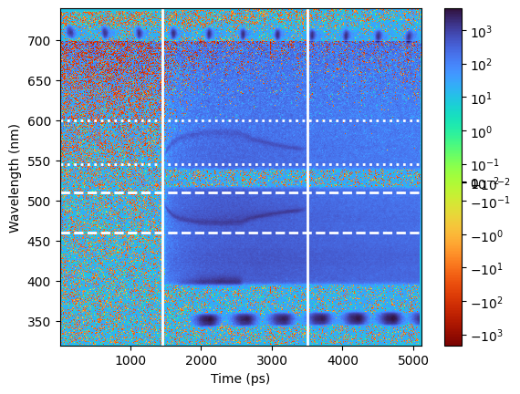
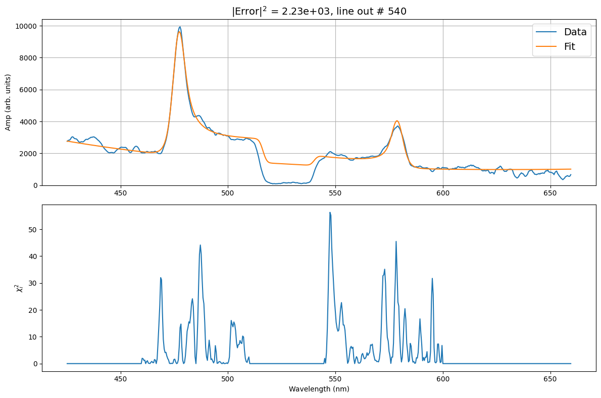
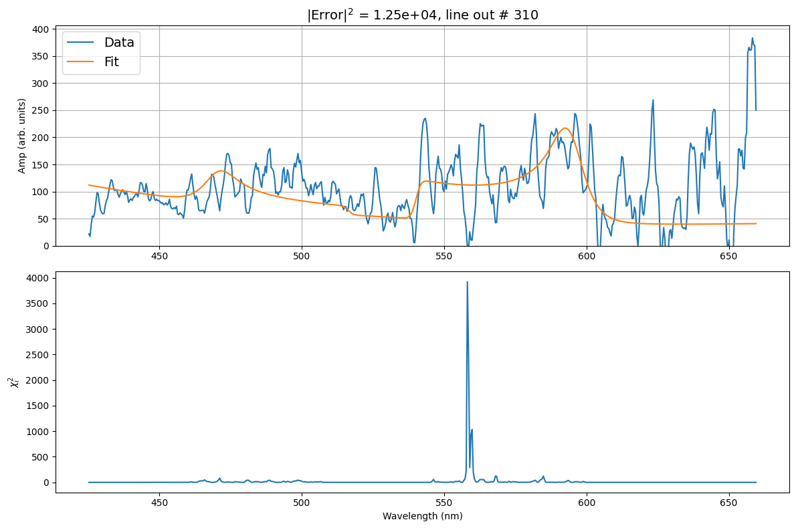
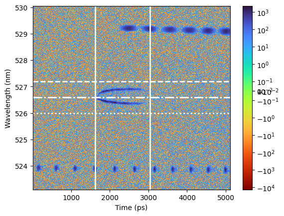
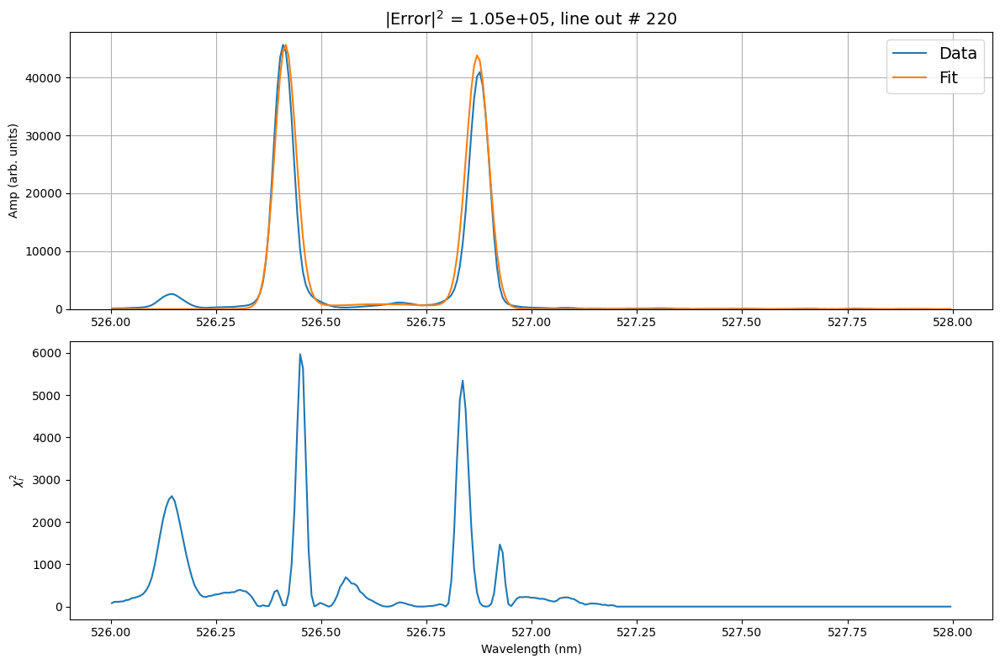
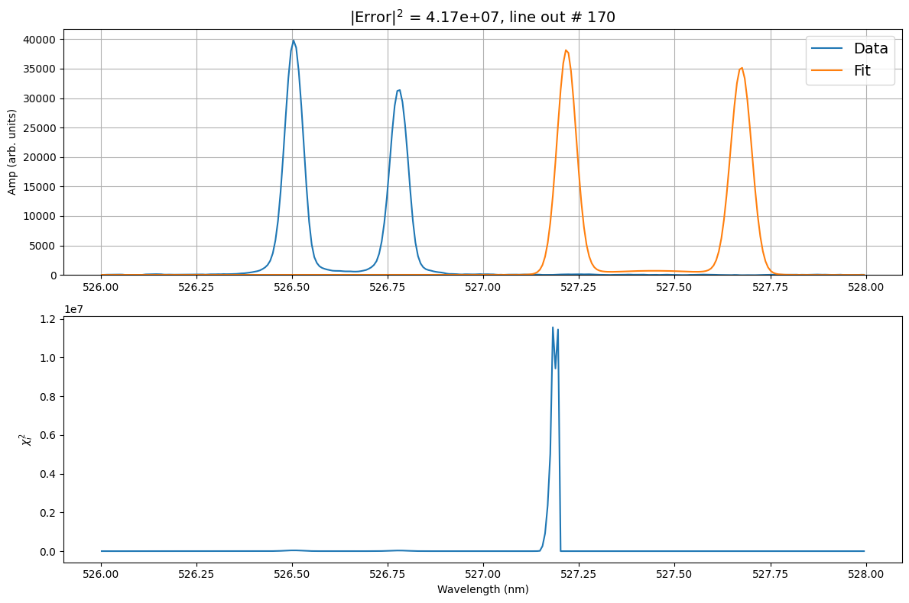

Example: Fitting time-resolved data
--------------------------------------

This is an example will walk you through the key steps for fitting time-resolved data. 

After loading your data, you wil want to indicate the shotnumber of your experimnet in the :ref:`Input.yaml <inputs_deck>` deck.
The input decks are located in **inverse-thomson-scattering/configs/1d**.
The code will identify the data as time resolved for OMEGA experients, based of the data file. 
For fitting data files from other sources, please contact the authors.

.. code-block:: yaml
    :caption: Inputs.yalm
    :emphasize-lines: 2

    data:
        shotnum: 101675
        lineouts:
            type:
                pixel

Fitting time resolved EPW
^^^^^^^^^^^^^^^^^^^^^^^^^^^

Load the electron spectra, and activate the EPW fit by setting the corresponding booleans to :bdg-success-line:`True`. 

.. code-block:: yaml
    :caption: Inputs.yalm
    :emphasize-lines: 4,6,7

    other:
        extraoptions:
            load_ion_spec: False
            load_ele_spec: True
            fit_IAW: False
            fit_EPWb: True
            fit_EPWr: True
        PhysParams:

Once you have adjusted the parameters, and saved the changes made. You will want to implement the run command.

.. code-block:: python

    python run_tsadar.py --cfg <path>/<to>/<inputs>/<folder> --mode fit

.. _mlflow_ui:

The following command will allow you to visualize the results of the fitting. The output link will redirect you to a local site where the outputs can be viewed. 
 
.. code-block:: shell

    mlflow ui

.. image:: _elfolder/mlflow_home.png

The resulting plots can be founs in the **Artifacts** unedr the folder **plots**. 

Electron fit ranges plot 

Best and worst folders contain the best and worst fits respectively. `

Best plots 

Worst plots

Dowload the learned parameters to confirm the code ran correctly

.. image:: _elfolder/lparam_epw.png

Fitting time-resolved IAW
^^^^^^^^^^^^^^^^^^^^^^^^^^^

Load the ion spectra, and activate the IAW fit by setting the corresponding booleans to :bdg-success-line:`True`. To visualize the outputs, use the :ref:`mlflow ui <mlflow_ui>` command.

.. code-block:: yaml
    :caption: Inputs.yalm
    :emphasize-lines: 3,5

    other:
        extraoptions:
            load_ion_spec: True
            load_ele_spec: False
            fit_IAW: True
            fit_EPWb: False
            fit_EPWr: False
        PhysParams:

Ion fit ranges plot 

Best plots

Worst plots

Dowload the learned parameters to confirm the code ran correctly

.. image:: _elfolder/lparam_iaw.jpg
